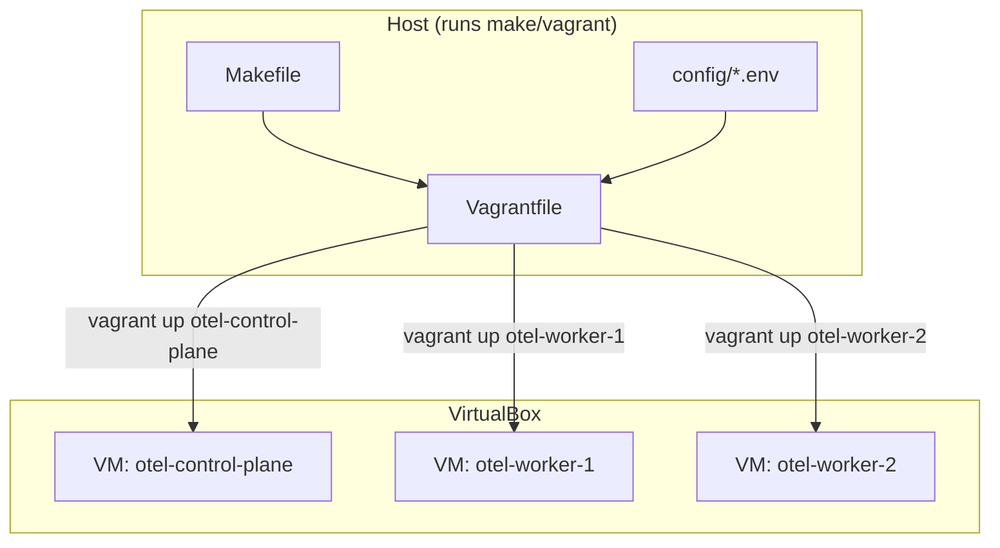
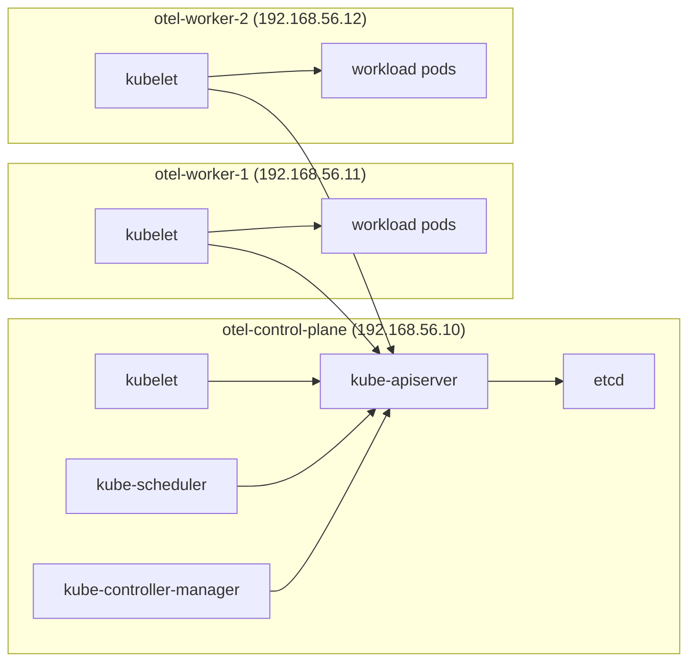
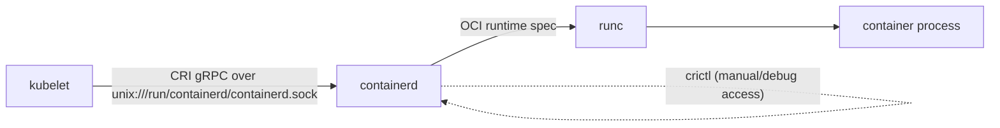
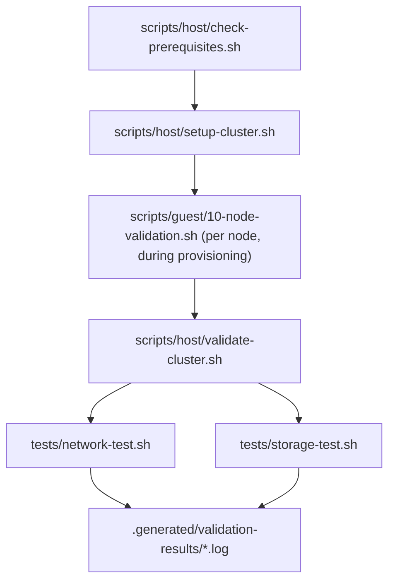

# Module Architecture: `auto-setup-default-kube-env`

This document covers this module's *internal* implementation architecture: how the Vagrantfile, config, and scripts fit together to produce the 3-node cluster. For the repository-wide architecture (directory ownership, dependency direction between modules, the observability/mesh/policy pipelines this platform ultimately supports), see [`../../docs/ARCHITECTURE.md`](../../docs/ARCHITECTURE.md) — this document does not repeat that content.

## Design principle: config is data, scripts are logic

Every value that could plausibly change (an IP, a version, a CPU count) lives in `config/*.env`, never hardcoded into a script or the Vagrantfile. Both the Ruby `Vagrantfile` and every Bash script parse the same `.env` files (`Vagrantfile` via a small `load_env_file` helper; scripts via `source`). This means changing, say, the pinned Kubernetes version is a one-line edit to `config/versions.env`, not a multi-file hunt.

## Host, VirtualBox, and the three VMs

`make setup` never calls plain `vagrant up` (which would bring up all three machines with whatever ordering/parallelism this Vagrant version's VirtualBox provider chooses). Instead `scripts/host/setup-cluster.sh` calls `vagrant up <machine-name>` once per machine, in a fixed order — see "Setup orchestration" in [`INSTALLATION.md`](INSTALLATION.md).

## Kubernetes control plane and workers

A single control-plane node (no HA — this is a learning lab, not a production topology) runs the full control-plane stack; both workers run only `kubelet` plus scheduled workload pods. kube-proxy runs on all three nodes (retained per [ADR-003](../../docs/DECISIONS.md#adr-003-retain-kube-proxy-initially)).

## kubelet → CRI → containerd → runc

kubelet never talks to a container runtime directly — it speaks the Container Runtime Interface (CRI), a gRPC API, to containerd over the Unix socket `unix:///run/containerd/containerd.sock` (pinned in `config/cluster.env` as `CRI_SOCKET` and used consistently in the kubeadm config, `/etc/crictl.yaml`, and every script that touches the runtime). containerd itself delegates actual container process creation to `runc` via the OCI runtime spec. `crictl` (installed alongside containerd) talks the same CRI API kubelet does, for manual inspection/debugging — see `docs/TROUBLESHOOTING.md`.

## Validation workflow

Validation happens at two levels: each guest script validates its own step immediately (fast feedback, catches a problem at the node it happened on), and `scripts/host/validate-cluster.sh` re-validates everything from the host's point of view afterward (the actual acceptance gate for "is this cluster usable"), delegating the network- and storage-specific deep checks to `tests/network-test.sh` and `tests/storage-test.sh`. Every host-side check's PASS/WARN/FAIL result is appended to a timestamped file under `.generated/validation-results/` (git-ignored).

## Script execution order (authoritative)

The Vagrantfile fixes provisioning order explicitly per machine — filenames' numeric prefixes reflect logical grouping, not execution order (Helm, `09-install-helm.sh`, must run before Cilium, `06-install-cilium.sh`, on the control plane):

| Node role | Order |
| --- | --- |
| Control plane | `00-common` → `01-configure-network` → `02-configure-kernel` → `03-install-containerd` → `04-install-kubernetes` → `09-install-helm` → `05-init-control-plane` → `06-install-cilium` → `10-node-validation` |
| Worker | `00-common` → `01-configure-network` → `02-configure-kernel` → `03-install-containerd` → `04-install-kubernetes` → `07-join-worker` → `10-node-validation` |

`08-install-storage` is deliberately **not** in either machine's Vagrant provisioner chain — `scripts/host/setup-cluster.sh` invokes it once, explicitly, after both workers exist (via `vagrant ssh otel-control-plane -c '... 08-install-storage.sh'`), since PVC scheduling needs at least one worker `Ready` and re-running it as part of every `vagrant provision` on the control plane would be wasted work once storage already exists (the script itself is idempotent regardless, via `kubectl apply`).

## Idempotency model

Every guest script checks state before acting (see `scripts/lib/validation.sh`): `is_control_plane_initialized`, `is_node_joined`, `is_containerd_active`, `is_helm_release_installed`, etc. This makes `vagrant provision` / `make provision` safe to re-run at any point — a script that finds its target state already true logs `[INFO] ... already ..., skipping.` and moves on rather than erroring or duplicating work. The one deliberate exception is worker-join credentials (`.generated/cluster-info.env`), which `05-init-control-plane.sh` **always** regenerates on every run (tokens expire ~24h), even though it never re-runs `kubeadm init` itself.
