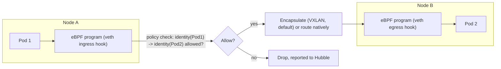
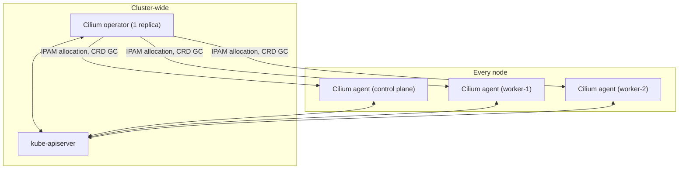
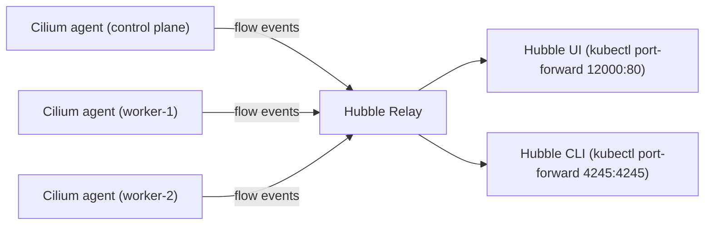
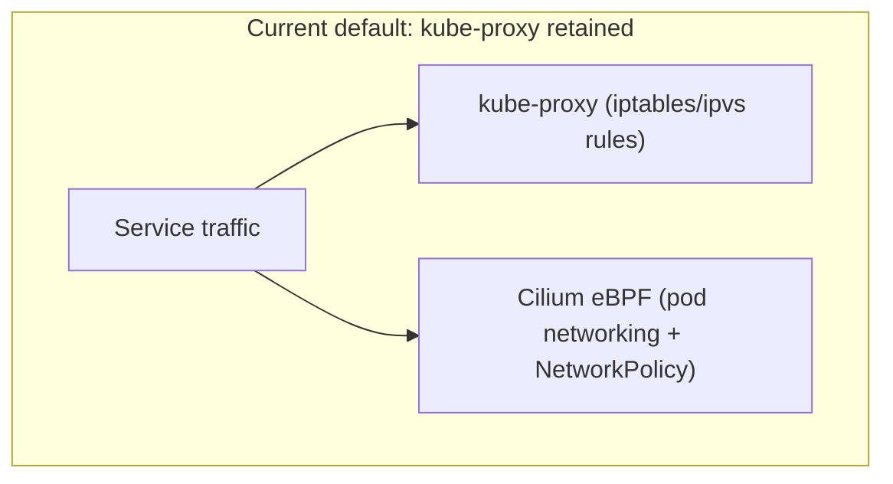
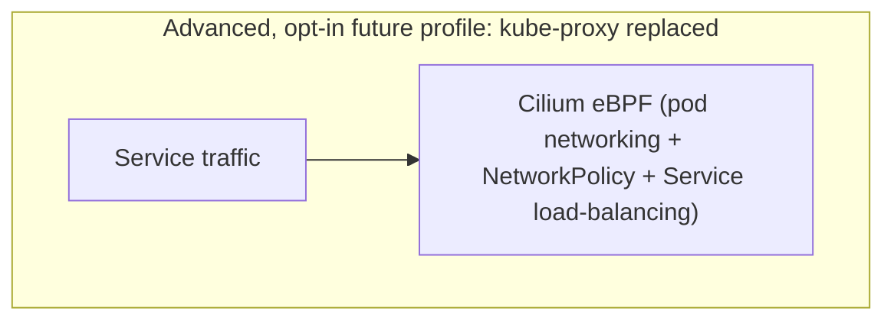

# Cilium and Hubble

## Why Cilium

See root [`docs/DECISIONS.md` ADR-002](../../docs/DECISIONS.md#adr-002-cilium-as-the-primary-cni) for the full alternatives-considered reasoning (vs. Calico, vs. Flannel). In short: Cilium's eBPF datapath gives first-class flow visibility (Hubble) that later phases of this repository lean on directly to troubleshoot Istio sidecar and Kyverno admission-webhook interactions at the network layer — a CNI chosen purely for basic pod networking would not offer that.

## eBPF datapath basics

Cilium does not implement pod networking, load-balancing, or NetworkPolicy enforcement with iptables rules (the traditional approach). Instead, the Cilium agent compiles and loads eBPF (extended Berkeley Packet Filter) programs directly into the Linux kernel on each node. These programs run in-kernel, at the point packets actually cross a network interface, and make forwarding/policy decisions there — avoiding the per-packet userspace round-trips and long, linearly-scanned iptables chains that traditional kube-proxy/CNI combinations rely on. This is genuinely new kernel-level infrastructure territory for engineers coming from iptables-based networking, which is exactly why this repository treats it as an explicit teaching surface (per the target-learner profile in the root [`README.md`](../../README.md)).

## Cilium agent

A DaemonSet pod on every node (control plane included — see `config/cilium-values.yaml.tpl`, no node selector excludes it). Responsible for: programming the local eBPF datapath, enforcing NetworkPolicy/CiliumNetworkPolicy decisions for pods on its node, participating in the cluster's identity-based security model (see below), and streaming flow events to Hubble.

## Cilium operator

A single-replica Deployment (`operator.replicas: 1` in `config/cilium-values.yaml.tpl` — appropriate for this lab's single control-plane node; production Cilium deployments typically run 2+ replicas with leader election). Handles cluster-wide coordination that doesn't belong on every node: IPAM allocation from the cluster-pool CIDR (see [ADR-011](../../docs/DECISIONS.md#adr-011-cilium-cluster-pool-ipam-without-a-kubeadm-podsubnet)), CRD garbage collection, and cluster-wide health aggregation.

## Cilium identity model

Traditional NetworkPolicy (and CiliumNetworkPolicy) targets pods by label selector, but underneath, Cilium assigns every distinct label set a numeric **security identity**, shared cluster-wide. Policy enforcement decisions (allow/deny) are then made against identities, not raw IPs — which is what lets Cilium enforce policy correctly even as pods are rescheduled and get new IPs, and is also the mechanism that makes Hubble's flow visibility identity-aware (a flow is annotated with the identities on each end, not just IPs).

## CiliumNetworkPolicy and Kubernetes NetworkPolicy

Cilium enforces both the standard Kubernetes `NetworkPolicy` API (which this cluster's `networking.k8s.io/v1` API supports, per `config/kubeadm-config.yaml.tpl`) and its own CRD, `CiliumNetworkPolicy`/`CiliumClusterwideNetworkPolicy`, which adds L3/L4 features standard NetworkPolicy doesn't have (DNS-aware egress rules, L7 HTTP/Kafka-aware rules for a limited protocol set) plus cluster-wide (non-namespaced) policies. `tests/network-test.sh` in this module exercises `CiliumNetworkPolicy` specifically as the enforcement validation case.

## Pod-to-pod flow through Cilium



Same-node pod-to-pod traffic never leaves the node's kernel (no encapsulation needed); cross-node traffic (as in this cluster's 3-node topology) is encapsulated by default (VXLAN) or, if native routing were configured, forwarded directly via the host-only network's own routing — this lab uses the default encapsulated mode for simplicity.

## Cilium agent and operator architecture



## Hubble architecture

**Hubble Relay** aggregates flow-event streams from every node's Cilium agent into one cluster-wide view (without it, you'd have to query each agent's local Hubble API separately). **Hubble UI** is a web frontend on top of Relay's gRPC API for visual flow exploration. **Hubble CLI** (`hubble` binary, installed on the control plane by `06-install-cilium.sh`) talks the same gRPC API for scriptable/terminal flow queries — this is what `tests/network-test.sh` and `make hubble-status` use.

## Hubble visibility flow



## Flow visibility, DNS visibility, dropped-packet visibility

Hubble records every flow the eBPF datapath sees a policy decision for for, tagged with source/destination identity, Kubernetes metadata (pod/namespace/labels), verdict (`FORWARDED`/`DROPPED`), and — for DNS traffic specifically — the queried name and response, giving DNS-level visibility without a separate DNS-logging mechanism. `hubble observe --verdict DROPPED` (used in `tests/network-test.sh`) is the primary tool for confirming a NetworkPolicy actually blocked what you expected it to block, rather than inferring it indirectly from an application-level connection failure.

## Relationship between Cilium and kube-proxy, and why kube-proxy is retained initially



Cilium's eBPF datapath is fully capable of replacing kube-proxy's Service load-balancing entirely (`kubeProxyReplacement: strict`), but this module runs `kubeProxyReplacement: disabled` (`config/cilium-values.yaml.tpl`) — kube-proxy handles Service ClusterIP/NodePort load-balancing via its normal iptables rules, while Cilium handles pod networking and NetworkPolicy independently alongside it. See [ADR-003](../../docs/DECISIONS.md#adr-003-retain-kube-proxy-initially) for why: coupling "learning Cilium fundamentals" with "learning kube-proxy-replacement's stricter bootstrap requirements" in the same default path increases the chance of an unrecoverable early failure for a learner still building Cilium fundamentals.

## Future kube-proxy replacement architecture



A future advanced lab profile would set `kubeProxyReplacement: strict` and skip installing kube-proxy entirely (kubeadm's `SkipPhases: [addon/kube-proxy]`, or removing the `kube-proxy` DaemonSet post-install), letting Cilium's eBPF datapath handle Service load-balancing directly — this removes an entire layer of iptables rules and is the more "native" Cilium deployment model, but requires `k8sServiceHost`/`k8sServicePort` to be correctly configured before the first agent starts (already set in `config/cilium-values.yaml.tpl` in preparation, even though replacement is disabled today) and has stricter requirements around when Cilium must be ready relative to kubelet's own bootstrap. **This is documented only — not implemented — in this phase.**

## Accessing Hubble UI/CLI

```bash
# Hubble UI
vagrant ssh otel-control-plane -c "kubectl -n kube-system port-forward deployment/hubble-ui 12000:80" &
# then browse to http://localhost:12000 from a browser tunneled through the same SSH connection,
# or run the port-forward with -L from your own machine:
ssh -L 12000:localhost:12000 vagrant@192.168.56.10 -i .vagrant/machines/otel-control-plane/virtualbox/private_key

# Hubble CLI (from the control plane, where it's installed)
make hubble-status
```

Hubble UI/Relay are never exposed on a host-forwarded port directly — always access them via `kubectl port-forward` (or an SSH tunnel to a `kubectl port-forward` running on the control plane), consistent with this module's security requirements (see [`INSTALLATION.md`](INSTALLATION.md) "Security limitations").
