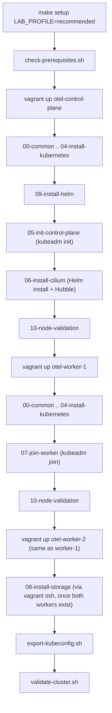

# Installation

Detailed setup instructions for this module. For a one-paragraph quick start, see the root [`README.md`](../README.md) of this module.

## Prerequisites

Run this first, always:

```bash
cd auto-setup-default-kube-env
make prerequisites
```

This is read-only — it checks OS, virtualization support, RAM, disk, required commands, existing VirtualBox/Vagrant state, and potential host-only network IP conflicts, printing `[PASS]`/`[WARN]`/`[FAIL]` for each. It never installs anything and never modifies host state. See `scripts/host/check-prerequisites.sh` for the full list of checks.

## Setup orchestration



`make setup` (`scripts/host/setup-cluster.sh`) runs this exact sequence, never relying on `vagrant up` bringing up multiple machines with an implicit, version-dependent ordering. This is what makes the "control plane before workers" and "storage after both workers" requirements deterministic rather than best-effort.

## Quick start

```bash
cd ~/github/Kyverno-Istio-Opentelementry/auto-setup-default-kube-env
make prerequisites
make setup LAB_PROFILE=recommended
make validate
export KUBECONFIG="$(pwd)/.generated/kubeconfig"
kubectl get nodes -o wide
```

Expect `make setup` to take a meaningful amount of wall-clock time (VM boot ×3, package installs ×3, kubeadm init, Cilium chart install and rollout, worker joins, storage install and PVC smoke test) — this is not a fast operation, and that's expected for a from-scratch VM-based Kubernetes bootstrap.

## Direct Vagrant commands

For finer-grained control than the Makefile wraps:

```bash
LAB_PROFILE=minimum vagrant up otel-control-plane   # bring up one machine at a time
vagrant status                                      # VM state
vagrant provision otel-worker-1                     # re-run provisioning scripts on one machine
vagrant ssh otel-control-plane                       # shell into a node
vagrant halt                                        # power off, preserve disk state
vagrant destroy -f                                  # permanently delete VMs and disks
```

`VAGRANT_GUI=true vagrant up otel-control-plane` shows the VirtualBox console window instead of running headless.

## Makefile commands

See `make help` for the full, current list with descriptions. The most-used targets:

| Target | What it does |
| --- | --- |
| `make prerequisites` | Read-only host checks |
| `make setup LAB_PROFILE=...` | Full ordered setup (see diagram above) |
| `make validate` | Full VM/OS/Kubernetes/Cilium/storage/host-access validation |
| `make status` | Quick read-only glance |
| `make kubeconfig` | Confirm/normalize the exported kubeconfig |
| `make ssh-control-plane` / `ssh-worker-1` / `ssh-worker-2` | Shell into a node |
| `make halt` | Power off (non-destructive) |
| `make destroy` | **Destructive** — delete VMs and disks |
| `make rebuild LAB_PROFILE=...` | **Destructive** — destroy then full re-setup |
| `make reset-cluster` | **Destructive** — `kubeadm reset` on all nodes, VMs kept |

## kubeconfig usage

```bash
export KUBECONFIG="$(pwd)/.generated/kubeconfig"
kubectl get nodes -o wide
```


The exported kubeconfig already references the control plane's real host-only address (`https://192.168.56.10:6443`) — no address rewriting is needed at export time, since `kubeadm init` was run with that address as both `--advertise-address` and `--control-plane-endpoint` in the first place (`config/kubeadm-config.yaml.tpl`). `make kubeconfig` (`scripts/host/export-kubeconfig.sh`) re-confirms this defensively, sets restrictive permissions, and validates reachability if `kubectl` is installed on the host. **The exported kubeconfig grants full cluster-admin access — treat it like a credential** (it's git-ignored by the root `.gitignore`'s `*kubeconfig*` pattern; never commit it or paste its contents anywhere).

## Cilium validation

```bash
make cilium-status     # cilium status --wait, run on the control plane
```

See [`CILIUM-HUBBLE.md`](CILIUM-HUBBLE.md) for the full architecture and CLI/UI access instructions.

## Hubble usage

```bash
make hubble-status     # hubble status via a temporary port-forward to Hubble Relay
```

## Network validation

```bash
make network-test       # tests/network-test.sh
```

## Storage validation

```bash
make storage-test       # tests/storage-test.sh
```

See [`STORAGE.md`](STORAGE.md) for what this actually exercises and its limitations.

## VM access

```bash
make ssh-control-plane
make ssh-worker-1
make ssh-worker-2
```

Root SSH password login is never enabled; access is exclusively via Vagrant's own SSH key management (see `docs/TROUBLESHOOTING.md` for SSH-related issues).

## Halt and resume

```bash
make halt      # power off, disk state preserved
make vm-up     # power back on (runs provisioning again, which is idempotent — see docs/ARCHITECTURE.md)
```

## Rebuild and recovery

See [`REBUILD-AND-RECOVERY.md`](REBUILD-AND-RECOVERY.md) for the full decision tree (halt/resume vs. reprovision vs. full rebuild vs. worker-only rebuild vs. `kubeadm reset`).

## Cleanup

```bash
make clean-generated   # removes only .generated/ contents — kubeconfig, join command, reports. VMs untouched.
make destroy            # DESTRUCTIVE — deletes all 3 VMs and their disks permanently
```

## Troubleshooting

See [`TROUBLESHOOTING.md`](TROUBLESHOOTING.md).

## Security limitations

- The exported kubeconfig grants cluster-admin. There is no RBAC restriction in this base platform — that's intentionally left to whichever tool module (Kyverno, etc.) needs it, per this module's tool-neutral scope.
- Hubble UI, if enabled, is only reachable via `kubectl port-forward` — it is never exposed on a host-bound port or the NAT interface.
- The host-only network (`192.168.56.0/24`) is not internet-routable and not encrypted; this is appropriate for a local single-host lab, not a multi-host or shared-network deployment.
- See the root [`docs/REPOSITORY-GOVERNANCE.md`](../../docs/REPOSITORY-GOVERNANCE.md) "Security requirements" for repository-wide rules this module follows.

## Local-lab limitations

- Single control-plane node — no HA, no etcd redundancy. A control-plane VM failure means a full rebuild, not a failover.
- Local-path storage has no redundancy and is tied to whichever node's disk a pod lands on (see [`STORAGE.md`](STORAGE.md)).
- Static, hardcoded IPs and a single hardcoded host-only subnet — this module assumes it is the only thing on `192.168.56.0/24` on your machine (see [`TROUBLESHOOTING.md`](TROUBLESHOOTING.md) "Host-only IP conflict").

## Definition of done

This module is considered done for Phase 2 purposes when every item in [`../../PROJECT-IMPLEMENTATION-PLAN.md`](../../PROJECT-IMPLEMENTATION-PLAN.md) Phase 2's checklist is checked — see that document for the authoritative, current status (as of this writing, the automation is built and statically validated; live-cluster validation is pending a user-run `make setup`).

## Next learning modules

Once this environment is validated (`make validate` passes with a live cluster), proceed to:

1. [`../../kyverno/`](../../kyverno/) — independent Kyverno policy lab
2. [`../../istio/`](../../istio/) — independent Istio service-mesh lab
3. [`../../opentelemetry-prometheus-grafana-jaeger-loki/`](../../opentelemetry-prometheus-grafana-jaeger-loki/) — independent observability lab
4. [`../../all-tools-integrated-lab/`](../../all-tools-integrated-lab/) — final integrated lab

See [`../../docs/LAB-WORKFLOW.md`](../../docs/LAB-WORKFLOW.md) for the full recommended sequence and when to reuse vs. reset this cluster between them.
