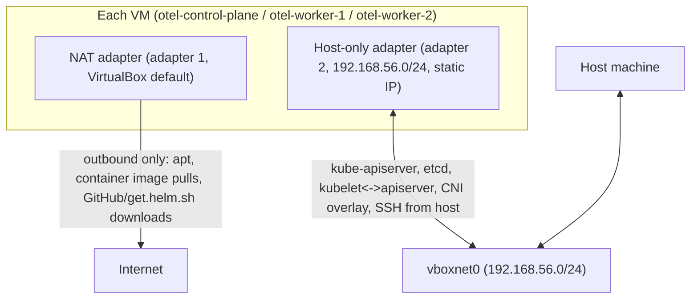

# Networking

## NAT and host-only interfaces

Every VM gets two interfaces:

1. **NAT** (VirtualBox's default first adapter) — outbound-only internet access for package installs and image pulls. Nothing on the host-only network or in the cluster is reachable through this adapter, and nothing external can reach the VM through it either (no inbound port-forwarding is configured beyond Vagrant's own SSH forwarding).
2. **Host-only** (`192.168.56.0/24`, static IPs `.10`/`.11`/`.12` per `config/cluster.env`) — this is the network the cluster actually runs on: kube-apiserver, etcd, kubelet↔apiserver traffic, and Cilium's overlay/tunnel or direct-routing traffic (mode-dependent) all use this network. It is not internet-routable and not visible outside your host machine.

kubelet's `--node-ip` is explicitly pinned to the host-only address on every node (`scripts/guest/01-configure-network.sh`, via `/etc/default/kubelet`), so nothing in the cluster ever advertises the NAT address as a node IP.

## DNS

VMs use whatever DNS resolution the `bento/ubuntu-24.04` box ships with by default (typically `systemd-resolved` forwarding to the NAT adapter's DHCP-provided resolver) — this module does not override host DNS configuration. In-cluster DNS (CoreDNS) is entirely separate and only relevant once the cluster and Cilium are up — see [`CILIUM-HUBBLE.md`](CILIUM-HUBBLE.md).

## Proxy support

If `HTTP_PROXY`/`HTTPS_PROXY` (or lowercase equivalents) are set on the host when you run `make setup`, Vagrant forwards them into each guest's provisioning environment, and `scripts/guest/00-common.sh` configures an apt proxy (`/etc/apt/apt.conf.d/95proxy`). `NO_PROXY` is always extended (never replaced) to include `localhost`, `127.0.0.1`, all three node IPs, the service CIDR, the Cilium pod CIDR, `.svc`, and `.cluster.local`, so cluster-internal traffic is never routed through a proxy even if you set a broad `NO_PROXY` yourself. See [`../examples/proxy.env.example`](../examples/proxy.env.example). If no proxy variables are set (the default), no proxy configuration is written anywhere.

## Firewall (UFW)

`scripts/guest/02-configure-kernel.sh` checks UFW's state and logs it, but never enables, disables, or reconfigures it — the `bento/ubuntu-24.04` box ships with UFW inactive by default, and this module does not change that. If you've enabled UFW yourself on the base image, you are responsible for ensuring it permits: SSH (22, Vagrant-managed), the Kubernetes API (6443) and kubelet (10250) on the host-only interface between all three nodes, and Cilium's VXLAN (8472/UDP, default overlay mode) or Cilium's health/Hubble ports listed below.

## Port requirements (this module's components only)

| Component | Port(s) | Interface | Notes |
| --- | --- | --- | --- |
| SSH | 22 | host-only + Vagrant-managed forwarded port | Vagrant's own SSH management, not manually configured |
| kube-apiserver | 6443 | host-only (`192.168.56.10`) | `controlPlaneEndpoint` in `config/cluster.env` |
| etcd | 2379-2380 | host-only, control plane only | Not exposed beyond the control-plane node |
| kubelet API | 10250 | host-only, all nodes | apiserver → kubelet |
| Cilium VXLAN (default overlay) | 8472/UDP | host-only, all nodes | Only relevant if Cilium is not using native routing |
| Cilium health checks | 4240, 9962-9965 | host-only, all nodes | See root [`docs/DEPENDENCIES.md`](../../docs/DEPENDENCIES.md) §14 |
| Hubble Relay | 4245 | host-only, control plane | Accessed via `kubectl port-forward`, never host-bound directly |
| Hubble UI | 12000 | host-only, control plane | Accessed via `kubectl port-forward`, never host-bound directly |

No component in this module binds to a host-forwarded port beyond Vagrant's own SSH management — every other access path is either host-only-network-direct (from the host, which has a route to `192.168.56.0/24` via `vboxnet0`) or via `kubectl port-forward`/`vagrant ssh`.

## Host-only network conflicts

Because the IPs in `config/cluster.env` are static, another local VirtualBox/Vagrant environment on the same `192.168.56.0/24` range claiming the same addresses is a real, encountered risk in this repository's own development (see root [`docs/DEPENDENCIES.md`](../../docs/DEPENDENCIES.md) for the specific incident). `scripts/host/check-prerequisites.sh` checks for this (via `VBoxManage list hostonlyifs`, `vagrant global-status`, and a liveness ping to each target IP) before `make setup` proceeds — see [`TROUBLESHOOTING.md`](TROUBLESHOOTING.md) "Host-only IP conflict" if it warns.
