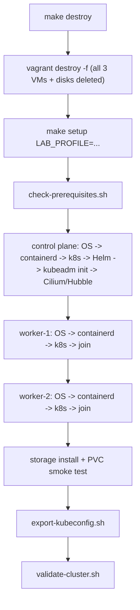

# Rebuild and Recovery

## Normal halt and resume

```bash
make halt       # power off all 3 VMs, disk state preserved
make vm-up      # power back on; provisioning scripts re-run (idempotent — see docs/ARCHITECTURE.md)
```

Use this for "I'm done for today, don't want VMs consuming host RAM/CPU, but I want the exact same cluster tomorrow." No cluster state is lost.

## Reprovision

```bash
make provision   # vagrant provision — re-runs every guest script on every running VM
```

Every script's idempotency guard means this is safe: already-done steps are skipped (`is_control_plane_initialized`, `is_node_joined`, etc.), while genuinely-changed config (e.g. you edited `config/cilium-values.yaml.tpl`) gets re-applied via `helm upgrade --install`. Use this after editing any `config/*.env` or `config/*.tpl` file, to apply the change without a full rebuild.

## Complete rebuild

```bash
make destroy
make setup LAB_PROFILE=recommended
```

Full teardown and from-scratch recreation — new VMs, new disks, new cluster, new certificates, new join tokens. Use this when you want a guaranteed-clean baseline (e.g. before starting the integrated lab — see root [`docs/LAB-WORKFLOW.md`](../../docs/LAB-WORKFLOW.md) step 9) or when `make reset-cluster` (below) hasn't resolved a problem.



## Rebuild one worker

Use this when a single worker is in a bad state you don't want to diagnose (rather than rebuilding the whole cluster). Sequence, using `otel-worker-1` as the example:

```bash
# 1. Drain, where possible (skip if the node is already unreachable/broken)
export KUBECONFIG="$(pwd)/.generated/kubeconfig"
kubectl drain otel-worker-1 --ignore-daemonsets --delete-emptydir-data --force || true

# 2. Delete the old Node object (kubeadm doesn't do this automatically)
kubectl delete node otel-worker-1

# 3. Destroy just that VM
vagrant destroy -f otel-worker-1

# 4. Recreate it — this generates a NEW join command automatically as
#    part of the control-plane's 05-init-control-plane.sh idempotency
#    (it always refreshes .generated/cluster-info.env), but since the
#    control plane itself isn't being re-provisioned here, force a
#    refresh first:
vagrant provision otel-control-plane   # regenerates .generated/cluster-info.env (fresh token)

# 5. Bring the worker back up — this runs the full guest script chain
#    including 07-join-worker.sh, which will join fresh since the old
#    Node object (and this VM's disk state) are both gone.
vagrant up otel-worker-1

# 6. Validate Cilium picked up the new node
make cilium-status

# 7. Validate workloads rescheduled correctly
kubectl get pods -A -o wide | grep otel-worker-1
make validate
```

## Kubernetes reset without deleting VMs

```bash
make reset-cluster
```

**This is explicitly destructive to cluster state (not VMs).** It runs `kubeadm reset -f` on all three nodes and removes CNI configuration, kubelet state, and Kubernetes certificates, while leaving the VMs themselves (and their OS-level setup — containerd, kubelet binaries, kernel modules, sysctls) intact. It does **not** run automatically as part of `provision` or `reload` — it is a separate, explicitly-named target you must invoke on purpose.

What it accounts for:

- **CNI configuration** — `kubeadm reset` removes `/etc/cni/net.d` and `/var/lib/cni` (the target's `reset-cluster` Makefile recipe does this explicitly, since `kubeadm reset` alone doesn't always fully clear Cilium's own state directories).
- **kubelet state** — `kubeadm reset` stops kubelet and clears `/etc/kubernetes`; the recipe also clears `/var/lib/kubelet/*` since Cilium/CNI-related mount state can otherwise linger.
- **containerd state** — not touched by `reset-cluster` (containers/images stay cached, which speeds up the subsequent `make setup`); if you suspect containerd-level corruption specifically, a full VM rebuild is the more appropriate tool, not `reset-cluster`.
- **Kubernetes certificates** — removed along with `/etc/kubernetes` (all of them are regenerated by the next `kubeadm init`).
- **iptables/nftables state** — `kubeadm reset` cleans up the iptables rules it and kube-proxy added; Cilium-added rules/eBPF programs are cleared when the Cilium agent pod itself is gone (which happens automatically once the node's kubelet state is wiped and it's no longer part of a cluster).
- **Cilium state** — cleared as a side effect of the CNI/kubelet cleanup above; Cilium re-installs cleanly on the next `kubeadm init`.
- **Worker rejoining** — after `reset-cluster`, run `make setup` again (not `vagrant up`) — this re-runs the full ordered sequence (control plane init → Cilium → both workers join) against the now-reset-but-still-existing VMs.
- **Control-plane reinitialization** — happens automatically as part of the next `make setup`'s control-plane step, since `is_control_plane_initialized` will now correctly report `false`.

Use `make reset-cluster` over a full `make destroy && make setup` when you specifically want to keep the VM-level setup (OS packages, containerd, kubelet binaries already installed — saves the apt-install time) and only want fresh cluster state. If you're not sure which one you need, prefer the full rebuild — it's slower but leaves zero ambiguity about residual state.
