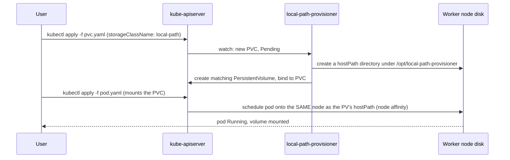

# Storage

## What's installed

[Rancher local-path-provisioner](https://github.com/rancher/local-path-provisioner) v0.0.26 ([ADR-012](../../docs/DECISIONS.md#adr-012-rancher-local-path-provisioner-as-the-lab-storageclass)), providing a `local-path` StorageClass set as the cluster default. **This is for hands-on learning, not production-grade shared storage** — read the limitations below before assuming any behavior beyond "a PVC binds and works."

## Storage provisioning flow

Unlike a "real" dynamic provisioner backed by a SAN/cloud disk API, local-path-provisioner's mechanism is simple by design: it creates a directory on whichever node the first consuming pod is scheduled to, and stamps the resulting `PersistentVolume` with a `nodeAffinity` requirement pinning it to that exact node. This is why the write/read/restart/persistence sequence in `tests/storage-test.sh` re-creates the pod with the *same* PVC rather than a new one — it's specifically testing that the data survives on that node's disk across a pod restart, not that it's available cluster-wide.

## Data location on worker nodes

`/opt/local-path-provisioner/<pvc-namespace>_<pvc-name>_<pv-uid>/` on whichever node the volume was provisioned on. Inspect it directly via `vagrant ssh otel-worker-1 -c "sudo ls -la /opt/local-path-provisioner/"` (or `otel-worker-2` — check `kubectl get pv -o wide` first to know which node actually holds a given volume).

## No high availability

There is exactly one copy of the data, on one node's local disk. There is no replication, no snapshotting, and no cross-node availability. If that node's VM is destroyed or its disk corrupted, the data is gone — this is a deliberate simplicity trade-off for a disposable lab environment (see [ADR-012](../../docs/DECISIONS.md#adr-012-rancher-local-path-provisioner-as-the-lab-storageclass) for why Longhorn, which would add replication, was rejected as unnecessary weight for this module's scope).

## Node affinity implications

Because a `PersistentVolume`'s data lives on one specific node, any pod that later mounts that same PVC **must** be scheduled onto that same node — Kubernetes enforces this automatically via the `PersistentVolume`'s `nodeAffinity` field, but it means a StatefulSet or Deployment using local-path storage is not freely reschedulable across your two workers the way a stateless one is. This is invisible until a node becomes unschedulable (cordoned, drained, or down), at which point any pod depending on that node's local-path volume simply cannot be rescheduled elsewhere.

## Data-loss behavior if a VM is destroyed

`make destroy` (or a worker-only rebuild per [`REBUILD-AND-RECOVERY.md`](REBUILD-AND-RECOVERY.md)) deletes the VM's virtual disk entirely, including anything local-path-provisioner wrote there. There is no automatic backup of this data anywhere in this module — if you need to preserve something written to a `local-path` volume, copy it out (`kubectl cp` or `vagrant ssh ... -c "sudo tar -czf ..."`) before destroying the VM that holds it.

## Validation performed by `tests/storage-test.sh`

1. Create a PVC against the `local-path` StorageClass.
2. Create a pod mounting that PVC.
3. Write a timestamped string to a file on the volume.
4. Read it back and confirm it matches.
5. Delete and recreate the pod (same PVC).
6. Read the file again and confirm the value from step 3 is still there — proving persistence across a pod restart, not just within one pod's lifetime.
7. Delete the temporary namespace (cleans up the PVC, the PV, and the underlying `/opt/local-path-provisioner/...` directory via the provisioner's own reclaim behavior).

See [`../tests/expected-results.md`](../tests/expected-results.md) for what a healthy run's output looks like.
