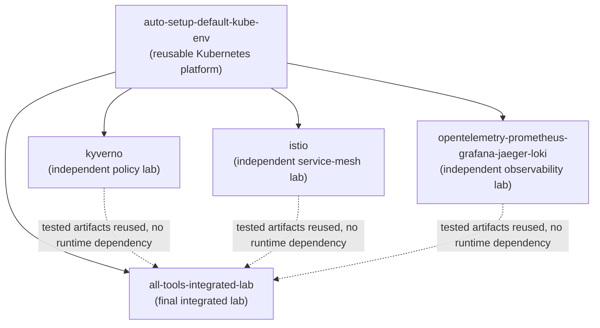
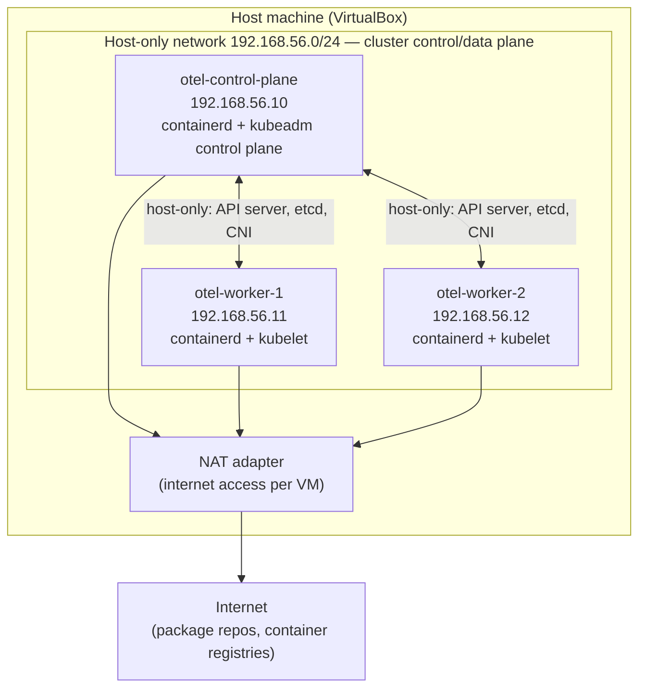
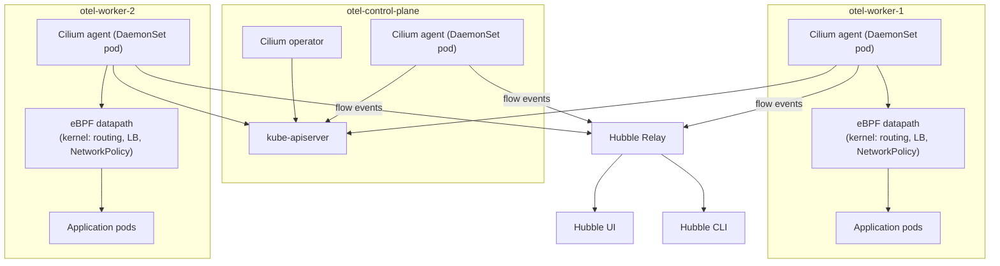
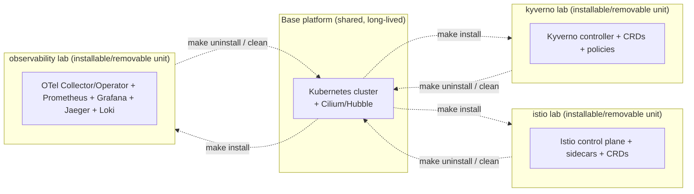
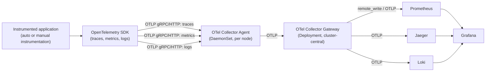
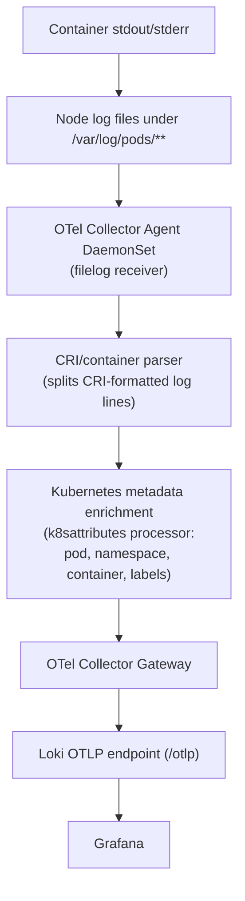
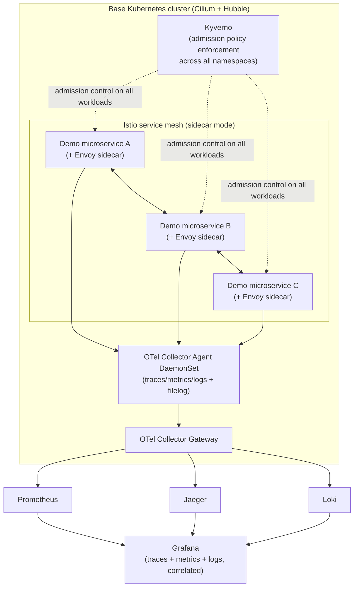

# Architecture

This document describes the overall system architecture of the repository: directory ownership, dependency direction, the base Kubernetes platform, Cilium/Hubble networking, the independent-lab model, the OpenTelemetry three-signal pipeline, the `filelog`-based log ingestion path, and the final integrated architecture. It also states, explicitly, the separation between **platform provisioning** (the reusable Kubernetes foundation) and **tool installation** (Kyverno, Istio, observability stack).

Nothing described here has been implemented yet — this is the target architecture for the phases defined in [`PROJECT-IMPLEMENTATION-PLAN.md`](../PROJECT-IMPLEMENTATION-PLAN.md). Planned component versions are in [`VERSIONS.md`](VERSIONS.md); cross-component compatibility detail is in [`DEPENDENCIES.md`](DEPENDENCIES.md).

## 1. Directory ownership

| Directory | Owns | Does not own |
| --- | --- | --- |
| `auto-setup-default-kube-env/` | VirtualBox/Vagrant VM definitions, Ubuntu Server provisioning, containerd, kubeadm bootstrap, Cilium CNI + Hubble, Helm install, local StorageClass, optional local registry, kubeconfig export, cluster validation/cleanup/rebuild automation | Any application-layer tool: no Kyverno, Istio, or observability components are installed by this directory's automation |
| `kyverno/` | Kyverno install, all policy types (validate/mutate/generate/cleanup/verifyImages), policy exceptions, policy reports, admission vs. background processing, audit vs. enforce mode, its own validation/troubleshooting/cleanup | The cluster itself, Istio, or observability |
| `istio/` | Istio install (sidecar mode first), Istio CNI, sidecar injection, traffic management (VirtualService/DestinationRule/traffic shifting/canary/retries/timeouts/fault injection/circuit breaking), mTLS/PeerAuthentication/AuthorizationPolicy, ServiceEntry/egress, its own validation/troubleshooting/cleanup | The cluster itself, Kyverno, or observability |
| `opentelemetry-prometheus-grafana-jaeger-loki/` | OpenTelemetry SDK/Collector/Operator, instrumentation (auto + manual), tracing, metrics, structured logs, OTLP (gRPC/HTTP), context propagation, sampling, Prometheus, Grafana, Jaeger, Loki, correlation, exemplars, Collector scaling/troubleshooting | The cluster itself, Kyverno, or Istio |
| `all-tools-integrated-lab/` | Final integration of all of the above against instrumented demo services and failure scenarios, reusing tested configuration from the independent labs | Re-deriving configuration already validated in an independent lab |

## 2. Repository dependency architecture

Every module depends on the base platform. The three independent labs (`kyverno`, `istio`, the observability stack) never depend on each other or on the integrated lab — each can be installed, validated, and fully removed in isolation. The integrated lab is the only consumer that reuses configuration validated in the independent labs (dashed lines): it does not redefine policies, mesh config, or Collector pipelines from scratch.

## 3. Base Kubernetes platform: VirtualBox and Kubernetes topology

| Node | Role | Private IP |
| --- | --- | --- |
| `otel-control-plane` | Kubernetes control plane | `192.168.56.10` |
| `otel-worker-1` | Kubernetes worker | `192.168.56.11` |
| `otel-worker-2` | Kubernetes worker | `192.168.56.12` |

Each VM gets two network interfaces: a **host-only** adapter on `192.168.56.0/24` for stable, private cluster communication (API server, etcd, CNI overlay/tunnel traffic, node-to-node), and a **NAT** adapter for outbound internet access (package installs, container image pulls). Private IPs are static per the table above so that `kubeadm init`/`kubeadm join`, TLS SANs, and any hardcoded lab references remain stable across VM restarts and rebuilds. Ubuntu Server LTS is the guest OS; containerd is the CRI; kubeadm bootstraps the control plane and joins workers; kube-proxy is retained initially (see [ADR-003](DECISIONS.md#adr-003-retain-kube-proxy-initially)).

## 4. Cilium and Hubble networking architecture

The Cilium agent runs as a DaemonSet on every node (control plane included) and programs an eBPF datapath in the kernel for pod networking, service load-balancing, and NetworkPolicy enforcement — replacing the traditional iptables-based kube-proxy model at the data-plane level, even though kube-proxy itself is retained initially (dual-stack transition, see ADR-003). The Cilium operator handles cluster-wide coordination (IPAM, CRD garbage collection). Each agent streams flow visibility events to Hubble Relay, which aggregates cluster-wide flow data for the Hubble UI (visual flow explorer) and Hubble CLI (scriptable flow queries) — this is the primary tool for observing and troubleshooting both plain pod-to-pod traffic and, later, Istio sidecar traffic and Kyverno-mediated admission behavior at the network layer.

## 5. Independent lab model

Each independent lab installs against the same long-lived base cluster, but is scoped so that `make uninstall` for one lab leaves the cluster and the other labs' namespaces untouched. This lets a learner run, break, and fully tear down the Kyverno lab, for example, without needing to rebuild the cluster or touch the Istio or observability labs. Exact sequencing and when a full cluster reset is actually required (as opposed to a namespace-scoped uninstall) is documented in [`LAB-WORKFLOW.md`](LAB-WORKFLOW.md).

## 6. OpenTelemetry three-signal flow

Applications emit all three signals (traces, metrics, logs) via the OpenTelemetry SDK over OTLP (gRPC or HTTP), using W3C Trace Context for propagation. A per-node **Collector Agent** DaemonSet receives this traffic locally (short network hop, local buffering) and forwards it to a central **Collector Gateway** Deployment, which fans out each signal to its dedicated backend: metrics to Prometheus, traces to Jaeger, logs to Loki. Grafana is the single visualization layer across all three backends — it never stores signal data itself (see [ADR-009](DECISIONS.md#adr-009-prometheus-jaeger-loki-and-grafana-responsibilities)). This agent-and-gateway split is explained further in [ADR-006](DECISIONS.md#adr-006-opentelemetry-collector-agent-and-gateway-architecture).

## 7. Filelog receiver flow (Kubernetes log ingestion)

This is the default and only log-ingestion architecture for this repository — no sidecar log shippers and no direct application-to-Loki log writes. The container runtime (containerd) writes every container's stdout/stderr to node-local files under `/var/log/pods/<namespace>_<pod>_<uid>/<container>/*.log` in CRI log format. The `filelog` receiver in the node-local Collector Agent tails those files, a CRI/container parser splits the CRI-specific log-line format into timestamp/stream/log-body fields, and the `k8sattributes` processor enriches each record with pod, namespace, container, and label metadata by correlating the file path back to the Kubernetes API. Enriched records are forwarded to the central Collector Gateway, which writes them to Loki's native OTLP ingestion endpoint (`/otlp`), from which Grafana queries them via LogQL. Rationale for choosing `filelog` over sidecar shipping is in [ADR-007](DECISIONS.md#adr-007-filelog-receiver-for-kubernetes-logs).

## 8. Final all-tools integrated architecture

The integrated lab layers Kyverno admission control, the Istio sidecar mesh, and the full OpenTelemetry pipeline on the same base cluster simultaneously, against a shared set of demo microservices. Kyverno governs what can be admitted/mutated cluster-wide (including inside the mesh namespaces); Istio governs traffic between the demo services and enforces mTLS/authorization; the OpenTelemetry pipeline observes all of it — including Envoy sidecar and Kyverno webhook behavior — end to end. This is deliberately the *last* thing built: every piece here should already be individually understood and validated from its independent lab before being combined (see [ADR-004](DECISIONS.md#adr-004-independent-labs-plus-one-integrated-lab)).

## 9. Platform vs. tooling separation

`auto-setup-default-kube-env/` is intentionally **tool-neutral**: its automation provisions VMs, the container runtime, kubeadm, Cilium/Hubble, Helm, storage, and kubeconfig export — and stops there. It never installs Kyverno, Istio, or any observability component. This separation exists so that:

- The base cluster can be reused, unmodified, across every independent lab and the integrated lab.
- A broken or partially-applied tool install (e.g., a bad Kyverno policy, a misconfigured Istio mesh) can be cleaned up by uninstalling that tool alone, without ever needing to re-provision VMs.
- Learners can measure each tool's actual footprint (CRDs, webhooks, resource consumption) against a known-clean baseline, because the baseline never silently already has the tool installed.

## Resource planning

Two initial lab profiles are planned. Both are estimates; exact values will be revised after real resource validation once the base environment is provisioned in Phase 2.

### Minimum profile (~16 GB host RAM)

| Node | vCPU | RAM |
| --- | ---: | ---: |
| Control plane | 2 | 3 GB |
| Worker 1 | 2 | 3 GB |
| Worker 2 | 2 | 3 GB |

Expected limitations on this profile: single replicas for every component, short metric/trace/log retention, reduced synthetic load in demos, and lower application replica counts than the recommended profile.

### Recommended profile (~32 GB host RAM)

| Node | vCPU | RAM |
| --- | ---: | ---: |
| Control plane | 2 | 4 GB |
| Worker 1 | 4 | 7 GB |
| Worker 2 | 4 | 7 GB |

## Planned namespace strategy

| Namespace | Owning module |
| --- | --- |
| `kube-system` | Base platform (core Kubernetes components) |
| `cilium` | Base platform (Cilium agent/operator, if not installed into `kube-system`) |
| `hubble` | Base platform (Hubble Relay/UI, if not installed into `kube-system`) |
| `kyverno` | `kyverno/` lab |
| `istio-system` | `istio/` lab (control plane) |
| `istio-ingress` | `istio/` lab (ingress gateway) |
| `opentelemetry` | `opentelemetry-prometheus-grafana-jaeger-loki/` lab (Collector, Operator) |
| `observability` | `opentelemetry-prometheus-grafana-jaeger-loki/` lab (Prometheus, Grafana, Jaeger, Loki) |
| `demo` | Independent labs' demo/sample workloads |
| `integrated-demo` | `all-tools-integrated-lab/` demo workloads |

Namespaces are not created in this phase; this table documents planned ownership only.
