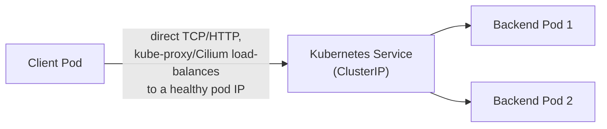

# Service Mesh Fundamentals

## Definition

A **service mesh** is a dedicated infrastructure layer that handles service-to-service communication — routing, retries, encryption, authorization, observability hooks — outside your application code, implemented as a **data plane** of per-workload proxies (sidecars) coordinated by a **control plane**.

## Problem being solved

Every one of retries, timeouts, mTLS, circuit breaking, and fine-grained authorization is either reimplemented per-language/per-service (inconsistent, expensive to audit) or bolted onto a shared library every service must adopt (a distributed upgrade problem every time the library changes). A service mesh moves all of this into the network path itself, uniformly, regardless of what language or framework a service is written in.

## Kubernetes-native behavior without Istio

A Kubernetes `Service` gives you stable DNS and basic round-robin/random load balancing via kube-proxy (or, in this cluster, Cilium's eBPF datapath — see `04-istio-cni-and-cilium.md`). That's it: no retries, no per-request routing, no mTLS, no request-level authorization. Anything beyond "route to a healthy pod" is either the application's job or doesn't exist.

## East-west vs. north-south traffic

**North-south** traffic crosses the boundary of the cluster (a client outside talking to a service inside, via the ingress gateway). **East-west** traffic stays inside the mesh (service-to-service, like `frontend` → `order-service`). Istio governs both, but the mechanisms differ: north-south goes through a `Gateway` + `VirtualService`; east-west goes directly sidecar-to-sidecar.

## Control plane and data plane

The **data plane** is every Envoy sidecar proxy actually handling traffic, one per workload pod. The **control plane** is Istiod, which watches your cluster's Kubernetes API (Services, Endpoints, and Istio's own CRDs) and computes/distributes the Envoy configuration each sidecar needs — see `02-istio-architecture.md`.

## Sidecar proxy and transparent traffic interception

A **sidecar** is a second container in the same pod as your application, sharing its network namespace. Istio arranges for all inbound and outbound traffic to transparently pass through this sidecar's Envoy proxy — the application never has to be modified to call a proxy explicitly; the network layer itself is redirected. This lab uses the **Istio CNI plugin** interception model exclusively (not the older init-container/iptables model) — see `03-envoy-and-sidecar-internals.md` for exactly how.

## xDS: the family of discovery protocols

Envoy doesn't read a static config file — it's configured dynamically over gRPC by Istiod, using a family of APIs collectively called **xDS**:

| Service | Discovers |
| --- | --- |
| LDS (Listener Discovery Service) | Which ports/protocols this proxy listens on |
| CDS (Cluster Discovery Service) | Upstream service groups ("clusters" in Envoy's terminology — not Kubernetes clusters) it can route to |
| EDS (Endpoint Discovery Service) | The actual healthy pod IPs backing each cluster |
| RDS (Route Discovery Service) | HTTP routing rules (path/header matching, traffic splitting) |
| SDS (Secret Discovery Service) | TLS certificates and keys, delivered dynamically rather than mounted as files |

## Envoy's own vocabulary

An Envoy **listener** binds a port and protocol. A **cluster** is a named group of upstream endpoints (roughly: one cluster per Kubernetes Service+subset). A **route** maps an incoming request (by path/header/host) to a cluster. An **endpoint** is one specific backend IP:port. `03-envoy-and-sidecar-internals.md` and `10-configuration-analysis.md` show these inspected directly via `istioctl proxy-config`.

## Service identity, SPIFFE, and trust domains

Istio assigns every workload a cryptographic identity, not just a network address — expressed as a **SPIFFE ID** (`spiffe://<trust-domain>/ns/<namespace>/sa/<service-account>`), issued as an X.509 certificate by Istiod's built-in CA. The **trust domain** (`cluster.local` by default) scopes which identities a given mesh trusts. This identity is what mTLS actually authenticates and what `AuthorizationPolicy` principal matching is built on — see `06-service-security-and-mtls.md`.

## Traffic policy, service registry, configuration distribution, eventual consistency

Istiod maintains an internal **service registry** (a merged view of Kubernetes Services/Endpoints plus any `ServiceEntry`-registered external services) and computes each proxy's configuration from it plus your **traffic policy** resources (`VirtualService`/`DestinationRule`/etc.). Configuration distribution to thousands of proxies is not instantaneous — it's **eventually consistent**: a config change propagates over seconds, not milliseconds, which is why `istioctl proxy-status` (showing `SYNCED` vs. `STALE`) is a real, necessary operational tool, not a curiosity — see `10-configuration-analysis.md`.

## Kubernetes traffic without a service mesh

No retries, no mTLS, no per-request routing rules, no request-level authorization — just IP-level load balancing to whichever pod is Ready. Everything past that point is the application's own responsibility, or doesn't exist at all.

## Failure modes

- Assuming Kubernetes Service load balancing alone gives you retries/timeouts — it doesn't; that's application code or, with Istio, `VirtualService`/`DestinationRule` (`05-traffic-management.md`, `09-resilience-patterns.md`).
- Assuming a config change (a new `VirtualService`) takes effect instantly everywhere — it's eventually consistent; check `istioctl proxy-status` before assuming a rollout is stuck.

## Production considerations

A service mesh is a genuine new operational dependency (docs `11-production-design.md`) — every one of the guarantees above (mTLS, retries, authorization) is only as reliable as the mesh's own control-plane availability.

## Interview-level explanation

*"Explain, without buzzwords, what a service mesh actually adds over plain Kubernetes networking."* — Kubernetes gives you service discovery and basic load balancing at L3/L4. A service mesh adds a uniform, language-agnostic L7 layer on top: per-request routing (canary, header-based), automatic mutual TLS with cryptographic workload identity (not just network-level trust), fine-grained authorization based on that identity, and resilience patterns (retries, timeouts, circuit breaking) — all configured declaratively and enforced by sidecar proxies, without touching application code. The cost is operational: you now run and must keep healthy a control plane (Istiod) and a proxy per workload (Envoy), both genuine new failure domains (`11-production-design.md`).
