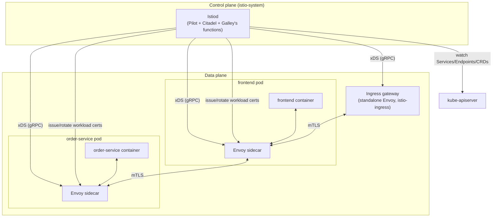
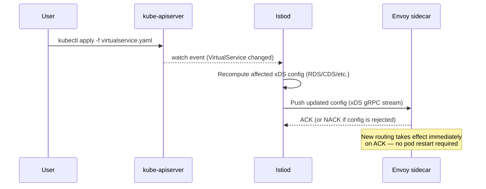

# Istio Architecture

Component names below are verified current against the pinned release (Istio 1.30.3 — see `../config/versions.env` and root `docs/VERSIONS.md`). Istio's architecture consolidated significantly early in its history; this document describes what's **actually running today**, not the historical multi-binary layout.

## Istiod: one binary, several historical roles

**Istiod** is a single control-plane binary/Deployment that consolidates what used to be three separate components in Istio's early (pre-1.5) architecture:

- **Pilot** — the traffic-management brain: watches the Kubernetes API and Istio CRDs, computes Envoy config, serves it over xDS.
- **Citadel** — the certificate authority: issues and rotates workload X.509 certificates for mTLS.
- **Galley** — historical configuration validation/distribution component. **Fully absorbed into Istiod; there is no standalone Galley in current Istio.** If you see Galley referenced as a separate running component, that documentation or diagram is describing pre-1.5 Istio, not this lab's pinned version.

## The full component picture

| Component | What it is | Where it runs |
| --- | --- | --- |
| Istiod | Control plane (Pilot+Citadel+Galley's functions) | `istio-system` Deployment |
| Envoy sidecar | Data plane, one per workload pod | Injected into every pod in an injection-labeled namespace |
| Istio CNI | Node-level traffic-interception plugin, chained with Cilium | `istio-system` DaemonSet — see `04-istio-cni-and-cilium.md` |
| Ingress gateway | A standalone Envoy (no application container) fronting north-south traffic | `istio-ingress` Deployment |
| Egress gateway | Same idea, for controlled egress — **not deployed in this lab's default profile** (this lab uses `ServiceEntry` + `Sidecar` egress scoping instead — see `08-egress-and-serviceentry.md`); documented here as an available, not-installed option |
| Sidecar injector webhook | A mutating admission webhook served by Istiod itself | Part of the Istiod process |

## Sidecar injection: webhook-based

Automatic injection is a **mutating admission webhook** (the same admission-control mechanism `../../kyverno/docs/01-kyverno-fundamentals.md` describes for Kyverno) — Istiod registers `MutatingWebhookConfiguration` watching Pod creation in namespaces labeled `istio.io/rev=<revision>` (or the older `istio-injection=enabled` label, superseded by revision labels — this lab uses revision labels exclusively). See `03-envoy-and-sidecar-internals.md` for what the injected pod spec actually looks like.

## Revisions and revision tags

A **revision** (`istio.io/rev=stable-1-30` in this lab's `config/lab-settings.env`) names one specific Istiod control-plane installation, letting multiple control-plane versions coexist during a canary upgrade (`13-upgrades-and-disaster-recovery.md`). A **revision tag** is a stable alias (e.g., `prod`) you can repoint from one revision to another without relabeling every namespace — this lab installs a single named revision (not the unnamed default) specifically so it's upgrade-ready per root `docs/DECISIONS.md` ADR-024, even though only one revision exists today.

## Istio configuration CRDs and Gateway API integration

Istio's own CRD group (`networking.istio.io`, `security.istio.io`) covers `VirtualService`/`DestinationRule`/`Gateway`/`ServiceEntry`/`Sidecar`/`WorkloadEntry`/`WorkloadGroup`/`EnvoyFilter`/`ProxyConfig` and `PeerAuthentication`/`AuthorizationPolicy`/`RequestAuthentication` — see `05-traffic-management.md` and `06-service-security-and-mtls.md` for the full field-level reference. Istio additionally supports (and increasingly recommends for new ingress configuration) the **Kubernetes Gateway API** (`gateway.networking.k8s.io`) — a vendor-neutral, upstream-Kubernetes-governed API this lab's `install/gateway-api/` documents but does not use for its own demo ingress (`07-gateways-and-ingress.md` explains why).

## Status and analysis tools

`istioctl analyze` and `istioctl proxy-status`/`proxy-config` are the primary built-in diagnostic tools — covered in depth in `10-configuration-analysis.md` and exercised throughout `labs/lab-18-debugging-xds.md`.

## Istio control plane and data plane

Istiod is the single source of truth every proxy's configuration derives from; there is no proxy-to-proxy control-plane traffic — all coordination flows through Istiod.

## xDS configuration distribution

This push happens over a long-lived gRPC stream each Envoy maintains to Istiod — not a poll. `istioctl proxy-status` shows whether a given proxy's last push was ACKed (`SYNCED`) or is still pending/failed (`STALE`) — the primary tool for confirming "did my config change actually take effect everywhere" (`10-configuration-analysis.md`, `labs/lab-18-debugging-xds.md`).

## Failure modes

- Treating "Galley" as a component you need to check the health of separately — it doesn't exist as a standalone process in this pinned version; its functions are inside Istiod.
- Assuming a config push is instant — it's an asynchronous gRPC push-and-ACK; `STALE` proxies are a real, checkable state (`docs/14-troubleshooting.md` "Proxy stale").

## Production considerations

Istiod is a single point of coordination for the entire mesh's configuration — its own availability (`11-production-design.md`) directly determines how quickly config changes propagate and whether new workloads can start (they need a cert from Istiod's CA function to complete mTLS handshakes).

## Interview-level explanation

*"Where did Galley and Citadel go?"* — They were absorbed into Istiod as part of Istio's architecture consolidation (well before this lab's pinned 1.30.3). This isn't a trivia question so much as a signal of whether someone's mental model is current: documentation or diagrams still showing Pilot/Citadel/Galley/Sidecar-injector as four separate running Deployments describe an architecture Istio moved away from years ago, and someone troubleshooting a live 1.30.3 cluster looking for a separate "Galley" pod would waste real time on a component that isn't there.
