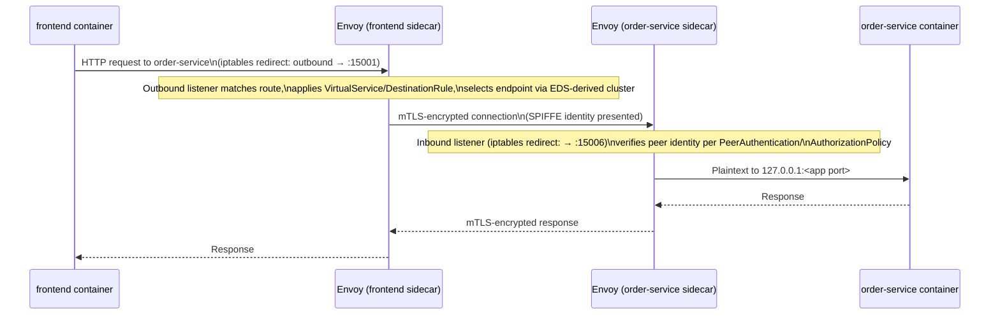

# Envoy and Sidecar Internals

## Definition

**Envoy** is the L3/L7 proxy Istio deploys as every sidecar, ingress gateway, and (optionally) egress gateway. Istio does not write its own proxy — it generates Envoy configuration and lets Envoy do the actual byte-pushing. Understanding Envoy's own object model (listener/cluster/route/endpoint, first introduced in `01-service-mesh-fundamentals.md`) is what separates "I applied a VirtualService and it worked" from being able to debug the case where it doesn't.

## What injection actually adds to a pod spec

Sidecar injection (the mutating webhook described in `02-istio-architecture.md`) adds, roughly:

- An `istio-proxy` container running Envoy, with resource requests/limits, running as a non-root UID.
- Shared volumes for Envoy's bootstrap config and (with SDS) certificates delivered in-memory rather than mounted as files.
- Pod annotations/labels recording the injected revision and the original container list, used by `istioctl proxy-status`/tooling.
- With the **Istio CNI plugin** (this lab's exclusive model — see `04-istio-cni-and-cilium.md`): traffic redirection rules are programmed by the CNI plugin at pod-creation time, at the CNI chain level. There is **no `istio-init` init-container** and **no `NET_ADMIN`/`NET_RAW` capability granted to the application pod itself** — that privilege lives once, in the CNI plugin's own privileged DaemonSet, not per-pod. This is a meaningful security improvement over the older init-container model and is called out explicitly because a learner researching Istio online will find far more material describing the init-container model, which this lab does not use.

## Transparent interception: what actually redirects the traffic

Regardless of interception mechanism, the goal is: application code calls `localhost` or a normal service DNS name exactly as if there were no mesh, and traffic ends up flowing through Envoy anyway. Redirection works via Linux **iptables rules operating on the pod's network namespace** (programmed once by the Istio CNI plugin at pod startup, not per-request):

- Inbound: everything arriving on the pod's IP other than the ports explicitly excluded gets redirected to Envoy's inbound listener (`15006`), which then forwards to `127.0.0.1:<original port>` where the application is actually listening.
- Outbound: everything the application sends out gets redirected to Envoy's outbound listener (`15001`), where Envoy applies routing/policy and opens the real upstream connection.

The application never sees a proxy hostname or port — the redirection is invisible at the socket level.

## Envoy's admin interface and key ports

| Port | Purpose |
| --- | --- |
| `15000` | Envoy admin interface (localhost-only) — stats, config dump, health. `config/endpoints.env`'s `ENVOY_ADMIN_PORT`. |
| `15001` | Outbound traffic capture |
| `15006` | Inbound traffic capture |
| `15020` | Merged Prometheus-format stats + health-check endpoint |
| `15021` | Health/readiness probe endpoint used by Kubernetes itself |
| `15090` | Envoy's own Prometheus stats endpoint (raw, pre-merge) |

`labs/lab-18-debugging-xds.md` uses `istioctl proxy-config` (which talks to `15000` for you) rather than requiring you to `kubectl exec` and curl the admin port directly, but knowing what's actually behind that port matters for real debugging.

## Reading a live proxy's configuration

`istioctl proxy-config {listeners,clusters,routes,endpoints,secret} <pod> -n <namespace>` dumps exactly what Envoy currently holds for each xDS resource type — the ground truth for "what will this proxy actually do with a request," independent of what your `VirtualService` YAML says should happen. `istioctl proxy-status` shows, mesh-wide, whether each proxy's xDS state is `SYNCED` or `STALE` (introduced in `02-istio-architecture.md`).

## Request flow through two sidecars

Both proxies apply policy independently — the *sending* sidecar enforces `VirtualService`/`DestinationRule` (routing, retries, circuit breaking), and the *receiving* sidecar enforces `PeerAuthentication`/`AuthorizationPolicy` (identity, access control) — see `05-traffic-management.md` and `06-service-security-and-mtls.md`.

## Failure modes

- Looking for an `istio-init` container to explain traffic redirection and not finding one — this lab uses the CNI-plugin interception model, where that logic runs once in the CNI DaemonSet, not per-pod (`04-istio-cni-and-cilium.md`).
- Debugging routing purely by re-reading the `VirtualService` YAML instead of checking what Envoy actually holds (`istioctl proxy-config routes`) — the two can diverge if the proxy is `STALE`.
- Forgetting the admin interface (`15000`) is localhost-only by design — it's not reachable from outside the pod without a port-forward or `kubectl exec`, which is intentional (it is an unauthenticated interface).

## Production considerations

Envoy's resource requests/limits (set per `install/istiod-values-{minimum,recommended}.yaml`'s injection defaults) directly affect pod scheduling and, under sustained load, proxy latency — sizing this correctly is part of `12-performance-and-capacity.md`. The CNI-plugin model also removes a class of failure this lab's learner should recognize by name even though it isn't hit here: init-container-based injection could leave a pod stuck if the init container itself failed to set up iptables before the app container started; the CNI-plugin model moves that risk to a per-node DaemonSet instead of per-pod.

## Interview-level explanation

*"How does traffic actually get from my application into the sidecar, mechanically?"* — It's iptables rules in the pod's own network namespace, redirecting outbound traffic to Envoy's outbound listener (`15001`) and inbound traffic to its inbound listener (`15006`); the application's code is completely unaware a proxy exists. In this lab's setup those iptables rules are programmed by the **Istio CNI plugin** at pod-creation time (a privileged DaemonSet action), not by a per-pod `istio-init` container — a specific, checkable difference from the older Istio interception model, and one worth stating explicitly because most public tutorials still describe the init-container version.
