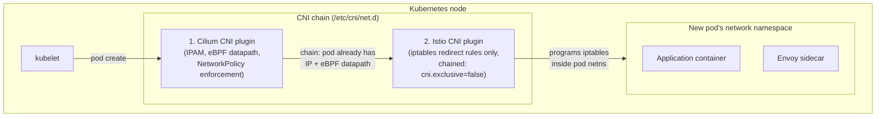

# Istio CNI and Cilium

This is the single most important compatibility document in this lab. Read it before running `make install`.

## Why this matters: two CNI plugins, one node

This cluster's CNI is **Cilium** (installed independently in `../../auto-setup-default-kube-env/`, eBPF-based, with kube-proxy retained per that module's own ADRs — root `docs/DECISIONS.md` ADR-003). Istio's sidecar data plane also needs a CNI-level component — the **Istio CNI plugin** — to program traffic-redirection rules into each pod's network namespace at creation time (`03-envoy-and-sidecar-internals.md`). These are not alternatives; on this cluster **both must run, chained together**: Cilium remains the actual network-plumbing CNI (IP allocation, routing, eBPF datapath, NetworkPolicy enforcement), and the Istio CNI plugin runs as an **additional, chained** CNI plugin that only adds iptables redirection rules after Cilium has already set up the pod's networking.

This lab **never replaces Cilium, never disables kube-proxy, and never runs Istio in ambient mode** (`16-future-ambient-mode.md`) — sidecar mode with CNI chaining is the only model this phase implements, matching root `docs/DECISIONS.md` ADR-019/ADR-020.

## The compatibility gap in this specific repository

CNI chaining requires the underlying CNI (Cilium) to be configured to cooperate with a second chained plugin. Concretely, Cilium's Helm values need:

- `cni.exclusive: false` — tells Cilium not to assume it's the only CNI plugin in the chain (Cilium's default is `true`, which would overwrite the CNI config file the Istio CNI plugin also needs to append to).
- `socketLB.hostNamespaceOnly: true` — required so Cilium's socket-level load balancing doesn't interfere with the Istio CNI plugin's iptables redirection inside the pod network namespace.

**As installed by `../../auto-setup-default-kube-env/`, this cluster's Cilium Helm release does not set these values** — they weren't needed for a Cilium-only cluster and Phase 2 correctly didn't anticipate a future Istio phase. This is a real, documented gap, not a defect: root `docs/DECISIONS.md` ADR-020 records it, and root `docs/DEPENDENCIES.md` cross-references it.

## Detection, never auto-remediation

Per this lab's git-safety constraints, `istio/` is not permitted to modify anything under `auto-setup-default-kube-env/`, and its scripts never call `helm upgrade cilium` themselves. Instead:

- `scripts/verify-cluster.sh` calls `cilium_cni_chaining_ready()` (`scripts/lib/istio.sh`) and reports a `[WARN]` with the exact remediation command if the live Cilium Helm release's values don't already have both settings.
- `scripts/install.sh` calls the same check again, immediately before the `istio-cni` install step, and **hard-fails** there (not just warns) — installing Istio CNI against a non-chaining-ready Cilium would silently break pod networking for every subsequently created pod in an injection-labeled namespace, so this step refuses rather than proceeding.

`cilium_cni_chaining_ready()` works by reading the live release's values (`helm get values cilium -n kube-system`) and checking for both settings — it never writes anything.

## The exact remediation command (run manually, against `auto-setup-default-kube-env`, by you)

```bash
helm upgrade cilium cilium/cilium -n kube-system --reuse-values \
  --set cni.exclusive=false \
  --set socketLB.hostNamespaceOnly=true
```

This is a `helm upgrade --reuse-values` (additive, not a full values replacement) against the Cilium release Phase 2 already installed — it does not touch kube-proxy, does not remove Hubble, and does not reinstall Cilium from scratch. It is deliberately **not** run by any script in this repository; the user runs it themselves, once, before `make install` in this module.

## What CNI chaining looks like at runtime



Cilium always runs first in the chain — it must finish allocating the pod's IP and setting up the eBPF datapath before the Istio CNI plugin can add its iptables rules on top.

## Verifying chaining is actually working

`tests/cilium-compatibility-test.sh` (runtime, requires a cluster) checks: both the `cilium` and `istio-cni-node` DaemonSets are healthy, the live Cilium Helm values confirm the chaining settings, and — the real end-to-end proof — a plain pod-to-pod HTTP request between two sidecar-injected workloads actually succeeds. A Cilium `NetworkPolicy` (L3/L4) and an Istio `AuthorizationPolicy` (L7, identity-based) can coexist on the same traffic; this test only exercises connectivity, not policy layering, which is out of scope for this phase (no Cilium NetworkPolicy is installed by this lab).

## Failure modes

- Running `make install` without ever running `verify-cluster` first and having `istio-cni` pods enter `CrashLoopBackOff` or leave newly created pods with no working network — the direct consequence of installing Istio CNI against a non-chaining Cilium config. `install.sh`'s hard-fail before the `istio-cni` step exists specifically to catch this before it happens.
- Assuming the remediation `helm upgrade` risks Cilium's other settings — `--reuse-values` only adds the two named keys; it does not reset anything else Phase 2 configured (kube-proxy retained, Hubble enabled, etc. are all untouched).
- Confusing this chaining relationship with **Ambient mode**, which uses a completely different interception approach (a node-level `ztunnel`, no per-pod sidecar) and is not implemented in this lab at all — see `16-future-ambient-mode.md`.

## Production considerations

CNI-chaining compatibility is a cluster-wide, all-or-nothing property — every node needs both plugins correctly chained, and a partial rollout (some nodes upgraded, some not) can produce inconsistent pod networking behavior depending which node a pod lands on. In production, this is exactly the kind of gap that belongs in a pre-upgrade checklist, not discovered live during an Istio rollout — which is the entire reason this lab treats it as a hard pre-install gate rather than a warning to notice later.

## Interview-level explanation

*"You have Cilium already running as CNI. How do you add Istio's sidecar data plane without replacing it?"* — CNI chaining: Cilium stays the primary CNI doing IPAM and the eBPF datapath, and the Istio CNI plugin is installed as a second, chained plugin whose only job is programming iptables redirect rules into each new pod's network namespace once Cilium has already set it up. It requires Cilium itself to be configured non-exclusively (`cni.exclusive: false`) and with `socketLB.hostNamespaceOnly: true` so the two plugins don't step on each other — a real prerequisite that has to be checked and, if missing, fixed on the Cilium side (a `helm upgrade --reuse-values`) before Istio CNI is installed, not something Istio's own install can silently work around.
