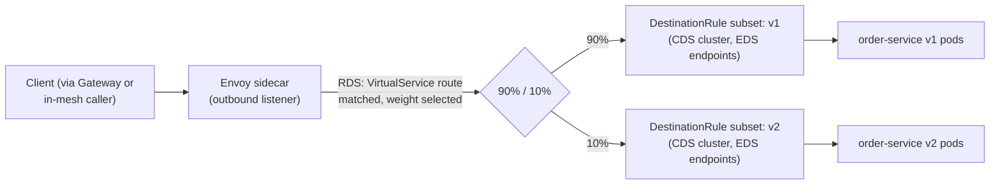

# Traffic Management

## Definition

Istio's traffic-management API layer — `VirtualService`, `DestinationRule`, `Gateway`, `Sidecar` — lets you control **how** requests are routed once basic Kubernetes Service discovery has found candidate endpoints: which subset gets traffic, in what proportion, based on what request attributes, with what resilience policy applied.

## The core split: routing vs. policy

This is the most commonly confused pair in Istio, so it's worth stating precisely:

- **`VirtualService`** answers "where should this request go" — host matching, path/header/method matching, traffic splitting by weight, request routing to a named **subset**, plus request-level resilience (retries, timeouts, fault injection — `09-resilience-patterns.md`).
- **`DestinationRule`** answers "once routed to this service, how should the connection to it behave" — subset **definitions** (mapping a subset name to a label selector, usually a version label), load-balancing policy, connection-pool limits, outlier detection (circuit breaking — `09-resilience-patterns.md`), and TLS mode for talking to that destination.

A `VirtualService` route referencing a subset name that no `DestinationRule` defines is a real, checkable misconfiguration — `istioctl analyze` catches it (`10-configuration-analysis.md`).

## Subsets: how "v1" and "v2" become routable

This lab's `demo/services/frontend/` and `demo/services/order-service/` each ship two Deployments distinguished by a `version: v1`/`version: v2` label. A `DestinationRule` (`demo/traffic/destinationrule-order-service.yaml`) defines subsets `v1` and `v2` as label selectors over that same key; a `VirtualService` then routes by weight or header to `subset: v1` / `subset: v2`. The Kubernetes `Service` itself doesn't know about subsets at all — subset routing is purely an Istio/Envoy-layer concept resolved from Kubernetes Endpoints plus the `DestinationRule`'s label selectors.

## Traffic-splitting strategies this lab exercises

| Manifest | Strategy | Lab |
| --- | --- | --- |
| `virtualservice-canary-90-10.yaml` | Weighted split, 90% v1 / 10% v2 | `labs/lab-06-canary-releases.md` |
| `virtualservice-canary-50-50.yaml` | Weighted split, 50/50 | same lab, progression step |
| `virtualservice-canary-0-100.yaml` | Full cutover to v2 | same lab, final step |
| `virtualservice-header-routing.yaml` | Route by a specific request header (e.g., internal testers) | `labs/lab-07-header-based-routing.md` |
| `virtualservice-path-routing.yaml` | Route by URL path prefix | `labs/lab-08-path-based-routing.md` |

`tests/traffic-routing-test.sh` verifies the canary split statistically (observed distribution within `TRAFFIC_STATISTICAL_TOLERANCE_PERCENT`, `config/lab-settings.env`) — weighted routing is probabilistic per-request, not deterministic, so any verification has to be a distribution check over many requests, not a single curl.

## Gateway: north-south entry, not sidecar policy

`demo/gateway/gateway.yaml` provisions a `Gateway` resource bound to the `istio-ingress` Deployment's selector (`app: istio-ingress` — the standalone Envoy from `02-istio-architecture.md`, not a sidecar). `demo/gateway/virtualservice.yaml` attaches to that `Gateway` via `spec.gateways`, routing external-facing hostnames/paths to `frontend`. See `07-gateways-and-ingress.md` for the full ingress path.

## Sidecar resource: scoping what a proxy even knows about

The `Sidecar` resource (distinct from the sidecar *container* — an unfortunate but standard naming overlap) restricts which hosts a given namespace's proxies build listeners/clusters for at all, rather than relying on Istiod's default "every proxy knows about every service in the mesh" behavior. `policies/sidecar/namespace-scoped-sidecar.yaml` scopes `istio-demo` proxies to only `istio-demo/*`, `istio-system/*` (needed to reach Istiod for xDS itself... no — Istiod is control plane, not a data-plane egress target; the actual reason `istio-system` egress is listed is any control-plane-adjacent services proxies may need to reach), `kube-system/*` (**needed for CoreDNS resolution** — DNS lives in `kube-system`, not `istio-system`, a detail specifically called out because it's easy to get wrong when scoping egress and silently break in-cluster name resolution — see `08-egress-and-serviceentry.md`), and the one explicitly registered `istio-external` simulated service host. This is a production hardening pattern (`11-production-design.md`): unscoped sidecars in a large mesh hold configuration for every service in the mesh, which is a real memory/CPU/config-propagation-time cost at scale.

## Request flow with weighted routing

The weighted decision happens inside Envoy itself (compiled into the RDS route config Istiod pushed) — there's no external load balancer or extra network hop involved in evaluating the split.

## Failure modes

- A `VirtualService` referencing a subset with no matching `DestinationRule` — requests fail with a cluster-not-found-style error; `istioctl analyze` catches this statically before it ever hits traffic (`10-configuration-analysis.md`).
- Expecting a weighted split to be exact on a small sample size — it's per-request probabilistic; `tests/traffic-routing-test.sh`'s tolerance band exists precisely because "10% of 20 requests" is not going to land on exactly 2.
- Forgetting a `Sidecar` resource's egress scoping applies to **all** proxies in that namespace, including test/debug pods you create later — a debug pod in a scoped namespace can appear to have "broken networking" when it's actually just not in the `Sidecar` resource's allowed egress hosts.

## Production considerations

`Sidecar` resource scoping and subset-based canary routing are both patterns that matter far more at scale than in a 4-service demo — a mesh with hundreds of services and no `Sidecar` scoping pays a real cost in per-proxy config size and push latency (`12-performance-and-capacity.md`); this lab's `Sidecar` resource is deliberately included even though a 4-service demo wouldn't strictly need it, specifically to teach the pattern.

## Interview-level explanation

*"What's the difference between VirtualService and DestinationRule, concretely?"* — `VirtualService` is the routing decision (which subset, what weight, matched on what request attributes, plus retry/timeout/fault-injection policy for that route); `DestinationRule` is what happens *after* routing decides a subset — it defines what the subsets actually are (label selectors), the load-balancing algorithm, connection-pool/circuit-breaker settings, and TLS mode toward that destination. A canary release needs both: the `DestinationRule` to say "v1 and v2 are these label selectors," and the `VirtualService` to say "send 90% of traffic to v1, 10% to v2."
