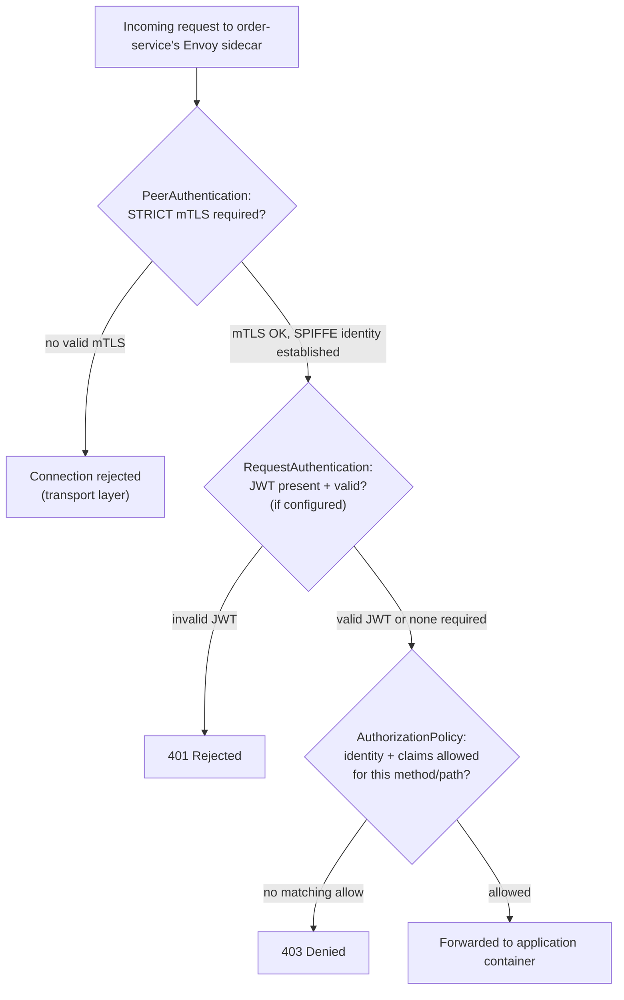

# Service Security and mTLS

## Definition

Istio's security layer has three independent building blocks that are frequently conflated but answer different questions: **PeerAuthentication** ("does this connection have to be mTLS?"), **AuthorizationPolicy** ("is this identity allowed to do this?"), and **RequestAuthentication** ("is this JWT valid, and who does it say the end user is?"). All three build on the SPIFFE workload identity introduced in `01-service-mesh-fundamentals.md`.

## mTLS and PeerAuthentication

Istiod's built-in CA (the historical "Citadel" function, `02-istio-architecture.md`) issues each workload a short-lived X.509 certificate encoding its SPIFFE identity, delivered to Envoy over SDS (not mounted as a file) and rotated automatically before expiry. `PeerAuthentication` controls whether a workload's inbound listener *requires* mTLS:

- `policies/peerauthentication/permissive.yaml` — accepts both mTLS and plaintext inbound. This is Istio's default and the safe starting mode for a mesh with workloads still being onboarded (a plaintext caller isn't rejected while sidecars are still rolling out).
- `policies/peerauthentication/strict.yaml` — rejects any non-mTLS inbound connection. This is the production-target mode; `tests/mtls-test.sh` verifies both that an in-mesh client succeeds and that a plaintext (non-mesh) client is correctly rejected under strict mode.

mTLS here authenticates **workload identity**, not the end user — a request end-to-end through five hops proves each hop is a trusted workload, not who the original human or client application was. That's what RequestAuthentication (JWT) is for.

## AuthorizationPolicy: default-deny plus explicit allow

`policies/authorization/namespace-default-deny.yaml` establishes a default-deny posture for `istio-demo` (an empty-selector, empty-rules `AuthorizationPolicy` denies everything not explicitly allowed elsewhere in that namespace). Explicit allow policies then open exactly the paths the demo app needs:

- `allow-frontend-to-order.yaml` — permits the `frontend` ServiceAccount's SPIFFE identity to call `order-service`.
- `allow-order-to-downstream.yaml` — permits `order-service`'s identity to call `inventory-service` and `payment-service`.
- `method-path-restriction.yaml` — further restricts one of those allows to a specific HTTP method/path combination, demonstrating that authorization can be far more granular than "can talk to this service at all."

Because policy is matched against the caller's **SPIFFE identity** (`spiffe://cluster.local/ns/istio-demo/sa/frontend`, derived from its ServiceAccount), this is enforced even between two pods on the same node, same namespace — it is not IP-based and not spoofable by an application claiming a different name, because the identity comes from the mTLS certificate Istiod issued, not from anything the caller asserts. `tests/authorization-test.sh` proves both an outright wrong identity and a different-but-still-in-mesh identity (`test-client`) are correctly denied.

## RequestAuthentication: JWT, end-user identity

`policies/requestauthentication/jwt-requestauth.yaml.tpl` is a template (`.tpl`, rendered at test/lab time by substituting an inline JWKS — deliberately **not** `jwksUri`, to avoid a runtime dependency on a remote identity provider this lab doesn't control). `RequestAuthentication` alone only *validates* a JWT if one is present; pairing it with an `AuthorizationPolicy` `when` clause requiring `request.auth.claims` is what actually *requires* a valid token — this two-resource pairing is a common point of confusion (`14-troubleshooting.md`) since `RequestAuthentication` by itself does not reject unauthenticated requests, only invalid ones.

## Layering: how these three interact on one request

Transport-level identity (mTLS/SPIFFE) is established first; JWT validation and authorization are both layered on top of that already-authenticated transport, not a replacement for it.

## Failure modes

- Deploying `RequestAuthentication` alone and assuming it blocks unauthenticated callers — it doesn't; only an accompanying `AuthorizationPolicy` `when` clause on `request.auth.claims` actually enforces "a valid JWT is required."
- Switching a namespace straight to `STRICT` mTLS before every workload has a sidecar — any not-yet-injected pod's plaintext traffic is then rejected outright; this lab's `permissive.yaml` documents the safe migration starting point.
- Assuming `AuthorizationPolicy` is IP- or namespace-based — it's SPIFFE-identity-based; two pods in the same namespace with different ServiceAccounts have different, independently-authorizable identities.

## Production considerations

The default-deny-plus-explicit-allow posture (`namespace-default-deny.yaml`) is the pattern this lab recommends for production namespaces generally (`11-production-design.md`) — an allow-list is auditable ("what's the complete list of who can call this service") in a way an implicit-allow, deny-list posture is not. JWT validation with inline JWKS (this lab) trades operational simplicity for a real production gap — production systems should use `jwksUri` against a real IdP with key rotation, which this lab documents but doesn't implement, to avoid depending on external network reachability during labs.

## Interview-level explanation

*"Walk me through how Istio authenticates and authorizes a service-to-service call."* — Two independent layers. First, transport-level: mTLS (governed by `PeerAuthentication`) authenticates that the calling **workload** is who its certificate — issued by Istiod's CA, encoding a SPIFFE identity derived from its Kubernetes ServiceAccount — says it is; this is unspoofable because the identity comes from the certificate, not from anything the caller claims in the request itself. Second, on top of that already-authenticated identity, `AuthorizationPolicy` decides whether that specific identity is allowed to make this specific call (optionally narrowed further by method/path, or by end-user claims from a validated JWT via `RequestAuthentication`). The two together mean authorization decisions are based on cryptographically verified identity, not network location — a fundamentally different trust model than "this request came from inside the cluster, so it's trusted."
