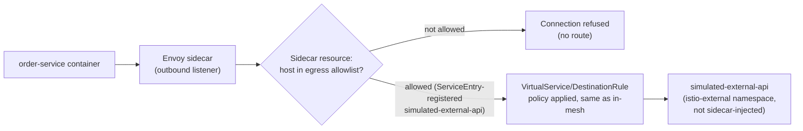

# Egress and ServiceEntry

## Definition

**Egress** is traffic leaving the mesh toward a destination Istiod's service registry doesn't already know about (`01-service-mesh-fundamentals.md`'s "service registry"). By default, a sidecar's outbound listener only has routing configuration for services Istiod knows about — Kubernetes Services plus anything registered via `ServiceEntry`. A `ServiceEntry` is how you add an external (or, as in this lab, simulated-external) host to that registry so sidecars can apply the same routing/policy/observability machinery to it that they apply to in-mesh services.

## Why this lab simulates the external service instead of using a real one

`demo/egress/simulated-external-service.yaml` deploys a `traefik/whoami` instance into its own `istio-external` namespace — deliberately **not** labeled for sidecar injection, so it behaves like a genuine outside-the-mesh endpoint from the mesh's perspective, while remaining entirely inside this cluster. Root `docs/DECISIONS.md` records this as a deliberate choice: a lab depending on a real public URL's uptime and rate limits would make `tests/egress-test.sh` flaky for reasons that have nothing to do with whether the learner configured Istio correctly.

## ServiceEntry: registering the destination

`demo/egress/serviceentry.yaml` registers `simulated-external-api.istio-external.svc.cluster.local` (a real in-cluster DNS name, standing in for what would otherwise be a real external FQDN) as a `ServiceEntry`, specifying its port/protocol and resolution mode. Once registered, this host is now a first-class entry in Istiod's service registry — meaning `VirtualService`/`DestinationRule` policy, retries, and observability all apply to it exactly like an in-mesh Kubernetes Service, which is the actual point of using `ServiceEntry` instead of just letting raw passthrough egress happen unmanaged.

## Sidecar egress scoping ties directly into this

`policies/sidecar/namespace-scoped-sidecar.yaml` (introduced in `05-traffic-management.md`) is what actually **restricts** `istio-demo` proxies to only the registered/allowed egress hosts — `istio-demo/*`, `istio-system/*`, `kube-system/*` (DNS), and the specific `istio-external` simulated host. Without both the `ServiceEntry` (registering the destination) and the `Sidecar` resource explicitly allowing egress to it, a call to an unregistered external host from a scoped namespace fails closed — this is the intended, auditable posture: **egress is default-deny by explicit scope, with named exceptions**, not default-allow-everything-external.

## What "default Istio behavior" actually is here, precisely

Istio's own default outbound traffic policy (`meshConfig.outboundTrafficPolicy.mode`, not overridden by this lab, so it keeps Istio's `ALLOW_ANY` default) would, on its own, let sidecars **passthrough** to arbitrary external hosts not registered via `ServiceEntry` — just without any Istio-layer policy/observability applied to that traffic. This lab's `Sidecar` resource scoping is what actually closes that gap for `istio-demo`, converting effectively-open egress into an explicit allowlist. This distinction — `ALLOW_ANY` passthrough vs. `REGISTRY_ONLY` vs. `Sidecar`-scoped allowlisting — is exactly the kind of nuance `tests/egress-test.sh` and `labs/lab-13-egress-control.md` are built to make concrete rather than theoretical.

## Egress request flow

## Failure modes

- Registering a `ServiceEntry` but forgetting to also add the host to the namespace's `Sidecar` resource egress list (if one exists) — the `ServiceEntry` alone doesn't override a `Sidecar` resource's scoping; both need to agree.
- Assuming egress is blocked by default mesh-wide — it isn't (`ALLOW_ANY` is Istio's actual default); this lab's apparent "default-deny" egress behavior for `istio-demo` comes specifically from its `Sidecar` resource, not from any mesh-wide Istio default.
- Testing egress against a real public endpoint and attributing a transient network/rate-limit failure to a mesh misconfiguration — exactly what simulating the external service in-cluster avoids.

## Production considerations

Production meshes handling sensitive egress (compliance-relevant external calls, cost-tracked third-party API usage) typically set `meshConfig.outboundTrafficPolicy.mode: REGISTRY_ONLY` mesh-wide rather than relying on a per-namespace `Sidecar` resource — a stronger, harder-to-accidentally-bypass posture this lab documents but doesn't set globally, to avoid mesh-wide side effects outside `istio-demo` during a lab exercise. An egress **gateway** (a dedicated Envoy Deployment for centralizing and monitoring all outbound mesh traffic, distinct from the ingress gateway) is the further production step beyond `ServiceEntry`/`Sidecar` scoping alone — introduced in `02-istio-architecture.md` as available but not deployed in this phase.

## Interview-level explanation

*"How do you control what external services a mesh workload is allowed to call?"* — Three layers, and it matters which one is actually doing the enforcing: Istio's default outbound policy (`ALLOW_ANY`) permits passthrough to anything unregistered, just without mesh policy applied to it; a `ServiceEntry` explicitly registers an external host into the service registry so `VirtualService`/`DestinationRule` policy and observability apply to it like any in-mesh service; and a `Sidecar` resource's egress host scoping is what actually converts a namespace's proxies from "can reach anything" to an explicit allowlist. Getting real default-deny egress requires either that `Sidecar`-level scoping per namespace, or a mesh-wide `REGISTRY_ONLY` outbound traffic policy — not just adding a `ServiceEntry`, which by itself only adds routing information, not a restriction.
