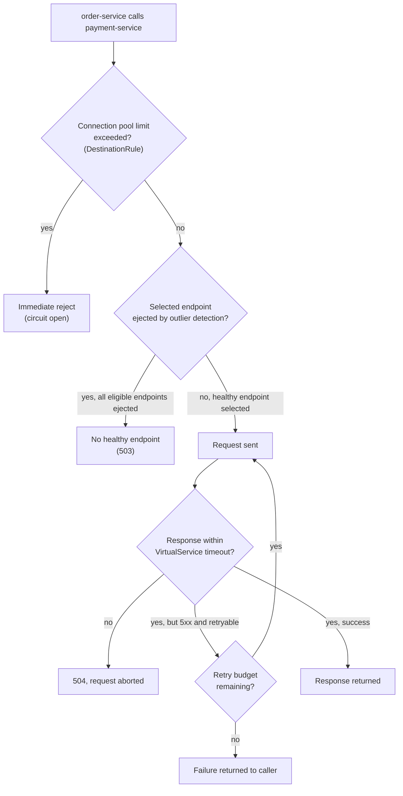

# Resilience Patterns

## Definition

Istio implements four distinct resilience mechanisms, each solving a different failure scenario, each configured in a different place: **retries** and **timeouts** (both `VirtualService`), **fault injection** (`VirtualService`, for deliberately testing resilience), and **circuit breaking** via connection-pool limits plus **outlier detection** (both `DestinationRule`). Confusing which resource owns which is a common source of "I set this and nothing happened."

## Retries and timeouts (`VirtualService`)

`demo/resilience/virtualservice-retries-timeouts.yaml` sets a per-route `retries` block (attempt count, per-try timeout, and a `retryOn` condition — e.g., `5xx,reset,connect-failure`) and a route-level `timeout` (the absolute ceiling for the whole request including all retry attempts). These interact: a 3-attempt retry policy with a 1s per-try timeout inside a 2s overall route timeout means the second retry attempt might not get its full 1s before the overall timeout cuts everything off — `tests/retry-timeout-test.sh` is built around exactly this interaction (a fault-injected delay long enough to trigger the route timeout, verified by observing a `504` arriving at the timeout boundary, not the delay's full duration).

## Fault injection (`VirtualService`): breaking things on purpose

`demo/resilience/virtualservice-fault-delay.yaml` and `-fault-abort.yaml` inject synthetic failures — a delay before forwarding, or an immediate abort with a chosen HTTP status — at a configurable percentage of requests, entirely inside Envoy, without touching application code or the (unmodified) `traefik/whoami` backend. This is how this lab exercises retries/timeouts/circuit-breaking realistically without needing an application that can actually fail on demand (`../PROJECT-IMPLEMENTATION-PLAN.md`'s demo-app design decision, also noted in root `docs/DECISIONS.md`). `tests/fault-injection-test.sh` verifies the abort rate lands within statistical tolerance of the configured percentage — again probabilistic, not exact-count, verification.

## Circuit breaking: connection pools + outlier detection (`DestinationRule`)

Two distinct settings, commonly conflated as "the circuit breaker" but mechanically different:

- **Connection pool limits** (`trafficPolicy.connectionPool` in `demo/traffic/destinationrule-order-service.yaml`) — a hard ceiling on concurrent connections/requests/pending-requests to a destination. Exceeding it causes Envoy to reject *new* requests outright (an overflow, not a graceful queue) — this is the classic "circuit breaker" behavior: protecting a struggling backend from being driven further into overload by continuing to pile on more concurrent work.
- **Outlier detection** (`trafficPolicy.outlierDetection`, same file) — passive health tracking per endpoint: if a specific backend endpoint returns consecutive errors, Envoy **ejects it** from the load-balancing pool for a configured interval, then allows it back in for re-evaluation. This is closer to what "circuit breaker" means in the classic Hystrix sense — automatically routing around a specific failing instance, not the whole service.

`tests/circuit-breaking-test.sh` drives concurrent load past the configured connection-pool limit and expects to observe overflow rejections (5xx from Envoy itself, not from the backend) — a `[WARN]` (no overflow observed) is explicitly documented as possible and non-fatal on fast backends/small load, because `whoami` responds fast enough that a small test load may not actually saturate the pool.

## Where each policy lives, and why that matters for debugging

| Behavior | Resource | Applies at |
| --- | --- | --- |
| Retries, timeouts, fault injection | `VirtualService` | The *calling* sidecar's outbound route config (RDS) |
| Connection pool, outlier detection | `DestinationRule` | The *calling* sidecar's cluster config (CDS), evaluated per-destination-cluster |

Both are evaluated by the **calling** sidecar, not the receiving one — resilience policy is a property of how a client calls a destination, not something the destination enforces on itself. This is why `istioctl proxy-config clusters <calling-pod>` (not the destination pod) is where you'd look to confirm a `DestinationRule`'s circuit-breaker settings actually reached the relevant proxy (`10-configuration-analysis.md`).

## Resilience decision flow for one request

## Failure modes

- Setting retries in a `VirtualService` and outlier detection in a `DestinationRule` and expecting them to obviously compose without checking the interaction — a retry can hit the same already-ejected endpoint if the load-balancing pool is small enough, worth tracing via `proxy-config` rather than assumed.
- Testing circuit breaking with a request volume too small to exceed the connection-pool limit and concluding it "doesn't work" — see `tests/circuit-breaking-test.sh`'s own documented `[WARN]` case.
- Confusing a route `timeout` with a per-try retry timeout — a route timeout is the absolute ceiling across all attempts; a per-try timeout only bounds one attempt.

## Production considerations

Retry storms are a real production risk this lab's `retries` config deliberately bounds (a fixed attempt count and `retryOn` condition, not unbounded retry-on-anything) — retrying every failure indefinitely can amplify an already-struggling backend's load rather than protecting it, which is precisely what connection-pool limits and outlier detection exist to prevent at the *caller* side even if retry policy is misconfigured. `11-production-design.md` and `12-performance-and-capacity.md` cover tuning these values for real traffic patterns rather than this lab's illustrative defaults.

## Interview-level explanation

*"Where do resilience settings live in Istio, and why does that matter?"* — `VirtualService` owns request-shaped policy (retries, timeouts, fault injection) because those are routing-time decisions about *this specific request*; `DestinationRule` owns connection-shaped policy (pool limits, outlier detection) because those are properties of *how this caller talks to this destination cluster* over time, independent of any single request. Both are evaluated by the calling sidecar, not the destination — which is why debugging a "circuit breaker isn't tripping" issue means inspecting the caller's Envoy config (`istioctl proxy-config clusters`), not the destination's.
