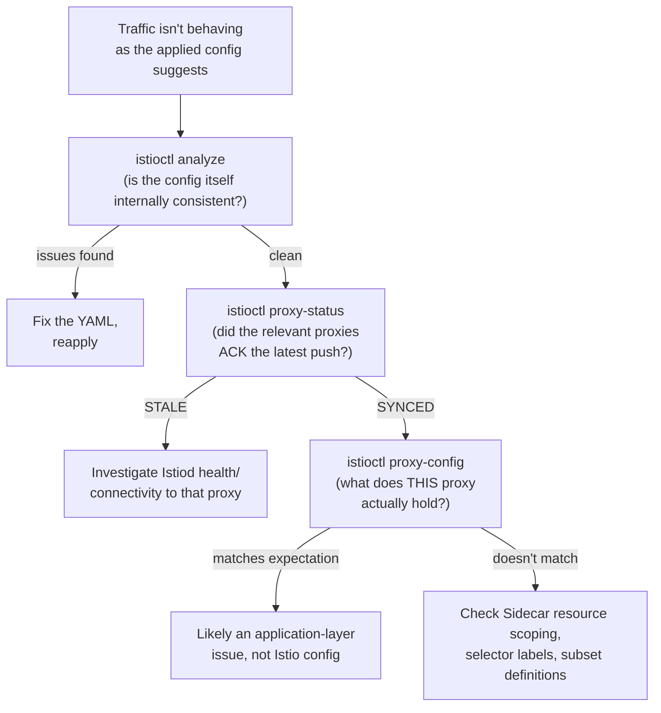

# Configuration Analysis

## Definition

Istio ships built-in tooling for answering two different questions: "is my configuration valid/sane before I apply it" (`istioctl analyze`) and "what did the control plane actually compute and push to a live proxy" (`istioctl proxy-status`/`proxy-config`). This lab treats both as first-class, required steps — not optional debugging tools reached for only when something's already broken.

## `istioctl analyze`: static, pre-apply checks

`istioctl analyze` inspects manifests (either live-cluster resources, or local files/directories via `--use-kube=false` for a cluster-free check) against a large built-in ruleset — unknown subset references, missing `Sidecar`/`Gateway` targets, conflicting hosts across `VirtualService`s, deprecated field usage, and dozens more. `tests/static-validation.sh` step 4 runs `istioctl analyze --use-kube=false` against every manifest this lab produces as part of static validation — genuinely running the tool, not just YAML-schema-checking it, which is the same "real tool execution catches things static review misses" lesson recorded from Phase 2/3 of this repository.

## `istioctl proxy-status`: mesh-wide sync state

Introduced in `02-istio-architecture.md`'s xDS discussion: every proxy's connection to Istiod either has the latest pushed config ACKed (`SYNCED`) or doesn't (`STALE`/`NOT SENT`/`STATE UNKNOWN`). This is the first command to run when "I applied a change and nothing happened" — before assuming the `VirtualService` itself is wrong, confirm the relevant proxies actually received and accepted it.

## `istioctl proxy-config`: what one proxy actually holds

`istioctl proxy-config {listeners,clusters,routes,endpoints,secret} <pod> -n <namespace>` — the ground-truth dump for a single Envoy, referenced throughout `03-envoy-and-sidecar-internals.md` and `09-resilience-patterns.md`. The critical habit this teaches: **the YAML you applied is your intent; `proxy-config` is what's actually enforced.** They can diverge (a `STALE` push, a `Sidecar` resource scoping a proxy away from a cluster you expected it to have, a typo in a selector that matched zero pods).

## `istioctl validate` vs `analyze`

`istioctl validate` runs the same admission-webhook-style schema validation Kubernetes itself would apply on `kubectl apply` (structural/schema correctness) — narrower than `analyze`, which additionally reasons about cross-resource semantic consistency (a subset that exists in one resource but not another, conflicting Gateway hosts, etc.). This lab's `tests/static-validation.sh` uses `analyze` as the primary check specifically because schema-only validation would miss the cross-resource issues that are the actual common real-world mistakes documented throughout `05`–`09`.

## Debugging workflow this lab teaches

`labs/lab-18-debugging-xds.md` walks this exact flow against a deliberately-introduced misconfiguration.

## Failure modes

- Debugging by re-reading the applied YAML repeatedly instead of checking what the proxy actually received — the YAML is intent, not ground truth once a push might have gone stale.
- Running `istioctl analyze` against a live cluster when you meant to check local files before applying (or vice versa) — `--use-kube=false` and an explicit path/context matter; this lab's static validation always runs the cluster-free form.
- Treating a clean `analyze` result as proof traffic is behaving correctly — `analyze` only checks configuration consistency, not runtime behavior; `proxy-status`/`proxy-config` (or the actual `tests/*-test.sh` runtime scripts) are what confirm real behavior.

## Production considerations

Running `istioctl analyze` in CI against every Istio manifest change, before merge, is a low-cost, high-value gate this lab's `make test-static` mirrors — catching cross-resource misconfigurations (a classic source of production incidents: a `VirtualService` referencing a subset a since-modified `DestinationRule` no longer defines) before they ever reach a cluster.

## Interview-level explanation

*"A VirtualService change you applied doesn't seem to be taking effect. Walk me through how you'd debug it."* — Three steps, in order: first, `istioctl analyze` to rule out a configuration-consistency problem (wrong subset reference, conflicting hosts, etc.) — cheap and catches a large fraction of real mistakes immediately. Second, if the config itself analyzes clean, `istioctl proxy-status` to confirm the relevant proxies actually received and ACKed the latest push rather than being `STALE`. Third, `istioctl proxy-config routes/clusters` against the specific proxy in question to see exactly what it currently holds — if that matches what you expect but behavior is still wrong, the issue is very likely in the application itself, not Istio's configuration at all.
