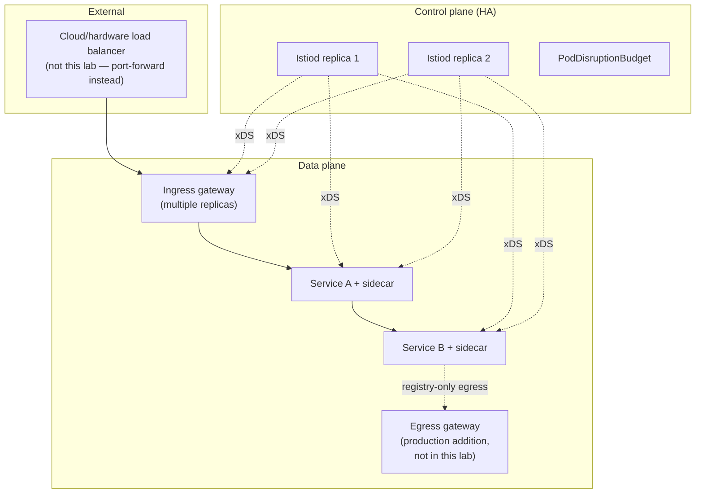

# Production Design

This document consolidates production-readiness considerations referenced throughout `01`–`10` into one place, and states plainly what this lab implements versus what it only documents.

## Control-plane availability

Istiod is a single coordination point (`02-istio-architecture.md`) — its own availability determines both how quickly config changes propagate (`10-configuration-analysis.md`'s `SYNCED`/`STALE`) and whether new workloads can even start (they need a cert from Istiod's CA function before mTLS can complete). `install/istiod-values-recommended.yaml` sets `replicaCount: 2` plus a `PodDisruptionBudget` and anti-affinity — this lab's minimum production-shape gesture — while `install/istiod-values-minimum.yaml` (single replica) is explicitly the lab/dev profile, not a production recommendation. Real production Istiod sizing also accounts for the number of proxies it serves and config-push fan-out cost, which scales with mesh size, not covered quantitatively here — see `12-performance-and-capacity.md`.

## Resource sizing for sidecars

Every injected Envoy sidecar consumes real CPU/memory on the node it runs on — this lab's `LAB_PROFILE` (`minimum`/`recommended`, `config/lab-settings.env`) controls sidecar injection resource requests/limits accordingly. At production scale, under-provisioned sidecar resources are a common, easy-to-miss source of tail latency, since a CPU-starved Envoy adds proxy-hop latency on every single request, not just occasionally.

## Namespace and Sidecar-resource scoping

`policies/sidecar/namespace-scoped-sidecar.yaml` (`05-traffic-management.md`) is this lab's concrete implementation of the general production pattern: unscoped sidecars hold config for every service in the mesh, which is real memory and config-push-latency cost that grows with mesh size, independent of how much traffic that namespace's workloads actually generate.

## Default-deny security posture

`policies/authorization/namespace-default-deny.yaml` plus `PeerAuthentication` strict mode (`06-service-security-and-mtls.md`) is the production-recommended starting posture this lab implements for `istio-demo` — explicit allow-lists are auditable in a way implicit-allow is not. The JWT/RequestAuthentication inline-JWKS approach, by contrast, is explicitly a lab simplification (documented, not production-recommended) to avoid a live IdP dependency.

## Egress control

`REGISTRY_ONLY` mesh-wide outbound policy (`08-egress-and-serviceentry.md`) is named as the stronger production posture; this lab uses the weaker but still real per-namespace `Sidecar`-scoping instead, to avoid mesh-wide side effects during a lab exercise. An egress gateway is the further production step, documented as available but not deployed.

## Revision-based upgrades

This lab installs a single, **named** revision (`stable-1-30`, not the unnamed default) specifically so a future canary-style control-plane upgrade is structurally possible without relabeling every namespace from scratch — root `docs/DECISIONS.md` ADR-024, detailed in `13-upgrades-and-disaster-recovery.md`. This is upgrade-readiness, not an upgrade itself — only one revision is ever installed in this phase.

## What this lab does NOT implement, by design, and why

| Not implemented here | Where it's documented | Why not now |
| --- | --- | --- |
| Ambient mode | `16-future-ambient-mode.md` | Explicitly out of scope for this phase — sidecar mode only |
| Egress gateway | `08-egress-and-serviceentry.md` | `Sidecar`-scoping sufficient for this lab's single simulated external host |
| Mesh-wide `REGISTRY_ONLY` | `08-egress-and-serviceentry.md` | Avoids mesh-wide side effects outside `istio-demo` |
| Kiali/Prometheus/Grafana/Jaeger/Loki | root README, this module's own README | Reserved for Phase 5 — explicitly prohibited from this phase |
| Multi-cluster mesh | not covered | Out of scope — this repo is a single-cluster homelab |
| Real JWKS/IdP integration | `06-service-security-and-mtls.md` | Avoids a live external dependency during labs |

## Production topology at a glance

## Failure modes

- Treating this lab's `minimum`/`recommended` profiles as production-sized — they're calibrated for a 3-node Vagrant homelab cluster, not real production traffic.
- Assuming "the lab implements strict mTLS and default-deny AuthorizationPolicy" means the lab is production-ready wholesale — several other axes (egress posture, JWT/IdP integration, HA sizing depth) are deliberately simplified and documented as such.

## Production considerations

This entire document *is* the production-considerations reference other docs point back to — the recurring theme is: this lab implements the pattern at small scale and explains, explicitly, what changes at production scale rather than silently pretending the lab defaults are production defaults.

## Interview-level explanation

*"What would you change about this lab's Istio setup before running it in production?"* — Several concrete things, each already flagged in this lab rather than discovered later: bump Istiod to at least the `recommended` HA profile and account for real mesh-size config-push cost; move from per-namespace `Sidecar` egress scoping to mesh-wide `REGISTRY_ONLY` plus a real egress gateway; replace inline-JWKS `RequestAuthentication` with a real IdP's `jwksUri`; and revisit sidecar resource requests against actual measured production traffic rather than lab defaults. None of these are surprises — they're the explicit gap list between "a working teaching lab" and "a production mesh," which is the whole point of stating it plainly rather than letting a learner assume the lab defaults are already production-grade.
