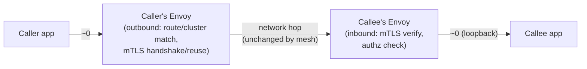

# Performance and Capacity

## Definition

Adding a sidecar to every workload is not free — every request now crosses at least two additional Envoy hops (caller's outbound, callee's inbound) versus direct pod-to-pod traffic. This document covers where that cost actually comes from, how to reason about it, and what this lab does (and doesn't) do to keep it manageable at its own small scale.

## Where the cost actually comes from

- **Per-hop latency** — each Envoy hop adds processing time: TLS handshake/reuse overhead (amortized via connection pooling, `09-resilience-patterns.md`), route/cluster matching, and the proxy's own scheduling latency under load. Two sidecar hops (caller-out, callee-in) is the typical east-west cost per call, not per network round-trip — Envoy-to-Envoy is usually a loopback-speed connection, not a new network path.
- **Sidecar resource consumption** — CPU/memory requests on every single pod, multiplied by however many pods exist; `11-production-design.md`'s `LAB_PROFILE` distinction (`minimum` vs `recommended` injection resource requests) is this lab's lever for this.
- **Control-plane push cost** — every config change (a new `VirtualService`, a scaling event changing endpoints) means Istiod recomputes and pushes updated xDS state to every affected proxy; this scales with **mesh size** (number of proxies × amount of config each holds), which is exactly why `Sidecar`-resource scoping (`05-traffic-management.md`) matters more as a mesh grows — fewer hosts per proxy means smaller, faster pushes.
- **mTLS overhead** — TLS handshake cost is mitigated by Envoy's connection pooling/reuse (`DestinationRule` `connectionPool` settings, `09-resilience-patterns.md`) — a cold connection pays the handshake cost once, not per request.

## What this lab measures vs. what it doesn't

This lab does **not** include a load-testing/benchmarking harness — that's explicitly out of scope for a hands-on conceptual lab on a 3-node homelab cluster with no representative production traffic pattern to benchmark against. What it does provide: `LAB_PROFILE`-based resource sizing you can inspect and adjust (`config/lab-settings.env`), and pointers to the real tools (`istioctl proxy-config`, Envoy's own `/stats` endpoint on `15090`, referenced from `03-envoy-and-sidecar-internals.md`) that a real capacity exercise would use.

## Where added latency shows up

The two boxes with real added cost are both Envoy hops — the actual network hop between pods is unchanged by adding a mesh; the mesh adds proxy-processing time at each end, not additional network latency itself.

## Failure modes

- Attributing all added latency to "the mesh is slow" without isolating whether it's proxy CPU starvation (under-provisioned sidecar resources), cold connection pools (no reuse happening), or genuine per-hop processing cost — these have different fixes.
- Sizing Istiod for today's mesh and not re-checking as the mesh grows — config-push cost scales with mesh size, not a fixed cost decided once at install time.
- Assuming `Sidecar`-resource scoping is purely a security feature (`05-traffic-management.md`'s framing) and missing that it's also a direct performance lever — fewer known hosts per proxy is strictly less config to compute and push.

## Production considerations

Real capacity planning for a mesh means load-testing with production-representative traffic and measuring p50/p99 added latency per hop, sidecar CPU under real load, and Istiod push latency at real mesh size — none of which a 4-service homelab demo can meaningfully represent. This document intentionally states the *mechanisms* of cost rather than fabricating benchmark numbers this lab never actually measured.

## Interview-level explanation

*"What's the performance cost of adding Istio to a service, and how would you reason about it?"* — Two added Envoy hops per east-west call (caller-outbound, callee-inbound), each contributing proxy-processing latency — mTLS handshake cost (amortized by connection reuse), route/cluster matching, and authorization checks — rather than additional network latency, since the underlying pod-to-pod network path doesn't change. At the control-plane level, cost scales with mesh size: more proxies and more config per proxy means larger, more frequent xDS pushes from Istiod. The concrete levers are sidecar resource sizing, connection-pool reuse, and `Sidecar`-resource scoping to reduce config size per proxy — and the only way to size any of that correctly is measuring against real traffic, not assuming lab-scale numbers generalize.
