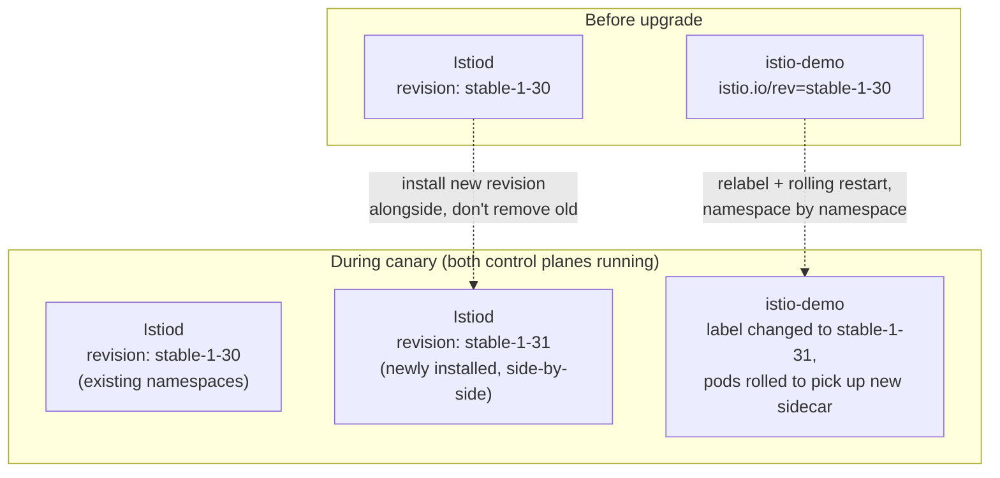

# Upgrades and Disaster Recovery

## Definition

Two distinct operational concerns: **upgrading** the control plane/data plane without a traffic-affecting outage, and **recovering** a mesh's configuration/certificates after a loss event. This lab is structured to be upgrade-*ready* (root `docs/DECISIONS.md` ADR-024) without performing an actual upgrade — only one revision is installed.

## Why this lab installs a named revision

`config/lab-settings.env`'s `ISTIO_REVISION="stable-1-30"` is used throughout install (`scripts/install.sh`) instead of Istio's unnamed/default revision. This single choice is what makes a future canary upgrade possible without a disruptive one-shot cutover: a second Istiod (e.g., revision `stable-1-31`) could be installed **alongside** the existing one, and individual namespaces migrated one at a time (by changing their `istio.io/rev` label and rolling their pods) while both control planes run concurrently. An unnamed/default-revision install doesn't support this — there's only ever one control plane, and upgrading it means upgrading it for every namespace simultaneously.

## Canary control-plane upgrade flow (documented, not performed in this phase)

This lab does not install a second revision or perform this migration — it only ensures the install is *structured* so this path is available later, which is the entirety of what ADR-024 claims.

## Certificate rotation

Istiod's built-in CA (`06-service-security-and-mtls.md`) automatically rotates workload certificates well before expiry, with no manual intervention required in normal operation — this is standard Istio behavior, not something this lab configures specially. The root CA itself (self-signed, Istiod-generated by default in this lab's install, versus an external CA integration) is a longer-lived trust anchor; rotating *that* is a much rarer, higher-stakes operation this lab doesn't exercise, since it wasn't asked for and would require careful sequencing across every workload's trust bundle — out of scope, noted here as a real production concern rather than silently ignored.

## Disaster recovery scope for this lab

Istio's own state (control-plane config, certificates) is entirely derived from Kubernetes CRDs and Istiod's in-memory CA state — there's no separate persistent datastore for Istio itself to back up in this lab's configuration. Recovering this module after a cluster-level disaster means: reinstalling Istio via `make install` (idempotent, values-file-driven) and reapplying the demo/policy manifests already tracked in this Git repository — nothing here depends on runtime-generated state that isn't reproducible from the checked-in YAML plus the pinned `config/versions.env`. This is a meaningfully different (simpler) DR story than a stateful system, worth stating explicitly rather than leaving implied.

## Failure modes

- Assuming an unnamed/default-revision Istio install supports the same canary-upgrade path a named revision does — it doesn't; migrating off a default-revision install to a named one is itself a bigger one-time migration, which is exactly why this lab starts with a named revision from day one.
- Treating certificate rotation as something requiring manual scheduling — normal workload-certificate rotation is automatic; only root-CA rotation is the rare, manual, high-stakes case.
- Forgetting that a canary control-plane migration is per-namespace and requires a rolling restart of that namespace's pods to actually pick up the new sidecar — relabeling a namespace alone doesn't move already-running pods to the new revision.

## Production considerations

A real production canary upgrade would additionally need: monitoring both control-plane revisions' health during the overlap window, a clear namespace-migration order (typically lowest-risk namespaces first), and a rollback plan (relabel back, roll pods back) if the new revision shows problems — none of which this lab needed to build since no actual upgrade is performed here, but all of which the named-revision structure this lab does implement makes possible later.

## Interview-level explanation

*"How would you upgrade Istio's control plane in production with zero downtime?"* — Canary control-plane upgrade: install the new Istiod version as a separate, named revision alongside the existing one (not replacing it), then migrate namespaces one at a time by changing their `istio.io/rev` label and rolling their pods to pick up the new sidecar — verifying health at each step before continuing. This only works if the *original* install already used a named revision rather than the unnamed default; an unnamed-revision mesh has to do a much bigger one-time migration first just to get into a canary-upgradeable state, which is why this lab's install uses a named revision (`stable-1-30`) from the very first install, even though only one revision is ever actually installed here.
