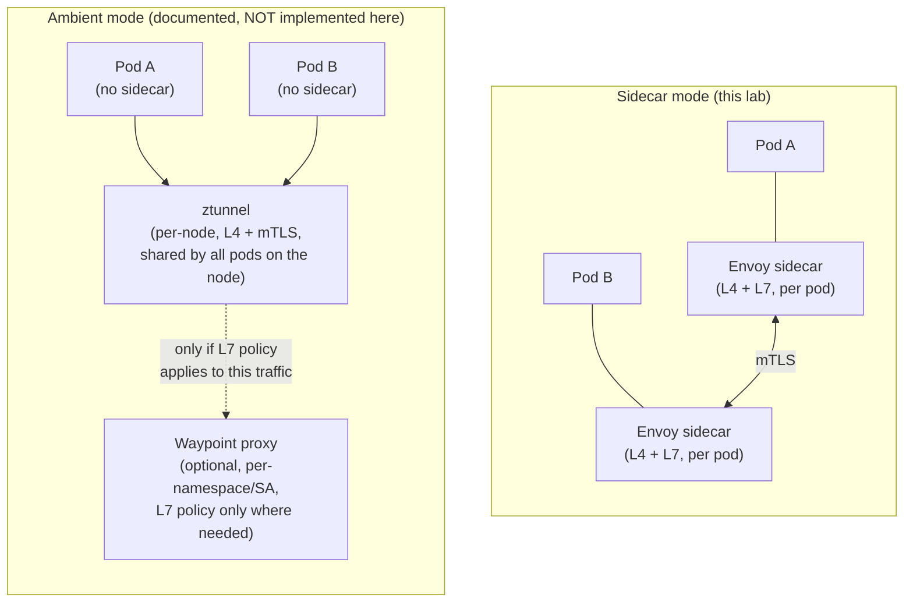

# Future Option: Ambient Mode

**Not implemented in this phase.** This document exists to give this lab's learner an accurate mental model of ambient mode as a documented future option, per this phase's explicit scope boundary — nothing in `istio/` installs, configures, or exercises ambient mode. Everything else in this lab (`01`–`15`, all 20 labs) uses **sidecar mode exclusively**.

## Definition

**Ambient mode** is an alternative Istio data-plane architecture that removes the per-pod sidecar entirely, replacing it with two node/namespace-level shared components: **ztunnel** (a per-node daemon handling L4/mTLS for all pods on that node) and, optionally, **waypoint proxies** (per-namespace or per-service-account Envoy deployments handling L7 policy only for workloads that need it).

## Why it exists: the problem sidecar mode has at scale

Sidecar mode (this lab's model) means every single pod gets its own Envoy — real per-pod resource cost (`12-performance-and-capacity.md`) and a proxy restart tied to pod lifecycle. Ambient mode's premise is that most workloads only need L4 mTLS/identity, not full L7 policy, and paying the L7 proxy cost per-pod is wasteful when it could be a shared, opt-in resource instead.

## Architectural difference from sidecar mode

| Aspect | Sidecar mode (this lab) | Ambient mode (documented only) |
| --- | --- | --- |
| L4 (mTLS, identity) | Per-pod Envoy sidecar | Per-node **ztunnel** daemon, shared across pods on that node |
| L7 (routing, fault injection, etc.) | Same per-pod Envoy sidecar | Optional per-namespace/service-account **waypoint proxy**, only for workloads that need L7 features |
| Traffic interception | Istio CNI plugin programs iptables in each pod's netns (`03-envoy-and-sidecar-internals.md`) | A different interception model (node-level, via the CNI layer redirecting to ztunnel) — mechanically distinct from this lab's per-pod iptables model |
| Injection | Per-pod, at pod-creation time | No per-pod injection step required for baseline L4 mTLS |
| Resource cost model | Scales with pod count | L4 scales with node count (not pod count); L7 only added where actually needed |

## What would have to change to adopt it in this repository later

- Cilium+CNI-chaining considerations (`04-istio-cni-and-cilium.md`) would need re-verification against ambient mode's own interception requirements — this lab's documented Cilium-chaining gap and remediation is specific to the sidecar-mode Istio CNI plugin and is not guaranteed to transfer unmodified.
- Every policy resource this lab uses (`PeerAuthentication`, `AuthorizationPolicy`, `Sidecar`) has documented ambient-mode equivalents/caveats upstream that would need to be re-validated against whatever Istio version is current at the time — not assumed identical to sidecar-mode behavior.
- This would be scoped as its own future phase, not a modification to this lab's existing sidecar-mode implementation — the two modes are different enough operationally that mixing them within one teaching module would confuse rather than clarify the concepts in `01`–`15`.

## Sidecar mode vs. ambient mode, side by side

## Failure modes (of the comparison itself, not a live ambient install)

- Assuming ambient mode is a drop-in replacement requiring no re-validation of existing sidecar-mode policy — several Istio resources have version-specific ambient-mode behavior differences that must be checked against the Istio version in use at adoption time, not assumed from this document, which is a conceptual overview, not an implementation reference.
- Assuming ambient mode eliminates the CNI-chaining consideration with Cilium entirely — it changes the shape of the problem, it doesn't remove cluster-CNI-compatibility as a concern.

## Production considerations

Ambient mode's main production appeal is reduced per-pod resource overhead and simpler sidecar-lifecycle-free pod restarts — genuinely relevant at large mesh scale. Whether it's the right choice for this repository's homelab-scale learning cluster is a separate question from whether it's architecturally superior in general; this document deliberately doesn't make that call, since this phase's own scope was sidecar mode only.

## Interview-level explanation

*"What's ambient mode, and why might someone choose it over sidecar mode?"* — Ambient mode removes the per-pod Envoy sidecar, splitting responsibilities into a per-node `ztunnel` daemon (handling baseline L4 mTLS/identity for every pod on that node) and optional per-namespace/service-account `waypoint` proxies (handling L7 policy only for workloads that actually need it). The appeal is resource efficiency at scale — most workloads only need L4 identity/mTLS, and paying a full L7 Envoy's resource cost per-pod for that is wasteful. The tradeoff is a genuinely different interception and policy-application model that isn't a drop-in swap — existing sidecar-mode policy resources and CNI-chaining assumptions need real re-validation against the specific Istio version at adoption time, which is exactly why this lab documents ambient mode conceptually without implementing it.
