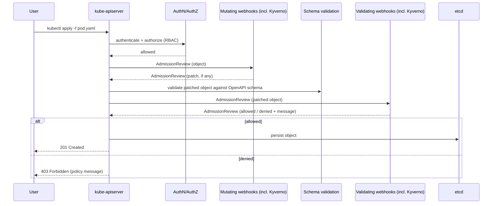

# Kyverno Fundamentals

## What problem is being solved

Every object your cluster admits — a Pod, a Deployment, a Service, even a Namespace — passes through Kubernetes' **admission control** chain before it's persisted to etcd. Without a policy engine, "don't run privileged containers" or "every Deployment needs an owner label" is enforced by convention, code review, and hope. Kyverno turns those conventions into code the API server itself enforces (or reports on) at admission time, and continuously re-checks against resources already in the cluster.

## Kubernetes admission control, from first principles

An API request (create/update/delete/connect) goes through, in order: authentication → authorization (RBAC) → **mutating admission webhooks** → object schema validation → **validating admission webhooks** → persistence to etcd. Kyverno registers itself as both kinds of webhook.

- **Mutating admission webhook**: can modify the object before it's persisted (add labels, inject a sidecar, set defaults). Runs first, so validating webhooks see the *mutated* object.
- **Validating admission webhook**: can only allow or deny — it cannot change the object. Runs after mutation.

The API server sends each webhook an **AdmissionReview** request (the object, the operation, the requesting user/groups, old/new object on updates) and expects an **AdmissionReview** response (`allowed: true/false`, optionally a `patch` for mutating webhooks, optionally a `status.message` explaining a denial). Kyverno's admission controller is the process that receives these requests and evaluates your policies against them — nothing in your cluster runs a policy engine "in-band"; it's always this webhook round-trip.

Fields that matter operationally on every Kyverno-managed webhook configuration:

| Field | What it controls | Kyverno's default posture |
| --- | --- | --- |
| `failurePolicy` | What happens if the webhook itself is unreachable/times out: `Fail` (block the request) or `Ignore` (admit it anyway) | `Fail` for validating webhooks in enforce mode by default — meaning a Kyverno outage can block *all* admission unless mitigated (see docs/11-production-design.md) |
| `matchPolicy` | `Exact` or `Equivalent` — whether the webhook also fires for older API versions of a resource that are equivalent to a newer one | `Equivalent` |
| `namespaceSelector` | Which namespaces the webhook even considers | Kyverno excludes its own namespace and select system namespaces by default (see config/namespaces.env) |
| `objectSelector` | Label-based filtering of the object itself, independent of policy `match`/`exclude` | Not set by default — Kyverno's own `match`/`exclude` blocks are the primary filtering mechanism instead |
| `timeoutSeconds` | How long the API server waits for a webhook response before treating it as a failure | Kyverno's chart default is a small number of seconds — expensive policies (many rules, slow `context` API calls) can hit this; see docs/13-performance-and-scaling.md |
| `sideEffects` | Whether the webhook has side effects outside the admission response (relevant for dry-run requests) | `None` — Kyverno's admission decisions are pure, which is what makes `kubectl apply --dry-run=server` safe against Kyverno-governed clusters |
| `reinvocationPolicy` | Whether a mutating webhook is re-invoked if a *later* mutating webhook changes the object again | `IfNeeded` — Kyverno mutation rules can see and react to mutations made by other webhooks running after them |

**Admission ordering** matters: webhooks within the same phase (all mutating, or all validating) run in an order the API server does not guarantee across different webhook *configurations* unless you control it explicitly. Within a single Kyverno `ClusterPolicy`, rules run top-to-bottom as written.

## Admission-time validation vs. background scanning

Admission control only ever sees objects *as they're being created or updated* — it says nothing about the thousands of objects already sitting in your cluster from before a policy existed, or objects created by a controller Kyverno's webhook never intercepted for some reason (a `failurePolicy: Ignore` outage window, for instance). Kyverno's **background controller** solves this separately: it periodically re-evaluates existing resources against your policies and writes the results to `PolicyReport`/`ClusterPolicyReport` objects, without touching the resources themselves for `validate` rules. See docs/03-admission-and-background-processing.md for the full mechanics and its important limitation for `mutate` rules specifically.

## Kubernetes admission request flow

Kyverno's admission controller participates as both a mutating and a validating webhook target in this same flow — there is no separate code path. This is why a Kyverno outage with `failurePolicy: Fail` stops *all* matching admission, not just policy-governed decisions: the API server is blocked waiting on (or failing over) that webhook call for every matching request.

## Common failures

- **Webhook timeout under load**: a policy with many rules, or a `context.apiCall`, pushes past `timeoutSeconds` — the API server treats this as a webhook failure, governed by `failurePolicy`.
- **`failurePolicy: Fail` + Kyverno down = cluster-wide admission outage** for anything matching the webhook's `rules`/`namespaceSelector` — mitigated by HA (docs/11-production-design.md), not by disabling `Fail` in production.
- **Assuming validate rules retroactively fix existing resources** — they don't; only background scanning *reports* on them (docs/03-admission-and-background-processing.md).

## Production considerations

Every one of the webhook fields in the table above is a real production lever, not a detail to ignore: `failurePolicy` is an availability-vs-security trade-off, `timeoutSeconds` is a latency budget you're spending on every matching request cluster-wide, and `namespaceSelector` is your first, cheapest line of defense against accidentally locking yourself out of `kube-system`.

## Interview-level explanation

*"Walk me through what happens when I `kubectl apply` a Pod in a cluster running Kyverno."* — The request hits the API server, passes auth/RBAC, then Kyverno's mutating webhook gets an AdmissionReview call (if any mutate policies match), returns a JSON patch, the API server merges it and validates against the OpenAPI schema, then Kyverno's validating webhook gets a second AdmissionReview call against the *mutated* object and returns allow/deny. If Kyverno is down and its webhook's `failurePolicy` is `Fail`, the whole request fails at whichever webhook call couldn't complete — this is exactly why Kyverno HA (docs/11-production-design.md) is a production requirement, not a nice-to-have, the moment you set enforce-mode policies with `Fail`.
