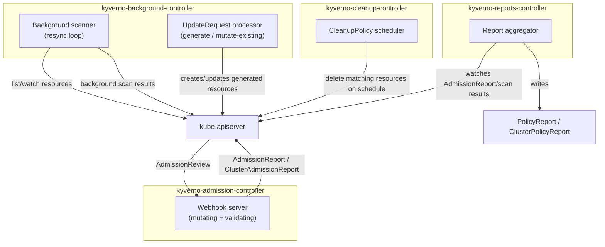

# Kyverno Architecture and Internals

Component and CRD names below are verified against the pinned chart (Kyverno Helm chart 3.8.2 / application v1.18.2 — see `../config/versions.env` and root `docs/VERSIONS.md`). Kyverno's chart has restructured its controller split more than once across major versions; this document describes the **current** (1.18-era) four-controller architecture, not an older or removed layout.

## The four controllers

| Controller | Deployment name (this chart) | Responsibility |
| --- | --- | --- |
| Admission controller | `kyverno-admission-controller` | Serves the mutating and validating admission webhooks — the only controller in the synchronous request path described in docs/01-kyverno-fundamentals.md |
| Background controller | `kyverno-background-controller` | Periodically re-evaluates existing resources (background scanning), and processes `generate`/some `mutate-existing` reconciliation via `UpdateRequest` objects |
| Cleanup controller | `kyverno-cleanup-controller` | Runs `CleanupPolicy`/`ClusterCleanupPolicy` on their configured schedule |
| Reports controller | `kyverno-reports-controller` | Aggregates `AdmissionReport`/`ClusterAdmissionReport`/background-scan results into the queryable `PolicyReport`/`ClusterPolicyReport` objects |

Splitting these into separate deployments (rather than one monolithic Kyverno process, which is how early Kyverno versions worked) means a slow background scan or a cleanup-policy bug cannot starve the admission controller of resources or restart it — they scale, fail, and get resource-limited independently. This is directly reflected in this lab's `install/values-recommended.yaml`: only `admissionController` gets 2 replicas + a PodDisruptionBudget, because it's the only one on synchronous request latency's critical path.

## Kyverno component architecture

Every controller talks to the API server independently — there is no direct controller-to-controller RPC. The reports controller, for example, doesn't ask the admission controller for results; it watches the `AdmissionReport`/`ClusterAdmissionReport` objects the admission controller already wrote to the API server, and rolls them up.

## Kyverno CRDs (current, kyverno.io/v1 and kyverno.io/v2)

| CRD | Scope | Purpose |
| --- | --- | --- |
| `ClusterPolicy` | Cluster | The primary policy object — deprecated in favor of the CEL-based types below but fully supported through 1.18, removal targeted v1.20 (see root `docs/DECISIONS.md` ADR-018) |
| `Policy` | Namespaced | Same schema as `ClusterPolicy`, scoped to one namespace |
| `PolicyException` | Namespaced | Narrow, targeted exemptions from specific rules of specific policies for specific resources — see docs/09-policy-exceptions.md |
| `CleanupPolicy` | Namespaced | Scheduled deletion of matching resources within one namespace |
| `ClusterCleanupPolicy` | Cluster | Same, cluster-wide — this lab never uses this one (see docs/DECISIONS.md ADR-016 on scoping) |
| `AdmissionReport` | Namespaced | Raw per-admission-event result, written by the admission controller, consumed by the reports controller |
| `ClusterAdmissionReport` | Cluster | Same, for cluster-scoped resources |
| `PolicyReport` | Namespaced | Human/tool-queryable rollup of results for one namespace (a Kubernetes community CRD, `wgpolicyk8s.io`, that Kyverno populates — not a Kyverno-invented type) |
| `ClusterPolicyReport` | Cluster | Same, cluster-scoped |
| `UpdateRequest` | Namespaced | Internal queue object the background controller uses to reconcile `generate` and mutate-existing rules — you'll see these appear and disappear; they are not meant to be hand-edited |
| `ValidatingPolicy`, `ImageValidatingPolicy`, `GeneratingPolicy`, `DeletingPolicy`, ... | Cluster/Namespaced | The newer CEL-based policy types, GA since Kyverno 1.17 — the forward migration path from `ClusterPolicy`/`Policy`, not used as this lab's primary teaching API (ADR-018), but real and current |

## Webhook configurations, ConfigMaps, RBAC

Kyverno's admission controller registers `ValidatingWebhookConfiguration` and `MutatingWebhookConfiguration` objects named with a `kyverno-` prefix (exact names are chart-generated and can shift across versions — always confirm with `kubectl get validatingwebhookconfigurations,mutatingwebhookconfigurations | grep kyverno` rather than hardcoding a name, which is exactly what `scripts/lib/kubernetes.sh`'s `any_kyverno_webhook_exists` does in this lab's own automation). A `kyverno` ConfigMap (name configurable, see `config.name` in the Helm chart) holds cluster-wide behavioral settings: default `resourceFilters` exclusions, generate-success-event behavior, and more — this lab's `install/values-*.yaml` extend (not replace) that default exclusion list via `config.resourceFiltersExcludeNamespaces`. RBAC is scoped per-controller via the chart's own ServiceAccounts and ClusterRoles — the admission controller, for instance, needs broad read access to evaluate policies against arbitrary resource kinds, but the cleanup controller only needs delete permission on the kinds its policies actually target.

## Leader election and controller replicas

Each controller that can run more than one replica (admission, background, cleanup, reports) uses Kubernetes lease-based leader election for any singleton work (e.g., cleanup scheduling should not fire from two replicas simultaneously), while the admission controller's webhook-serving itself is *not* leader-elected — every ready replica serves webhook traffic simultaneously, which is exactly what makes multiple admission-controller replicas an HA mechanism rather than just redundant idle capacity. See docs/11-production-design.md for how this lab's `values-recommended.yaml` uses that.

## Common failures

- Referencing a CRD or webhook name that existed in an older Kyverno major version but has since been renamed/restructured — always cross-check `kubectl get crd | grep kyverno.io` against what's actually installed, not just documentation (including this document).
- Assuming `PolicyReport` is a Kyverno-specific type — it's a shared Kubernetes community CRD (`wgpolicyk8s.io`), which is *why* other policy engines (and Policy Reporter's UI) can consume it too.

## Interview-level explanation

*"Why does Kyverno split into four controllers instead of one binary?"* — Fault and resource isolation on different failure/performance profiles: the admission controller is latency-critical and in the synchronous request path (every matching API request waits on it), while background scanning, cleanup, and report aggregation are all asynchronous, best-effort, and can tolerate being slow or briefly down without blocking a single `kubectl apply`. Scaling and alerting policy should differ accordingly — page on admission-controller webhook latency/availability; background/cleanup/reports lag is a slower-burn signal.
