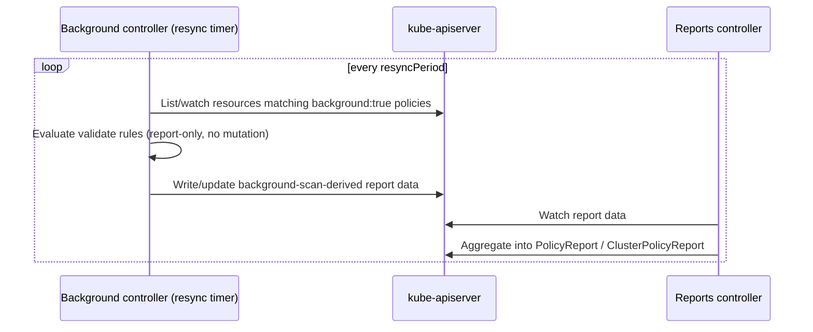

# Admission-Time Validation vs. Background Processing

## Definition

**Admission-time validation** happens synchronously, inside the request path described in docs/01-kyverno-fundamentals.md, every time a matching resource is created or updated. **Background processing** (background scanning) happens asynchronously, on a resync interval, against resources *already in the cluster* — regardless of when or how they got there.

## Problem being solved

A policy installed today says nothing, by itself, about the 4,000 Pods your cluster already had yesterday. Re-running every existing resource through the same admission logic retroactively, without a separate mechanism, would require either deleting and recreating everything (destructive, absurd) or a genuinely different evaluation path that only *reports*, never *blocks*, on resources that already exist. That's background scanning.

## Kubernetes-native alternative

There isn't a first-class Kubernetes-native equivalent — this is precisely the kind of "continuously reconcile policy against existing state" job a controller (which is what Kyverno's background controller literally is) is for. The closest built-in analog is `kubectl get --all-namespaces` plus a script you write yourself and run on a cron; Kyverno's background controller is that, generalized, integrated with the same policy objects, and surfaced through the same `PolicyReport` API your admission-time results already use.

## Kyverno implementation

The background controller lists and watches resources matching any policy with `background: true` (the default), evaluates each one, and writes the result as a background-scan-sourced entry contributing to that namespace's `PolicyReport` (or `ClusterPolicyReport`). This runs on a resync period (`resyncPeriod`, a Helm value under `backgroundController`) — it is not instantaneous the moment you create a new policy; expect a delay bounded by that interval before a brand-new policy's reports reflect every pre-existing matching resource.

**`validate` rules**: background scanning only ever *reports*. It never mutates or deletes a resource to bring it into compliance — there is no "auto-fix" for pre-existing violations. Getting from "reported as non-compliant" to "actually compliant" for a `validate` rule is always a human/GitOps action against the offending resource, informed by the report.

**`mutate` rules**: background scanning does **not** retroactively apply patches to existing resources by default — the security-relevant reason is: silently rewriting live, running resources on a timer is a much bigger blast-radius action than reporting on them, and Kyverno's design deliberately keeps that decision explicit and separate. A `mutate-existing` capability exists (via `mutate.targets` and specific trigger conditions) for the cases where you genuinely want that, but it's opt-in per rule, not the default background-scan behavior. This lab's mutate policies (`policies/mutate/`) both set `background: false` explicitly for exactly this reason — see docs/06-mutate-policies.md.

**`generate` rules**: these use background processing directly and routinely, via `UpdateRequest` objects — a generate rule's "did the trigger resource already exist before this policy did" case is handled by the background controller creating the target resource retroactively, which is the opposite asymmetry from `mutate` (see docs/07-generate-and-cleanup-policies.md).

## Internal request flow



## Policy example

Both `policies/audit/require-labels-audit.yaml` and `policies/validate/require-labels-enforce.yaml` set `background: true` (Kyverno's default) — apply either one, and `kubectl get policyreport -n kyverno-demo` will, within one resync interval, show results for every Pod already in that namespace, not just ones created after the policy existed.

## Expected behavior

- Create a policy → wait up to one resync interval → `kubectl get policyreport -A` shows entries for pre-existing resources.
- Create a *new*, matching resource *after* the policy exists → admission-time evaluation happens immediately (no wait), and that result is also reflected in the report.

## Validation commands

```bash
kubectl get policyreport -n kyverno-demo -o wide
kubectl describe policyreport -n kyverno-demo
kubectl get admissionreports -n kyverno-demo   # raw per-event data, before aggregation
```

## Common failures

- Expecting a brand-new policy's background-scan results to appear instantly — they're bounded by `resyncPeriod`, not real-time.
- Expecting a `mutate` policy to have "fixed" resources that existed before the policy — it only ever mutates at admission time unless explicitly configured with `mutate.targets` for existing-resource mutation, which this lab does not use by default.
- Confusing "background: false" on a mutate policy with "this policy doesn't work" — it means exactly what it says: no retroactive scanning for that rule, admission-time mutation still functions normally.

## Production considerations

Background scan load scales with (number of policies with `background: true`) × (number of matching resources) × (1/resyncPeriod) — this is a real, budgetable cost, covered in docs/13-performance-and-scaling.md. Teams sometimes set `background: false` on genuinely expensive validate rules (heavy `context.apiCall` usage, complex `foreach`) purely to bound this cost, accepting that pre-existing resources simply won't be re-reported by that specific rule.

## Interview-level explanation

*"A validate policy is in Enforce mode — does that mean every non-compliant resource in the cluster gets deleted?"* — No, and this is a common misunderstanding worth correcting directly in an interview: enforce mode only blocks *new* admission requests (create/update) that violate the policy. Every resource that already existed and already violates the policy stays exactly as it is, indefinitely, until something else (a human, a GitOps reconciler, an update that happens to touch that resource) changes it — Kyverno never deletes or force-fixes existing resources as a side effect of a validate policy. What Enforce mode changes for existing resources is nothing at admission time; what background scanning changes is only the `PolicyReport` entry for them, never the resource itself.
