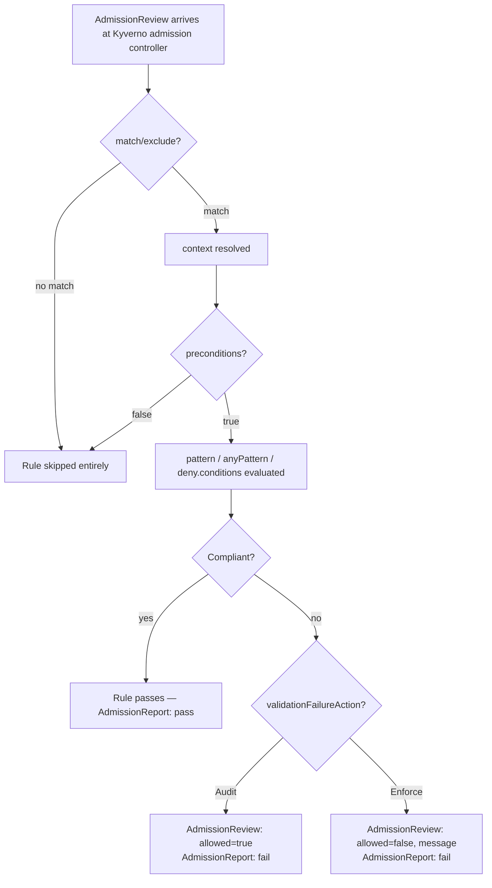

# Validate Policies

## Definition

A `validate` rule inspects an incoming (or, via background scanning, existing) resource and either allows it, denies it, or — in `Audit` mode — allows it while recording a failure in a `PolicyReport`.

## Problem being solved

"This class of resource must never/always look like X" is the single most common policy need in a shared cluster: required labels, forbidden privilege escalation, mandatory resource limits. Without an engine like Kyverno, this is enforced by code review discipline alone, which does not scale and does not catch every path a resource can enter the cluster (CI pipelines, `kubectl` from a laptop, a controller's own reconcile loop).

## Kubernetes-native alternative

**Pod Security Admission (PSA)**, built into the API server since 1.25, enforces three fixed profiles (`privileged`/`baseline`/`restricted`) at the namespace level with zero custom logic. It is fast (no webhook round-trip) and requires no extra component, but it can only express what its three profiles already define — it cannot require your specific four labels, cap Deployments per namespace, or verify an image signature. See docs/12-security-and-governance.md "Kyverno vs. Pod Security Admission" for exactly where this repo draws the line between the two.

## Kyverno implementation

`spec.validationFailureAction` is the whole-policy switch: `Audit` (report, admit anyway) or `Enforce` (report, deny). Every rule's `validate` block then expresses the actual check via `pattern`/`anyPattern` (structural matching) or `deny.conditions` (explicit boolean logic) — see docs/04-policy-anatomy.md for the syntax of each. `spec.background` controls whether this rule also runs against pre-existing resources (docs/03-admission-and-background-processing.md).

## Internal request flow: validate policy execution



## Policy example

`policies/validate/require-labels-enforce.yaml` (Enforce) and its twin `policies/audit/require-labels-audit.yaml` (Audit) — identical `pattern` logic, different `validationFailureAction`, deliberately kept as two separate files so you can `kubectl apply` either explicitly (labs/lab-02-audit-vs-enforce.md).

## Expected behavior

```bash
kubectl apply -f policies/audit/require-labels-audit.yaml
kubectl apply -f demo/insecure-workloads/pod-missing-labels.yaml   # admitted, reported
kubectl apply -f policies/validate/require-labels-enforce.yaml
kubectl apply -f demo/insecure-workloads/pod-missing-labels.yaml   # rejected outright
```

## Validation commands

```bash
kubectl get clusterpolicy require-labels-enforce -o jsonpath='{.status.ready}'
kubectl get policyreport -n kyverno-demo
kubectl describe policyreport -n kyverno-demo | grep -A3 require-labels
```

## Common failures

- Forgetting a policy is still `Audit` and being surprised a "rejected" resource was actually admitted — always check `validationFailureAction` first when a rule "isn't working."
- A `pattern` block that's stricter than intended because of a missing `=()` optional anchor, rejecting resources that simply don't set an optional field at all (see docs/14-troubleshooting.md "Policy does not match").
- Two rules in the same policy with overlapping `match` blocks producing two separate report entries for what looks like "one violation" — each rule is independently evaluated and independently reported.

## Production considerations

Every enforce-mode policy is a potential outage vector if it's wrong — the audit-first rollout pattern (root `docs/DECISIONS.md` ADR-013, this lab's own `policies/audit/` + `policies/validate/` pairing) exists specifically so a policy's real-world blast radius is visible in `PolicyReport` data *before* it can ever reject a real deployment.

## Interview-level explanation

*"How would you roll out a new validate policy to a production cluster you don't fully trust the blast radius of yet?"* — Apply it in `Audit` mode first, let background scanning populate `PolicyReport` data against every existing resource, review the fail counts by namespace/team, fix or exempt (via narrowly-scoped `PolicyException`, docs/09-policy-exceptions.md) the legitimate violators, and only then flip `validationFailureAction` to `Enforce` — ideally starting with `failurePolicy: Ignore` for the first Enforce rollout window so a policy bug degrades to "some bad requests get through" rather than "the API server webhook call fails and blocks matching admission entirely."
