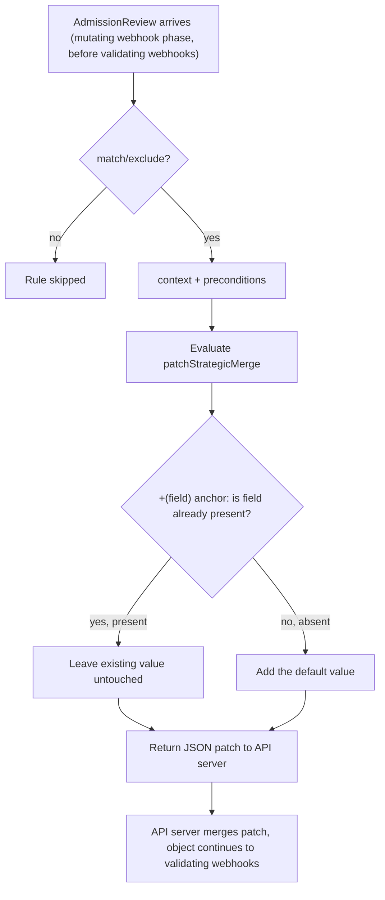

# Mutate Policies

## Definition

A `mutate` rule modifies a resource's spec before it's persisted — filling in defaults, adding metadata, or injecting fields the requester didn't set.

## Problem being solved

Requiring every team to remember to set `runAsNonRoot`, standard labels, or a seccomp profile on every single manifest doesn't scale, and rejecting them for omitting *optional-but-strongly-recommended* fields is often too aggressive. Mutation lets the platform fill in safe defaults automatically, reserving hard rejection (`validate` in Enforce mode) for genuinely unacceptable configurations.

## Kubernetes-native alternative

`PodPreset` existed briefly and was removed from Kubernetes years ago specifically because it was confusing and limited compared to a general mutating webhook. Kubernetes' actual native mechanism for this *is* the mutating admission webhook API itself — Kyverno's mutate rules are a declarative, no-code way to write one, instead of hand-writing a webhook server.

## Kyverno implementation

`mutate.patchStrategicMerge` describes the desired merge directly as YAML (as opposed to `patchesJson6902`, an explicit RFC 6902 JSON Patch list — this lab uses only `patchStrategicMerge`, which is more readable for the additive, non-destructive changes every mutate policy here makes). The `+()` anchor prefix on a key means **add if not present, never overwrite** — this is the single most important habit for a mutate policy: a policy that unconditionally sets a value will fight any workload that intentionally sets a different one, silently, forever. `spec.background` is set to `false` on both of this lab's mutate policies (`policies/mutate/*.yaml`) because mutation does not retroactively apply to pre-existing resources during background scanning (docs/03-admission-and-background-processing.md) — leaving `background: true` (the default) on a mutate-only policy would be misleading, implying a retroactive effect that doesn't happen.

## Internal request flow: mutate policy execution



## Policy example

`policies/mutate/add-default-labels.yaml` (Pod-level labels) and `policies/mutate/add-security-context-defaults.yaml` (Pod- and container-level securityContext, the latter via `foreach` over `spec.containers`).

## Expected behavior

```bash
kubectl apply -f policies/mutate/add-default-labels.yaml
kubectl run t1 --image=registry.k8s.io/pause:3.10 --labels="app.kubernetes.io/name=t1" -n kyverno-demo
kubectl get pod t1 -n kyverno-demo -o jsonpath='{.metadata.labels}'
# environment/owner/app.kubernetes.io/part-of now present, app.kubernetes.io/name unchanged

kubectl run t2 --image=registry.k8s.io/pause:3.10 --labels="app.kubernetes.io/name=t2,environment=production" -n kyverno-demo
kubectl get pod t2 -n kyverno-demo -o jsonpath='{.metadata.labels.environment}'
# still "production" — NOT overwritten to "lab"
```

## Validation commands

```bash
kubectl get clusterpolicy add-default-labels -o jsonpath='{.status.ready}'
bash tests/mutate-policy-tests.sh   # exercises exactly the two cases above
```

## Common failures

- **Mutation not applied at all**: check rule `match` first (most common), then whether another mutating webhook running later reverted the change (`reinvocationPolicy` interaction — docs/01-kyverno-fundamentals.md).
- **Mutation repeatedly changes an object**: a controller (e.g., a Deployment's own ReplicaSet controller re-applying a template) and a Kyverno mutate rule fighting over the same field on every reconcile — always use `+()` addIfNotPresent rather than an unconditional overwrite to avoid exactly this loop.
- Assuming a mutate rule fixes existing resources — it does not (docs/03-admission-and-background-processing.md).

## Production considerations

Mutation is powerful and therefore riskier to get wrong than validation: a bad `validate` rule rejects a request loudly; a bad `mutate` rule silently changes what actually got deployed, which can be far harder to notice and debug. Prefer `+()` everywhere, keep mutate rules narrow and well-named, and never chain more than a couple of mutate policies against the same field without very deliberate testing (`reinvocationPolicy: IfNeeded` interactions get genuinely hard to reason about past that point).

## Interview-level explanation

*"When would you choose mutate over validate-and-reject for the same requirement?"* — When the missing/wrong value has a safe, unambiguous default and rejecting the request would just push the burden of remembering that default onto every single team, with no security or correctness benefit over filling it in automatically. Reserve `validate`-and-reject for cases where there is no safe default to assume — you genuinely need the requester to make an explicit choice (e.g., you can default `seccompProfile` safely, but you should never *guess* an appropriate resource-limit value on someone's behalf and silently apply it).
