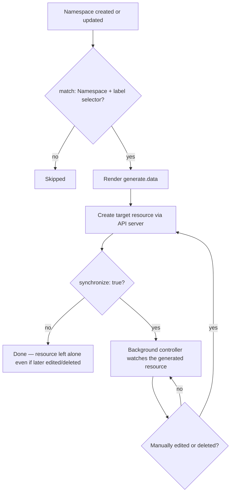
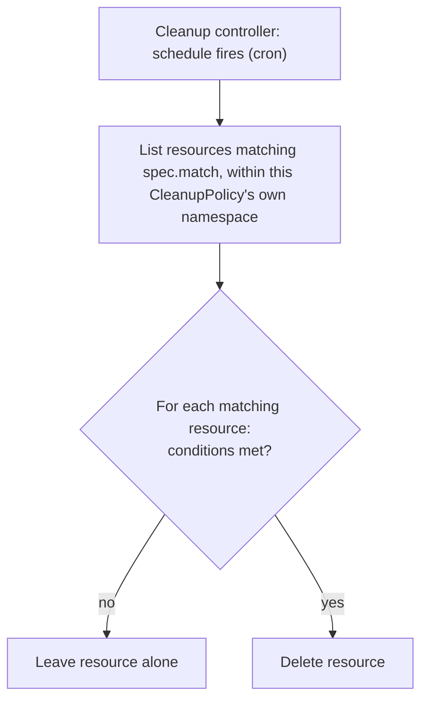

# Generate and Cleanup Policies

Two different lifecycles that both create/modify/delete *other* resources as a side effect of a policy, covered together because they're natural opposites: generate policies create and keep resources in sync; cleanup policies delete them on a schedule.

## Generate Policies

### Definition

A `generate` rule creates a new resource (of any kind) when a triggering resource is created — most commonly a per-namespace default (a NetworkPolicy, a ResourceQuota, a RoleBinding) triggered by Namespace creation.

### Problem being solved

Every new namespace in a multi-tenant cluster needs the same baseline objects. Without automation, either every team remembers to create them by hand (they won't, consistently) or a separate provisioning pipeline has to know about every namespace-creation event (more moving parts, another thing to keep in sync).

### Kubernetes-native alternative

None, directly — this is squarely "generalized controller" territory. The closest built-in mechanism is a Kubernetes controller you write and run yourself (a `client-go` informer watching Namespace creation); Kyverno's `generate` rule is that pattern, declared as a policy object instead of code you maintain.

### Kyverno implementation

`generate.apiVersion`/`kind`/`name`/`namespace` describe the target; `data` is the literal resource body to create; `synchronize: true` means Kyverno keeps the generated resource in sync with the policy's `data` going forward — if someone manually edits or deletes it, Kyverno's background controller (via an `UpdateRequest`) restores it. `synchronize: false` (not used by this lab) creates it once and then leaves it alone even if later edited.

### Generate policy execution

### Policy example, expected behavior, validation

`policies/generate/default-network-policy.yaml` — see `labs/lab-08-generate-network-policy.md` and `tests/generate-policy-tests.sh` for the exact commands and the synchronize-recreation check.

### Common failures

- **Generated resource missing**: check the *trigger* resource (a Namespace, in this lab's example) actually carries the label the policy's `match.any.resources.selector` requires — this is the single most common cause.
- **Generate UpdateRequest failed**: `kubectl get updaterequest -A` and check its status/message — usually an RBAC gap (the background controller's ServiceAccount lacking create/update permission on the target kind) or a `data` block that fails the target kind's own admission (e.g., another policy rejecting the generated resource).
- **Generated-resource ownership confusion**: a `synchronize: true` resource reverts manual edits — if you need to hand-edit the generated NetworkPolicy going forward, either edit the *policy's* `data` (the actual source of truth) or set `synchronize: false` deliberately, not by surprise.

---

## Cleanup Policies

### Definition

A `CleanupPolicy`/`ClusterCleanupPolicy` deletes matching resources on a cron-style `schedule`, subject to `match` and optional `conditions`.

### Problem being solved

Short-lived, clearly-labeled resources (a test Pod, a completed Job's leftover artifacts, a temporary debugging Deployment) accumulate if nothing removes them. A generic `kubectl delete` cron job outside Kyverno works too, but then your cleanup logic lives in a different system than your policy definitions, with different RBAC, different observability, and no relationship to `PolicyReport`.

### Kubernetes-native alternative

A `CronJob` running `kubectl delete` with a label selector — functionally similar, but entirely outside Kyverno's policy/report ecosystem, and easy to leave stale/undocumented since it's "just a script," not a first-class, auditable policy object.

### Kyverno implementation

`spec.match` (same shape as validate/mutate rules) + `spec.conditions` (same `deny.conditions`-style operators, evaluated against each matching resource) + `spec.schedule` (standard cron syntax). This lab uses a **namespaced** `CleanupPolicy` (not `ClusterCleanupPolicy`) specifically so its own `metadata.namespace` confines it to `kyverno-demo` structurally, not just by convention — see root `docs/DECISIONS.md` ADR-016 and this policy's own header comment for why that matters.

### Cleanup policy execution

### Policy example, expected behavior, validation

`policies/cleanup/cleanup-lab-marker-pods.yaml` — targets only Pods labeled `lab-marker: intentionally-insecure`, older than 1 hour, within `kyverno-demo`. See `labs/lab-13-cleanup-policies.md` and `tests/cleanup-policy-tests.sh` (which validates the policy's Ready state and selector scoping, not a live 1-hour-aged deletion — see that script's own note on the limitation).

### Common failures

- **Cleanup policy did not delete**: check `kubectl -n kyverno-demo get cleanuppolicy cleanup-lab-marker-pods -o yaml` for its `status.conditions` — a not-Ready policy never fires; also confirm the schedule has actually elapsed and the age condition is actually met (a common false alarm: testing 5 minutes after creating a "delete after 1h" policy).
- **Cleanup policy matched too broadly**: always re-derive `spec.match` narrowly and prefer a namespaced `CleanupPolicy` over `ClusterCleanupPolicy` unless you have a specific, reviewed reason not to (root `docs/DECISIONS.md` ADR-016).

### Production considerations

Both generate and cleanup policies act *on the cluster*, not just at the boundary of one admission decision — treat changes to them with the same review rigor as a database migration, not the same as a read-only reporting policy. A `synchronize: true` generate rule pointed at the wrong `data`, or a cleanup policy with an off-by-one condition, has real, ongoing blast radius until corrected.

### Interview-level explanation

*"Your on-call gets paged because a generated NetworkPolicy keeps reverting a manual hotfix."* — That's `synchronize: true` doing exactly what it's designed to do: the generate policy's `data` is the actual source of truth, and any manual edit to the *generated resource* is, by design, treated as drift to correct, not a change to preserve. The fix is never "edit the generated resource again" (it'll just revert again) — it's either updating the *policy's* `data` block (the real fix, if the hotfix should be permanent) or temporarily setting `synchronize: false` on that rule while a proper fix goes through review.
