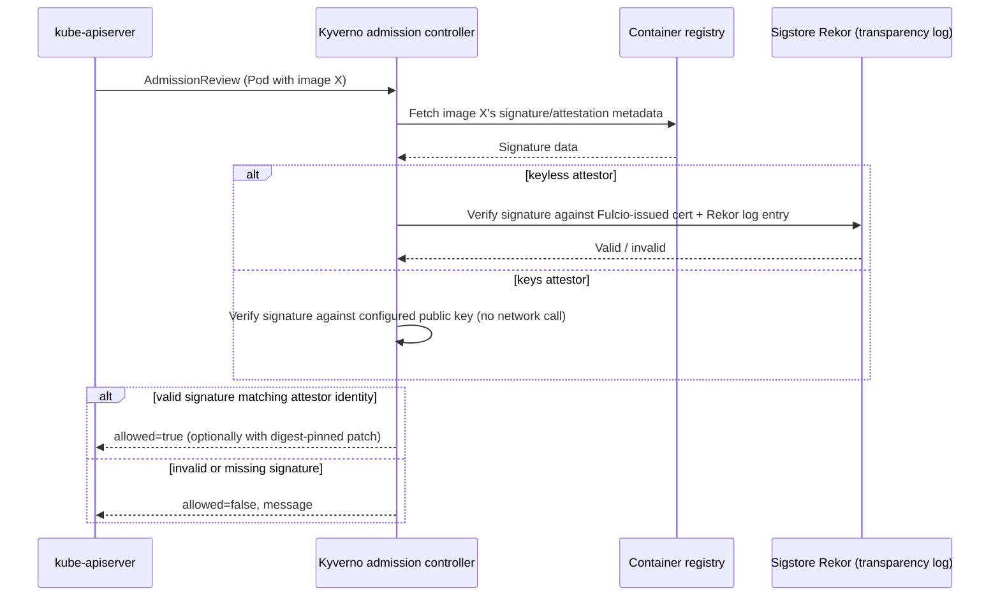

# Image Verification

## Definition

A `verifyImages` rule requires container images matching `imageReferences` to carry a valid cryptographic signature (and/or attestation) before the resource is admitted, checked against one or more `attestors`.

## Problem being solved

A pinned, non-`:latest` tag (docs/05-validate-policies.md's tag-restriction policy) tells you *what* image reference was requested, not that the bytes behind that reference are actually what your organization built and intended to ship. Supply-chain attacks (a compromised registry, a tampered tag, a typosquatted image name) all still succeed against tag-pinning alone. Signature verification closes that gap: only images signed by a trusted identity are admitted, regardless of what the tag or registry claims.

## Kubernetes-native alternative

None built into core Kubernetes — the API server has no concept of image signatures. This is exclusively an admission-webhook-layer concern, which is exactly why Kyverno (and competing tools like OPA/Gatekeeper with a signature-checking sidecar, or Sigstore's own `policy-controller`) exist to fill it.

## Kyverno implementation

`verifyImages` entries specify `imageReferences` (which images this rule governs) and `attestors` — either `keys` (a static public key, PEM-encoded) or `keyless` (Sigstore Fulcio/Rekor-based identity verification with no key management at all: you trust a specific OIDC `issuer` + `subject` pattern instead of a key file). `mutateDigest: true` additionally rewrites the tag reference to an immutable digest reference after successful verification — belt-and-suspenders against a tag being repointed after the fact.

## Image verification flow



## Two paths, deliberately

**Static/offline path (this lab's default)**: `policies/verify-images/verify-image-signature.yaml` uses **keyless** verification against `ghcr.io/kyverno/*` — Kyverno's own container images, which are genuinely signed via GitHub Actions OIDC as part of their real release pipeline. No key material is embedded in this file at all (a hardcoded key you can't verify the provenance of would be worse than no example). Policy syntax is fully validated offline via `kyverno test`/`kyverno apply`; real signature enforcement requires network access to Rekor, which `tests/image-verification-tests.sh` treats as best-effort, not a hard requirement.

**Optional runtime signing path**: gated behind `config/lab-settings.env`'s `ENABLE_COSIGN_RUNTIME_LAB` (default `false`). When enabled, generates a throwaway Cosign keypair under `.generated/cosign/` (git-ignored, never committed), signs a local test image with it, and demonstrates a **static-key** `attestors.entries[].keys` policy accepting the signed image and rejecting an unsigned one — see `labs/lab-11-image-verification.md` for the exact walkthrough and cleanup steps. This path requires `cosign` installed and is entirely optional.

No private registry credentials are required for either path.

## Validation commands

```bash
kubectl apply -f policies/verify-images/verify-image-signature.yaml
kubectl get clusterpolicy verify-image-signature -o jsonpath='{.status.ready}'
kyverno apply policies/verify-images/verify-image-signature.yaml -r demo/test-resources/compliant-pod.yaml   # syntax/dry-run
bash tests/image-verification-tests.sh
```

## Common failures

- **Image verification rejection** with a valid-looking image: usually the `imageReferences` glob doesn't match the actual reference format (check for an implicit `docker.io/library/` prefix Kyverno/the registry expects that your manifest didn't spell out).
- **Registry unavailable**: signature verification requires reaching the registry (for the signature/attestation metadata) and, for keyless, Rekor — a registry or Rekor outage manifests as verification failures indistinguishable from a real bad signature unless you check Kyverno's admission-controller logs for the actual network error.
- **Kyverno CLI and controller behavior differ**: `kyverno apply`/`kyverno test` validate policy *syntax* and can dry-run pattern/deny logic, but full `verifyImages` network verification behavior against a live registry is controller-side — don't treat a clean CLI run as proof that live signature enforcement works; that's what the optional runtime path or a real cluster test is for.

## Production considerations

Image verification is one of the highest-value, highest-friction controls in this lab's entire policy set — highest value because it closes a real supply-chain gap nothing else here does; highest friction because it depends on your image-build pipeline actually signing images consistently, which is an organizational change, not just a policy YAML file. Roll this out in `Audit` mode for a meaningfully longer window than other policies, specifically because "my image isn't signed yet" is a legitimate, common, non-adversarial reason for a failure here, not a sign of an attack.

## Interview-level explanation

*"Why keyless over static keys for signature verification?"* — Static keys mean you're managing key material: rotation, revocation, and secure storage become your problem, and a leaked private key silently undermines every policy trusting it with no built-in detection. Keyless verification (Sigstore Fulcio + Rekor) ties trust to a *verifiable identity* (e.g., "this specific GitHub Actions workflow, in this specific repo") issued short-lived certificates and logged transparently — there's no long-lived secret to leak, and every signing event is independently auditable in the public transparency log. The trade-off is a live dependency on Rekor/Fulcio availability at verification time, which is why some organizations run their own private Sigstore instance rather than relying on the public one for production-critical enforcement.
