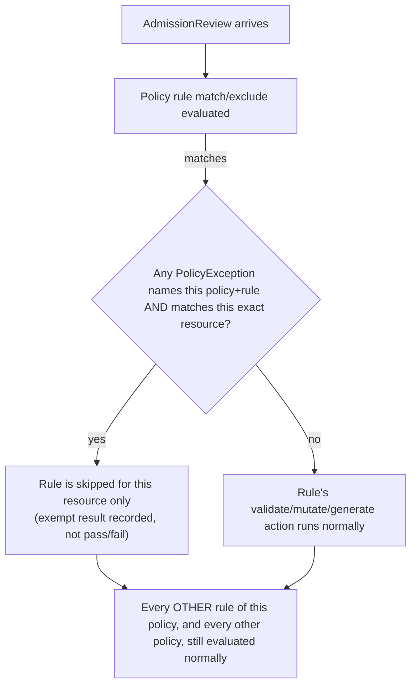

# Policy Exceptions

## Definition

A `PolicyException` narrowly exempts specific, named resources from specific rules of specific policies — without editing the policy itself.

## Problem being solved

Every real policy eventually meets a legitimate edge case: one workload genuinely needs a hostPath mount for a documented reason, one namespace genuinely needs a broader label set than the rest. Without a first-class exception mechanism, teams resort to one of two bad options: weaken the policy's `match`/`exclude` for everyone (silently reducing coverage cluster-wide, invisible to anyone reading the policy alone), or fork a slightly-looser duplicate policy per exception (multiplying policies to maintain, drifting from the original over time). `PolicyException` gives you a third option: the policy itself stays strict and unmodified; the exception is its own reviewable, revokable object.

## Kubernetes-native alternative

None — this is Kyverno-specific (OPA/Gatekeeper's closest equivalent is a separate `Constraint`/exemption mechanism with different mechanics). There is no core-Kubernetes concept of "an admission exception."

## Kyverno implementation

`spec.exceptions` names the exact `policyName` + `ruleNames` being exempted; `spec.match` scopes *which resources* get that exemption, using the same `match` shape as any policy rule (`kinds`, `names`, `namespaces`, `selector`). Critically, a `PolicyException` only ever narrows enforcement of the rules it names — it has no effect on any other rule of the same policy, or on any other policy entirely. `policies/exceptions/allow-demo-hostpath-exception.yaml` exempts exactly one rule (`disallow-hostpath-volumes`) of exactly one policy (`restrict-privileged-containers`), for exactly one named resource (`demo-approved-hostpath-reader`) in exactly one namespace — every other rule in that policy (privileged, host namespaces, dangerous capabilities) still fully applies to that same Pod.

## PolicyException evaluation



## Narrow scoping (this lab's requirement, not just a suggestion)

`policies/exceptions/allow-demo-hostpath-exception.yaml` is scoped by exact resource `names`, not a label selector matching an open-ended set — a differently-named Pod with the identical hostPath pattern is still rejected (verified explicitly by `tests/exception-tests.sh`'s negative case). This lab never creates a cluster-wide or wildcard-scoped exception; see root `docs/DECISIONS.md` ADR-016 for why that's a hard rule here, not just a style preference.

## Expiration and approval process

Kyverno's `PolicyException` CRD has **no built-in expiration/TTL field** — this is a real, easy-to-miss gap. This lab's convention (see the policy's own annotations) is a documented pattern, not something Kyverno enforces: `policy-exceptions.kyverno.io/expires` (a date), `policy-exceptions.kyverno.io/approved-by`, `policy-exceptions.kyverno.io/ticket`. A real platform team enforces the expiry with something *outside* Kyverno — a scheduled job or a GitOps CI check that fails a PR (or pages someone) when an exception's `expires` annotation is in the past. Approval, similarly, is a process convention (PR review requiring the `approved-by` annotation to be set by an authorized reviewer before merge) — Kyverno itself does not gate `PolicyException` creation on any approval workflow; that's your RBAC + GitOps process's job.

## Risk of broad exceptions

A `PolicyException` scoped by a label selector that many resources could carry, or with no `names` restriction at all, is functionally equivalent to weakening the underlying policy for that whole set — except now the weakening is invisible unless someone specifically thinks to check for exceptions. Every exception is a standing reduction in coverage; treat the *count* and *scope* of active exceptions as a governance metric worth reviewing periodically (docs/12-security-and-governance.md), not a one-time decision.

## Audit requirements

`kubectl get policyexceptions -A` should be part of any periodic security review — an exception with an expired `expires` annotation, or one whose `approved-by` doesn't match your actual approval record, is a finding, not a false positive.

## Validation commands

```bash
kubectl apply -f policies/exceptions/allow-demo-hostpath-exception.yaml
kubectl apply -f demo/test-resources/demo-approved-hostpath-reader.yaml   # admitted
kubectl get policyexceptions -n kyverno-demo -o yaml
```

## Common failures

- **PolicyException ignored**: the exception's `spec.exceptions[].ruleNames` doesn't exactly match the rule name in the target policy — Kyverno matches by exact string, not by pattern.
- Assuming an exception for one rule silently exempts the whole policy — it does not; verify with a resource that should still be rejected by a *different* rule of the same policy.

## Interview-level explanation

*"A team asks for a PolicyException instead of fixing their non-compliant workload — how do you evaluate that request?"* — First, is this genuinely a case with no compliant alternative, or a shortcut around real remediation work? Second, can the exception be scoped to the exact resource(s), not a namespace or label pattern that could silently cover future unrelated workloads? Third, does it have a real expiration and an owner, tracked outside Kyverno since the CRD itself won't enforce either? An exception that can't answer all three cleanly should usually be a "no, fix the workload" — exceptions that never expire and were never really reviewed are how a strict-looking policy set quietly stops meaning anything.
