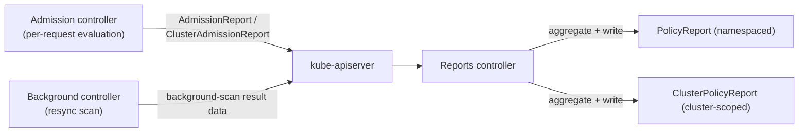

# Policy Reports

## Definition

`PolicyReport` (namespaced) and `ClusterPolicyReport` (cluster-scoped) are queryable, aggregated rollups of every policy evaluation result — admission-time and background-scan — for a given scope. They are a shared Kubernetes community CRD (`wgpolicyk8s.io`), not a Kyverno invention, which is why other policy engines and third-party tooling (like Policy Reporter) can read them too.

## Problem being solved

`kubectl describe` on a rejected resource tells you about *one* denial, after the fact, for someone who happened to be watching. There is no built-in way to ask "across my whole cluster, what's currently failing which policy, and how badly" — that's exactly the aggregated, queryable view `PolicyReport` provides, sourced from both live admission decisions and background scans.

## Kubernetes-native alternative

None with the same aggregation — Kubernetes Events are per-object, short-retention, and not designed for cluster-wide policy-compliance querying. You could build this yourself from admission webhook logs, but you'd be rebuilding what `PolicyReport` already standardizes.

## Kyverno implementation

Every admission decision writes an `AdmissionReport`/`ClusterAdmissionReport` (raw, per-event); every background scan pass writes equivalent background-scan result data. The reports controller (docs/02-architecture-and-internals.md) watches both and aggregates them into `PolicyReport`/`ClusterPolicyReport`, which is what you actually query day to day.

## Policy report generation



## The five result states

| Result | Meaning |
| --- | --- |
| `pass` | Rule evaluated, resource compliant |
| `fail` | Rule evaluated, resource non-compliant (in `Audit` mode, still admitted; in `Enforce` mode, this is what a rejection looked like *if* it had been admitted — background-scan `fail` entries specifically) |
| `warn` | A rule configured to warn rather than fail/pass outright (less common in this lab's policies, which use `pass`/`fail` semantics directly) |
| `skip` | A rule whose `preconditions` didn't match — deliberately skipped, not evaluated as compliant or not |
| `error` | The rule itself failed to evaluate (a bad `context` API call, a malformed `pattern`) — this is a policy *bug* signal, distinct from a resource being non-compliant |

## Validation commands

```bash
kubectl get policyreports -A
kubectl get clusterpolicyreports
kubectl describe policyreport -n kyverno-demo
kubectl get events -n kyverno-demo --sort-by=.metadata.creationTimestamp

# Summarized (script wraps this with jq if available):
bash ../scripts/collect-policy-reports.sh
# or: make reports
```

`scripts/collect-policy-reports.sh` uses `jq` (when installed) to extract failed rules, affected resources, and messages into one readable table — see that script for the exact JMESPath/jq expression, and fall back behavior when `jq` isn't available.

## Common failures

- **PolicyReport missing entirely**: confirm the reports controller is `Ready` (`kubectl -n kyverno get deployment kyverno-reports-controller`) and that at least one policy with `background: true` (or a recent admission event) actually exists to generate data from.
- Confusing `error` with `fail` — an `error` entry means the *policy* is broken (fix the policy), not that the *resource* is non-compliant (fix the resource). Treating every red entry the same way wastes time chasing the wrong fix.
- Report staleness after deleting a policy — old report entries for a since-deleted policy can linger briefly until the next reconcile; don't assume a report entry means the policy still exists without checking `kubectl get clusterpolicy`.

## Production considerations

Report volume scales with cluster size and policy count — this lab documents Kyverno's own metrics endpoints (below) as the path to real observability integration, deliberately without installing Prometheus/Grafana here (this is an independent, tool-neutral lab; see root `docs/ARCHITECTURE.md`'s separation between platform phases). `docs/13-performance-and-scaling.md` covers report retention/volume as a capacity-planning concern.

## Metrics and future observability integration

Kyverno's admission, background, cleanup, and reports controllers each expose a Prometheus-format `/metrics` endpoint (see each controller's `metricsService` values in the Helm chart). This lab does not install Prometheus or Grafana to scrape them — that's explicitly out of scope for this independent module (root `docs/ARCHITECTURE.md`). When the observability module (`../opentelemetry-prometheus-grafana-jaeger-loki/`) exists, Kyverno's metrics endpoints are a natural, documented future scrape target; nothing in this lab needs to change to support that later, since the endpoints already exist regardless of whether anything is scraping them today.

## Interview-level explanation

*"How would you build a weekly policy-compliance report for engineering leadership without adding a new dashboarding tool?"* — `PolicyReport`/`ClusterPolicyReport` already aggregate everything needed; a scheduled job running `kubectl get clusterpolicyreports -o json | jq '...'` (or the Policy Reporter UI, if that extra component is worth the operational cost for your org — see this lab's optional `install/optional/policy-reporter-values.yaml`) turns that into a weekly summary with zero new components beyond what Kyverno already writes. The key point to make: the data already exists and is already structured — the "report" is a query, not a new pipeline.
