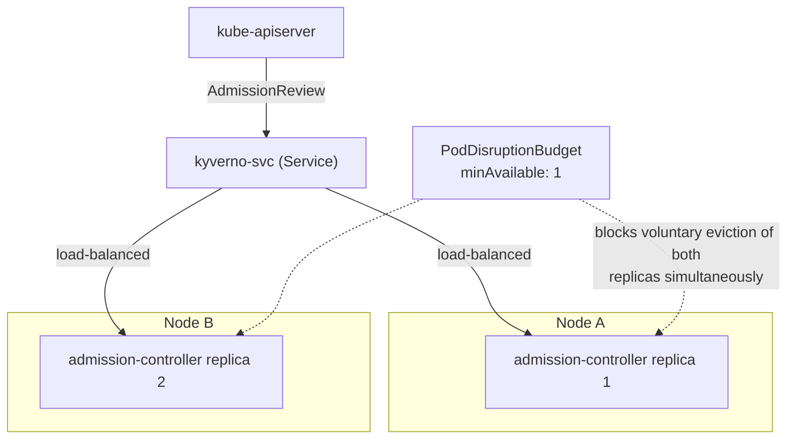

# Production Design

## High availability

### Controller replica recommendations

Only the admission controller sits in the synchronous request path (docs/01, docs/02) — it's the one component where replica count is directly an availability lever, not just throughput. This lab's `install/values-recommended.yaml` runs 2 admission-controller replicas; a genuinely production-scale cluster typically runs 3+ for tolerance to a single-AZ/node-pool failure alongside a rolling update. Background/cleanup/reports controllers benefit from 2 replicas mainly for faster failover of their leader-elected singleton work, not for throughput — they aren't blocking any live request.

### Pod anti-affinity and topology spread

`install/values-recommended.yaml` sets a `preferredDuringSchedulingIgnoredDuringExecution` pod anti-affinity on the admission controller, spreading its replicas across nodes on a best-effort basis — "preferred," not "required," because a `required` anti-affinity on a 2-3 node cluster (like this lab's own 3-node topology) can leave a replica permanently unschedulable if the preferred spread genuinely isn't achievable. A real multi-zone production cluster typically upgrades this to `topologySpreadConstraints` keyed on zone, not just hostname.

### PodDisruptionBudgets

`podDisruptionBudget.minAvailable: 1` on the admission controller (this lab's recommended profile) ensures a voluntary disruption (node drain, cluster upgrade) can't take the last remaining admission-controller replica down simultaneously — without it, a rolling node upgrade could momentarily leave zero replicas serving the webhook, which combined with `failurePolicy: Fail` means a full admission outage during routine maintenance, not just an incident.

### Leader election and webhook service availability

Admission-controller webhook serving itself is not leader-elected (every ready replica serves traffic) — but the Kubernetes Service in front of them (`kyverno-svc`) still needs healthy endpoints, which is exactly what `scripts/validate-installation.sh`'s `webhook_service_endpoints_ready` check verifies. A Service with zero ready endpoints, even with the Deployment showing "available" replicas briefly during a rollout, is functionally the same outage as no replicas at all.

### API server dependency

Kyverno's admission controller is *itself* a client of the API server (for policy CRDs, context `apiCall`s, writing reports) as well as a webhook target *of* the API server for other requests — an API server under severe load or partially unavailable can degrade Kyverno in both directions simultaneously. There's no mitigation Kyverno itself provides for this; it inherits the API server's own availability posture.

### Failure policy trade-offs

`failurePolicy: Fail` (webhook unreachable → deny the request) is more secure (nothing bypasses policy during an outage) but less available (a Kyverno outage becomes an admission outage for everything matching the webhook). `failurePolicy: Ignore` is the inverse. Most real deployments run `Fail` for validating webhooks once policies are enforce-mode and Kyverno itself is genuinely HA (multiple replicas + PDB + anti-affinity, as above) — running `Fail` *without* that HA investment first is choosing availability risk without the corresponding security benefit actually being reliable.

## High-availability Kyverno architecture

## Governance

- **Policy ownership**: every policy in this lab carries `app.kubernetes.io/part-of: kyverno-learning-lab` and lives under version control (`policies/`) — a real deployment extends this with a per-policy owning team label and a CODEOWNERS-style review requirement.
- **Change approval / GitOps**: policies here are plain YAML, meant to be applied via `kubectl apply -f`/GitOps sync, not hand-edited in-cluster — treat any live drift from what's in git as an incident, the same way you would for any other GitOps-managed resource.
- **Severity classification**: this lab's policy annotations (`policies.kyverno.io/severity`) are a starting taxonomy (low/medium/high) — a real rollout ties severity to rollout speed and alerting (a `high`-severity Audit-mode failure gets paged on; a `low`-severity one gets a weekly digest).
- **Exception expiry and audit evidence**: see docs/09-policy-exceptions.md in full.
- **Rollback**: since policies are plain Kubernetes objects applied via GitOps/kubectl, rollback is `git revert` + re-sync — no Kyverno-specific rollback mechanism needed or provided.
- **Break-glass access**: for a genuine incident where an enforce-mode policy is actively blocking a critical fix, the fastest safe break-glass is a narrowly-scoped, time-boxed `PolicyException` (docs/09) for the exact resource, not disabling the policy cluster-wide or setting `failurePolicy: Ignore` globally — the latter two remove protection for everything, not just the one blocked deployment.

## Disaster recovery

| Question | Answer |
| --- | --- |
| Which Kyverno components are stateless? | All four controllers — no controller holds state that isn't itself a Kubernetes object |
| What's stored in etcd? | Every policy CRD, `PolicyException`, `PolicyReport`/`ClusterPolicyReport`, `AdmissionReport`, `UpdateRequest` — all of it is regular Kubernetes API objects, backed by etcd like everything else in the cluster |
| How are policies recovered from Git? | `kubectl apply -f policies/` (or a GitOps controller's normal sync) — policies are declarative and idempotent, so recovery is identical to initial application |
| How are Helm releases recreated? | `make install LAB_PROFILE=...` — `helm upgrade --install` is idempotent; a fresh cluster and a recovering cluster use the exact same command |
| How are exceptions restored? | Same as policies — `PolicyException` objects are plain YAML under version control (`policies/exceptions/`), recovered via the same `kubectl apply`/GitOps path |
| How should generated resources be handled? | Generated resources with `synchronize: true` self-heal once their source `ClusterPolicy` is restored (the background controller recreates them) — do not attempt to manually restore generated resources directly; restore the *generating policy* instead |
| How do you validate recovery? | `make validate-installation` — the exact same functional probes (audit report generation, enforce rejection, mutation, generation) used to validate the original install, applied identically after a recovery |

## Interview-level explanation

*"Your Kyverno admission controller has a single replica and it just OOM-killed during a deploy storm — what actually happened to the cluster, and how do you prevent it next time?"* — With `failurePolicy: Fail` (the common default for enforce-mode policies) and a single replica, every matching admission request queued or failed for the restart duration — a real, if brief, cluster-wide admission outage for anything the webhook's `namespaceSelector`/`rules` cover. Prevention is exactly this document's HA section: 2+ replicas with a PDB and anti-affinity so a single pod's OOM-kill never removes 100% of webhook-serving capacity, plus right-sizing `resources.requests/limits` (this lab's own `install/values-recommended.yaml` starting point) so an OOM-kill under normal load shouldn't happen in the first place.
