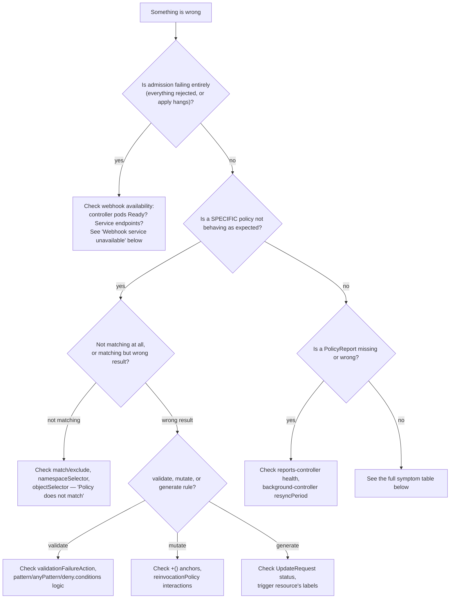

# Troubleshooting

## Troubleshooting decision tree

## Symptom table

| Symptom | Diagnostic commands | Likely cause | Immediate action | Permanent fix | Validation |
| --- | --- | --- | --- | --- | --- |
| Kyverno pods Pending | `kubectl -n kyverno get pods -o wide`, `kubectl -n kyverno describe pod <name>` | Insufficient node resources for requested CPU/memory, or no schedulable node | Check `kubectl describe node` for allocatable resources; try `LAB_PROFILE=minimum` | Right-size `install/values-*.yaml` resource requests to actual cluster capacity | Pod reaches Running |
| Controller CrashLoopBackOff | `kubectl -n kyverno logs <pod> --previous` | Config error, RBAC gap, or OOM-kill (`kubectl -n kyverno describe pod` shows `OOMKilled`) | Read the actual crash log/exit reason first — don't guess | Fix the specific root cause found in logs; if OOM, raise `resources.limits.memory` | Pod stable, no restarts for 5+ minutes |
| CRDs missing | `kubectl get crd \| grep kyverno.io` | Helm install didn't complete, or CRDs were manually deleted | Re-run `make install` (idempotent via `helm upgrade --install`) | none — CRDs are chart-managed; don't hand-edit them | All expected CRDs from `scripts/install.sh`'s list present |
| Policy not Ready | `kubectl get clusterpolicy <name> -o yaml` (check `status`) | Syntax error, or a referenced CRD/kind doesn't exist yet | Fix the reported error in `status.conditions`/message | Validate with `kyverno apply`/`kyverno test` before applying to a live cluster next time | `status.ready: true` |
| Webhook timeout | Admission-controller logs show timeout errors; slow `kubectl apply` | Expensive `context.apiCall`/`foreach`, or under-resourced pod (CPU throttling) | See docs/13-performance-and-scaling.md | Optimize the policy, or right-size resources — not just raising `timeoutSeconds` | Admission latency back to baseline |
| API server rejects all workloads | `kubectl get validatingwebhookconfigurations -o yaml \| grep -A5 kyverno` | `failurePolicy: Fail` + Kyverno admission controller fully down | Confirm Kyverno pods are down; if genuinely stuck, this is the scenario HA (docs/11) exists to prevent | Restore Kyverno availability (scale up, fix crash cause); for future, invest in HA before running `Fail` in production | `kubectl apply` of a trivial resource succeeds again |
| Policy does not match | `kyverno apply <policy> -r <resource>` locally; check `match`/`exclude`/`namespaceSelector` | Overly narrow `match`, or resource is in an excluded namespace | Widen/correct `match`, or confirm the namespace isn't in `config/namespaces.env`'s exclusion list | Add a matching test resource to `tests/cli-test-cases/` so this regressions-tests itself | `kyverno test` shows the expected result for that resource |
| Exclude rule does not work | Same as above, inverted | `exclude` block doesn't actually match the resource you expect it to skip | Verify the exact `exclude.any.resources` shape against the resource's real labels/namespace | Add a non-matching test resource confirming the exclude path | Excluded resource shows `skip`, not `pass`/`fail` |
| Mutation not applied | `kubectl get pod <name> -o yaml` (check for the expected field) | `match` didn't fire, or mutating webhook ran before another webhook that reverted it | Check policy `match` first (most common); check `reinvocationPolicy` interactions second | See docs/06-mutate-policies.md "Common failures" | Field present after a fresh `kubectl run`/`apply` |
| Mutation repeatedly changes an object | `kubectl get events` shows repeated updates to the same object | Mutate rule unconditionally overwrites a field another controller also writes, causing a fight | Switch the rule to `+()` addIfNotPresent if not already | Same | Object stabilizes, no more repeated diffs |
| Generate resource missing | `kubectl get updaterequest -A`, check trigger resource's labels | Trigger resource doesn't carry the label/selector the generate rule's `match` requires | Add/correct the trigger label | Document the required trigger label clearly in the policy's own description | Generated resource appears |
| Generate UpdateRequest failed | `kubectl describe updaterequest <name> -n <ns>` | RBAC gap on the background controller's ServiceAccount, or the generated `data` itself fails another policy's admission | Read the `UpdateRequest` status message directly | Fix the specific RBAC/data issue found | `UpdateRequest` succeeds, target resource exists |
| Cleanup policy did not delete | `kubectl -n <ns> get cleanuppolicy <name> -o yaml` (status), confirm schedule elapsed and age condition met | Policy not Ready, or condition/schedule not actually satisfied yet | Re-check `status.conditions`; re-check the actual resource age vs. the condition threshold | See docs/07 cleanup section | Matching, aged resource is deleted on the next scheduled run |
| Cleanup policy matched too broadly | `kubectl -n <ns> get <kind> -l <selector>` — does the result include resources you didn't intend? | `match` selector wider than intended | Narrow the selector immediately; this is a live-blast-radius issue, treat with urgency | Prefer namespaced `CleanupPolicy` over `ClusterCleanupPolicy` (root docs/DECISIONS.md ADR-016) | Selector result set matches intent exactly |
| PolicyException ignored | `kubectl get policyexception -n <ns> -o yaml` | `ruleNames`/`policyName` doesn't exactly match the target policy/rule name | Fix the exact string match | Add the exception's target resource to a test in `tests/exception-tests.sh`-style coverage | Named resource admitted, others still rejected |
| PolicyReport missing | `kubectl -n kyverno get deployment kyverno-reports-controller` | Reports controller not Ready, or no policy has `background: true`/no recent admission event | Check controller health first | See docs/10-policy-reports.md | `kubectl get policyreport -A` shows data |
| Background scanning delayed | Compare policy creation time to when reports first appear | Expected — bounded by `resyncPeriod`, not instantaneous (docs/03) | Wait out the resync interval before concluding it's broken | none needed — this is expected behavior, not a bug | Reports appear within one resync interval |
| Insufficient RBAC | Controller logs show `forbidden`/`cannot ...` errors | A generate/mutate-existing/cleanup rule targets a kind the controller's ServiceAccount wasn't granted access to | Check the specific RBAC error; this usually means the rule targets an unusual/custom resource kind the default chart RBAC didn't anticipate | Extend the controller's ClusterRole (chart `rbac` values) for that specific kind, narrowly | Rule succeeds without RBAC errors |
| TLS certificate issue | `kubectl -n kyverno get secret \| grep tls`, controller logs | Self-signed cert (chart default) expired or not yet propagated to the webhook config | Check cert expiry; a `helm upgrade` typically regenerates as needed | For production, consider `certManager.enabled: true` in the chart values instead of the default self-signed cert | Webhook calls succeed without TLS errors |
| Webhook service unavailable | `kubectl -n kyverno get endpoints kyverno-svc` | Zero ready endpoints — admission-controller pods not Ready, or a Service selector mismatch | Check pod readiness first | See docs/11-production-design.md HA section | Endpoints list is non-empty |
| Image verification rejection | Controller logs, `kyverno apply <policy> -r <resource>` for syntax | Signature genuinely missing/invalid, registry unreachable, or `imageReferences` glob doesn't match the real reference format | Distinguish "genuinely unsigned" from "policy/network issue" via logs before assuming an attack | See docs/08-image-verification.md | Correctly-signed image admitted, unsigned one rejected |
| Registry unavailable | Controller logs show registry connection errors | Network/DNS issue reaching the image registry from the cluster | Confirm basic node-level registry reachability first (`vagrant ssh <node> -c curl ...`) | Outside Kyverno's control — this is an infrastructure dependency | Registry reachable again, verification resumes |
| Kyverno CLI and controller behavior differ | Compare `kyverno test` output to live cluster behavior for the same policy+resource | CLI validates syntax/dry-run logic; live network-dependent checks (`context.apiCall`, `verifyImages` registry calls) aren't fully reproduced offline | Treat CLI results as necessary, not sufficient, for network-dependent rules | See docs/08 and docs/04 | Runtime test (`tests/`) confirms the same result live |
| High admission latency | Metrics/logs per-policy timing | See docs/13-performance-and-scaling.md | Same | Same | Latency back to baseline |
| High CPU or memory | `kubectl -n kyverno top pods` | Under-sized `resources.requests/limits`, or genuinely high policy/resource-count load | Right-size resources first | Capacity-plan per docs/13 | Resource usage stable under normal load |
| Controller leader-election issue | `kubectl -n kyverno get lease` | A stuck/stale lease after an ungraceful restart | Usually self-resolves after the lease's own TTL; check controller logs for explicit leader-election errors if not | none typically needed | New leader elected, singleton work (e.g. cleanup scheduling) resumes |
| Upgrade and CRD mismatch | `kubectl get crd <name> -o yaml` (check `spec.versions`), Helm chart changelog | Chart upgraded but CRDs weren't (Helm doesn't always auto-upgrade CRDs) | Check the specific chart's upgrade notes for a manual CRD-upgrade step | Follow the chart's documented CRD upgrade procedure exactly, don't skip it | `helm upgrade` succeeds, all CRDs at the expected version |

## How to read this table

Every row assumes you've already run `make status` and `make reports` for a quick orientation — this table is for once you know roughly *where* the problem is, not a replacement for that first look.
