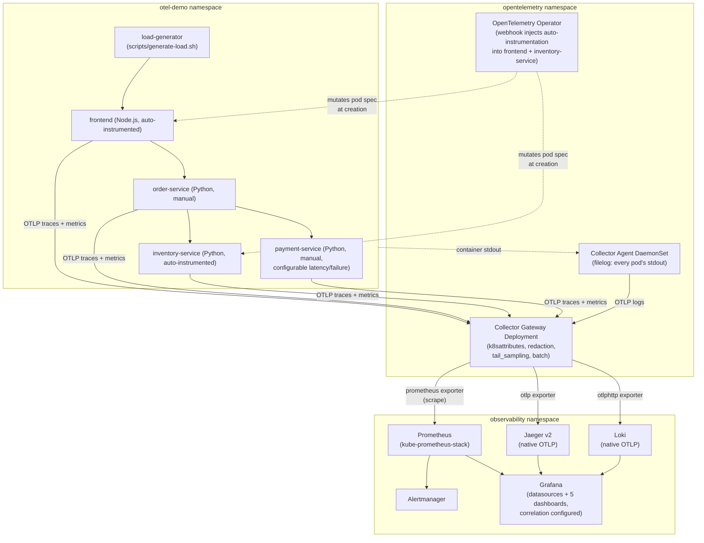

# Combined Architecture

This is the complete topology every independent lab (`../../labs/`) builds toward — every component installed together, wired exactly as `make install-all`/`make deploy-demo` configures it.

## Final combined observability architecture

## What's deliberately NOT in this diagram

Kyverno, Istio, and anything from `../../../all-tools-integrated-lab/` — this module is independent, per this phase's explicit scope boundary (`../../docs/DECISIONS.md`, root `PROJECT-IMPLEMENTATION-PLAN.md` Phase 5). The all-tools integration is Phase 6's job, not this one's.

## Reading this diagram against the independent labs

Every arrow here was individually exercised, in isolation, by a specific earlier lab: `frontend`/`inventory-service`'s auto-instrumentation (`../../labs/lab-08-auto-instrumentation.md`), `order-service`/`payment-service`'s manual instrumentation (`lab-09`), the Agent's filelog path (`lab-12`), the Gateway's tail sampling (`lab-15`), and every backend independently (`lab-02` through `lab-05`). This combined lab is where they all run simultaneously for the first time.
