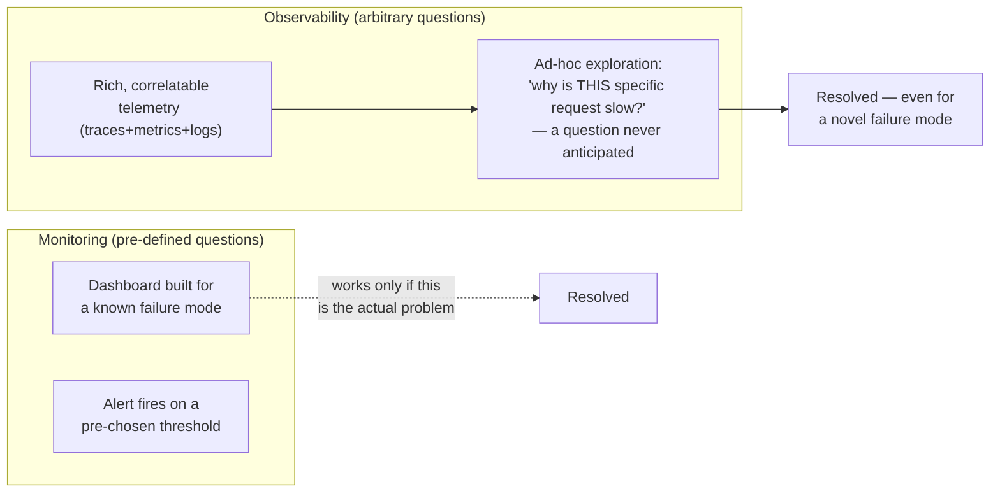
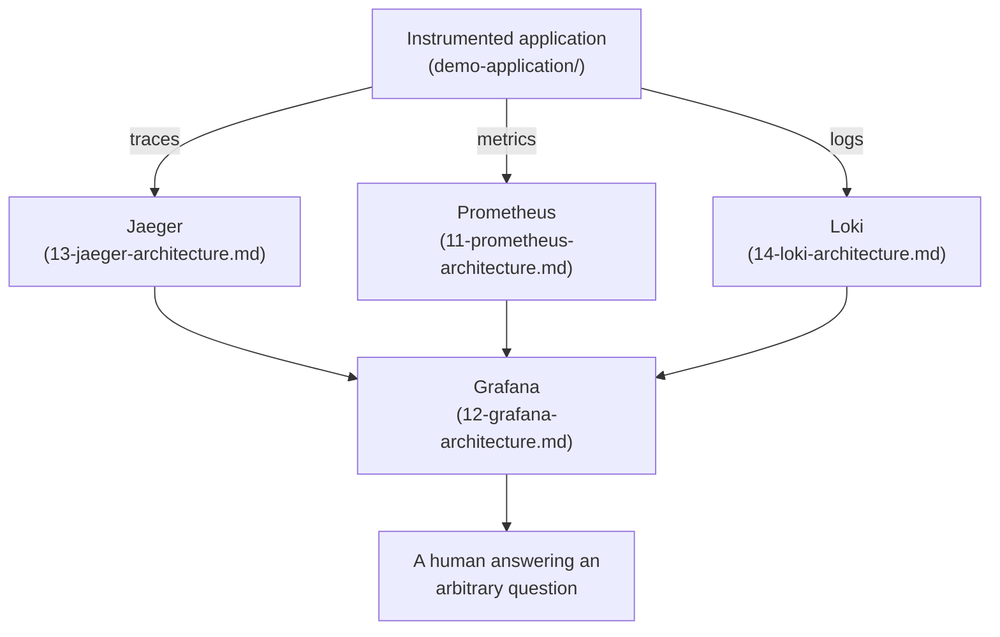

# Observability Fundamentals

## Definition

**Monitoring** answers questions you decided to ask in advance (dashboards and alerts built around known failure modes). **Observability** is the ability to answer questions you did *not* anticipate, by exploring the actual telemetry a system produced — it's a property of the system's output (how much genuine internal state that output exposes), not a tool you install.

## Problem solved

Monitoring degrades gracefully for known failure modes and fails completely for novel ones — a dashboard built for "is the database slow" tells you nothing when the actual problem is "an upstream service's retry storm is amplifying load on a specific tenant's shard." Observability's premise is that in a distributed system, the space of possible failure modes is too large to pre-enumerate; you need telemetry rich and correlatable enough to investigate a failure you've never seen before, live, without shipping new code.

## Traditional implementation

Pre-microservices: a handful of servers, SSH access, `tail -f` on a log file, a monitoring agent (Nagios/Zabbix-style) polling a fixed set of checks. Debugging meant reading logs on the one box that had the problem.

## OpenTelemetry implementation

OpenTelemetry standardizes the **three telemetry signals** (metrics, logs, traces) under one vendor-neutral API/SDK/wire-protocol, specifically so a system composed of many independently-deployed, independently-scaled services can produce telemetry that's still correlatable across all of them — see `02-opentelemetry-fundamentals.md`.

## Internal processing flow

Not applicable at this conceptual level — see `09-collector-internals.md` for the actual receiver→processor→exporter pipeline.

## Kubernetes implementation

Kubernetes itself gives you `kubectl logs`/`kubectl top`/liveness-probe status — genuinely useful, but scoped to one pod at a time, with no cross-service correlation and no historical retention once a pod is gone. This module's entire premise (`../docs/DECISIONS.md` ADR-006–009) is building the layer above that: a Collector pipeline plus three purpose-built backends (Prometheus, Jaeger, Loki) unified in Grafana.

## Working configuration

Not applicable — this is the conceptual foundation the rest of `docs/` implements concretely.

## Validation commands

```bash
kubectl -n otel-demo logs -l app=order-service --tail=20
```
Run this, then compare what it tells you against what `make port-forward-jaeger`/`grafana` can show for the same time window — the gap between the two is, concretely, what "observability" adds over "monitoring."

## Golden signals, RED, USE

**Golden signals** (Google SRE): latency, traffic, errors, saturation — a compact checklist for "is this service healthy." **RED method** (for request-driven services): Rate, Errors, Duration — a practical subset, directly what `grafana/dashboards/application-overview.json`'s panels show. **USE method** (for resources): Utilization, Saturation, Errors — what `grafana/dashboards/kubernetes-workload-overview.json` shows for CPU/memory.

## SLI, SLO, SLA, error budgets

A **SLI** (Service Level Indicator) is a measured value (e.g., `job:http_error_ratio:ratio5m` from `../prometheus/recording-rules/observability-recording-rules.yaml`). A **SLO** (Objective) is a target for that SLI (e.g., "error ratio < 1% over 30 days"). An **SLA** (Agreement) is a contractual/business commitment, usually looser than the internal SLO, with consequences for missing it. An **error budget** is `1 - SLO` — the amount of unreliability you're allowed to spend before you must prioritize reliability work over features. This lab's `prometheus/alerts/observability-alerts.yaml` `HighApplicationErrorRate` alert is a simplified, single-threshold stand-in for a real SLO-burn-rate alert (`docs/16-production-design.md` covers the production-grade multi-window burn-rate pattern).

## Why metrics alone are insufficient

Metrics are pre-aggregated numbers — cheap to store and query at scale, but they cannot answer "which specific request failed and why," because the individual request's identity was discarded at aggregation time. `orders_failed_total` tells you failures are happening; it cannot tell you *which* order or *why* without a trace.

## Why logs alone are insufficient

Logs are per-event and detailed, but in a distributed system a single logical request's logs are scattered across N services' log streams with no inherent linkage — `grep`-ing for an order ID across 4 services' logs manually is exactly the workflow trace-log correlation (`08-telemetry-correlation.md`) exists to eliminate.

## Why traces are required for distributed systems

A trace is the one signal that's inherently structured around **one request's actual path** through every service it touched, with parent-child timing — it directly answers "where did the time go" and "which specific hop failed" in a way no amount of per-service log-grepping or metric-dashboarding can, because it's the only signal that preserves cross-service causality. See `04-distributed-tracing.md`.

## Correlation across telemetry signals

The entire point of unifying all three signals under one system (rather than three separately-run tools) is that they're designed to correlate: a metric's exemplar points at a trace, a trace's spans carry a `trace_id` that also appears in structured logs, and Grafana surfaces all three side by side. See `08-telemetry-correlation.md` for exactly how this module wires that up.

## Monitoring versus observability



Monitoring is a subset of what rich telemetry enables — every monitoring dashboard can be built from observability-grade data, but not every question can be answered from monitoring-grade data alone.

## Three-signal observability model



All three signals flow through the OpenTelemetry Collector before reaching their backend (`09-collector-internals.md`, `10-collector-deployment-patterns.md`) — simplified here to show the conceptual destination, not the actual pipeline hop.

## Failure modes

- Building only dashboards for failure modes you've already seen — the next incident is, by definition, usually something new.
- Treating "we have Prometheus" as "we have observability" — metrics alone hit the ceiling described above; this module's whole design is that all three signals plus correlation are required.

## Production considerations

Error budgets and SLO burn-rate alerting are what turns "we have dashboards" into an actual operational discipline — `docs/16-production-design.md` covers the production-grade version of the single-threshold alerts this lab ships.

## Interview-level explanation

*"What's the difference between monitoring and observability, concretely?"* — Monitoring is built around known failure modes: you decide in advance what to watch and alert on. Observability is a property of the telemetry itself — rich and correlatable enough (traces linking causally across services, metrics and logs both carrying trace context) that you can investigate a failure mode nobody anticipated, live, without shipping new instrumentation. Metrics alone can't do this (aggregation destroys per-request identity), logs alone can't do this at scale in a distributed system (no cross-service linkage), which is exactly why traces — and the correlation connecting all three signals — are the piece that makes observability possible rather than just "monitoring plus more dashboards."
