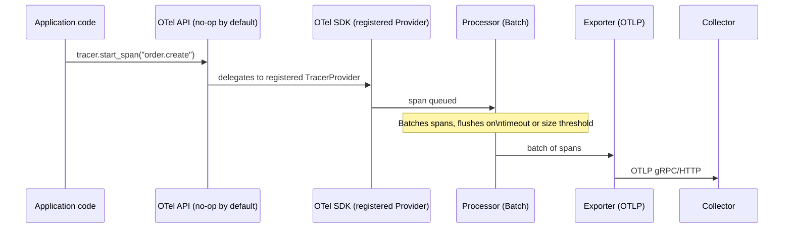
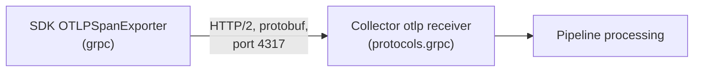
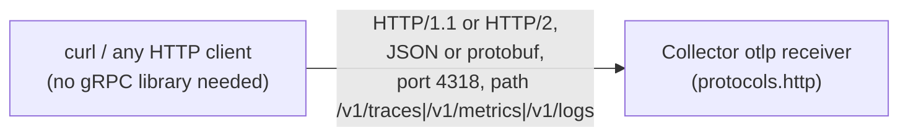

# OpenTelemetry Fundamentals

## Definition

**OpenTelemetry (OTel)** is a CNCF project providing a vendor-neutral **API** (the interfaces application code calls), **SDK** (the implementation that actually generates/exports telemetry), **Collector** (a standalone telemetry-processing pipeline), and **semantic conventions** (standardized attribute names) — one specification instead of a different client library per backend vendor.

## Problem solved

Before OTel, instrumenting an application meant picking a vendor's proprietary client library — switching backends meant re-instrumenting every service. OTel decouples "how you instrument" from "where telemetry goes": application code depends only on the OTel API; the SDK's configured exporter decides the destination, changeable without touching application code.

## Traditional implementation

Vendor-specific agents/libraries (a New Relic agent, a Datadog tracer, a custom Prometheus client per language) — each with its own instrumentation surface, its own semantic conventions (or none), and lock-in once enough application code depends on vendor-specific APIs.

## OpenTelemetry implementation

**API** — the interfaces (`Tracer`, `Meter`, `Logger`) application/library code calls; by design, a no-op if no SDK is registered (see `demo-application/frontend/server.js`'s use of `@opentelemetry/api` alone). **SDK** — the actual implementation: `TracerProvider`/`MeterProvider`/`LoggerProvider`, processors, exporters (see `demo-application/order-service/app.py`'s `setup_telemetry()`). **Instrumentation libraries** — pre-built integrations for common frameworks (FastAPI, Express, httpx) that auto-generate spans/metrics for that framework's requests without you writing span-creation code by hand.

## Internal processing flow

```text
Application code
  → OTel API call (tracer.start_span(), meter.create_counter(), ...)
  → SDK's registered Provider
  → SDK's processor(s) (e.g. BatchSpanProcessor)
  → SDK's exporter (OTLP gRPC/HTTP)
  → network hop (to Collector Agent or Gateway)
```

## Kubernetes implementation

Two paths coexist in this lab, deliberately, to teach both (`../docs/DECISIONS.md` ADR-031): **automatic instrumentation** via the OpenTelemetry Operator's `Instrumentation` CRD (webhook-injected, zero application code — `frontend`, `inventory-service`) and **manual instrumentation** (explicit SDK setup in application code — `order-service`, `payment-service`). See `03-opentelemetry-architecture.md` for the Operator's mechanics.

## Working configuration

`demo-application/order-service/app.py`'s `setup_telemetry()` is a complete, minimal, real manual SDK setup — `TracerProvider`/`MeterProvider` with `Resource` attributes, `BatchSpanProcessor` wrapping an `OTLPSpanExporter`, `PeriodicExportingMetricReader` wrapping an `OTLPMetricExporter`. Read it directly rather than a synthetic snippet here.

## Validation commands

```bash
kubectl -n otel-demo exec deploy/order-service -- python3 -c "from opentelemetry import trace; print(trace.get_tracer_provider())"
```
Confirms the registered TracerProvider is the SDK's real implementation, not the API's no-op default — the concrete difference between "the API is imported" and "telemetry is actually being generated."

## Resources, resource attributes, instrumentation scope

A **Resource** describes the entity producing telemetry (`service.name`, `service.version`, `deployment.environment` — set once per process, attached to everything that process emits). An **instrumentation scope** identifies *which library* generated a given span/metric (e.g., `opentelemetry.instrumentation.fastapi` vs. this lab's own `order-service` tracer) — lets you distinguish "spans FastAPI's instrumentation created automatically" from "spans `order.create` I created by hand," both present in the same trace.

## Providers, processors, exporters, receivers, connectors, extensions

**TracerProvider/MeterProvider/LoggerProvider** — the SDK's per-signal factory, holds the configured processors/exporters. **Span processor** — decides *when* spans are exported (`BatchSpanProcessor` batches for efficiency; `SimpleSpanProcessor` exports immediately, useful for debugging, wasteful in production). **Metric reader** — the metrics analog (`PeriodicExportingMetricReader`). **Exporter** — serializes and sends telemetry over the wire (OTLP gRPC/HTTP here). **Receiver/processor/exporter/connector/extension** are Collector-specific terms — see `09-collector-internals.md`.

## Pipelines, context propagation, semantic conventions

A **pipeline** (Collector term) is one receiver→processors→exporters chain per signal. **Context propagation** carries trace/baggage context across process boundaries — see `07-context-propagation.md`. **Semantic conventions** standardize attribute names (`http.request.method`, not `httpMethod`/`http_verb`/vendor-specific variants) so telemetry from different languages/frameworks is queryable consistently — this lab's `demo-application/order-service/app.py` uses current conventions (`http.request.method`, not the older `http.method`).

## OpenTelemetry API and SDK flow



If no SDK is registered (a bare `@opentelemetry/api` import with nothing configuring it), every API call above is a documented no-op — no error, no telemetry, silently nothing. This is precisely why `frontend`'s auto-instrumentation (which registers the SDK via the Operator's injected `NODE_OPTIONS`) is required for `@opentelemetry/api` calls in `server.js` to produce real trace context — see `operator/examples/README.md`.

## OTLP over gRPC


gRPC is this lab's default (`insecure=True` in `demo-application/*/app.py`, matching `tls: {insecure: true}` in `collector/*/configmap.yaml` — in-cluster hops only, see `17-security-and-governance.md` for the production TLS story) — lower overhead than HTTP/JSON for high-volume telemetry, at the cost of needing a gRPC-capable client (not just `curl`).

## OTLP over HTTP


Used by `scripts/lib/observability.sh`'s `send_test_otlp_trace`/`send_test_otlp_log` helpers specifically because it needs no gRPC dependency — plain `curl`/`urllib` suffices, valuable for quick manual testing (`labs/lab-04-jaeger-only.md`, `labs/lab-05-loki-only.md`) even though this lab's actual application SDKs use gRPC.

## Failure modes

- Assuming telemetry is flowing because the SDK import succeeded — the API is a no-op without a registered SDK; check `docs/21-troubleshooting.md` "Application SDK not exporting."
- Mixing OTLP gRPC and HTTP port numbers/paths — a gRPC exporter pointed at the HTTP port (or vice versa) fails with a protocol-mismatch error, not a helpful one; see `docs/21-troubleshooting.md` "OTLP gRPC and HTTP mismatch."

## Production considerations

`BatchSpanProcessor`/`PeriodicExportingMetricReader` (used throughout this lab) trade a small, bounded export delay for dramatically lower overhead than exporting synchronously per span/metric — the right default for production; `SimpleSpanProcessor` is a debugging-only tool.

## Interview-level explanation

*"What problem does OpenTelemetry actually solve, in one sentence?"* — It decouples instrumentation (what application code calls) from telemetry destination (where data goes), via a vendor-neutral API/SDK/wire-protocol, so you can instrument once and change backends — or run multiple backends, as this lab does with Prometheus+Jaeger+Loki simultaneously — without re-instrumenting a single line of application code.
