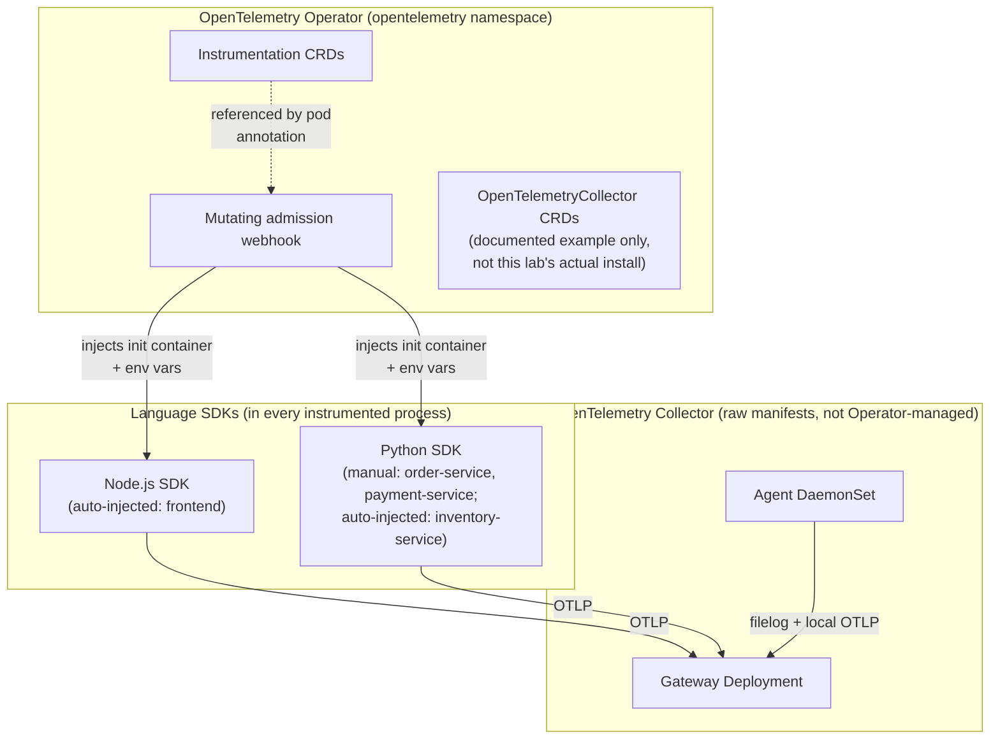

# OpenTelemetry Architecture

## Definition

The full OpenTelemetry project surface: language SDKs, the Collector (a standalone binary/process), and the Kubernetes Operator (a controller that manages Collector instances and injects auto-instrumentation) — three independently-versioned components this lab pins separately (`config/versions.env`).

## Problem solved

Running an OTel Collector as an actual Kubernetes-native, declaratively-managed component (rather than a hand-rolled Deployment every team reinvents) and getting zero-code auto-instrumentation into existing applications without a rebuild — both are what the Operator specifically adds on top of the Collector/SDK layer `02-opentelemetry-fundamentals.md` covers.

## Traditional implementation

Before the Operator existed, "add tracing to this Java service" meant modifying the Dockerfile to bake in a Java agent JAR, or manually wiring SDK calls into every service — a per-service, per-language, redeploy-required change.

## OpenTelemetry implementation

The **Operator** (`install/opentelemetry-operator/`) watches two CRDs: `OpenTelemetryCollector` (declaratively manages a Collector Deployment/DaemonSet/StatefulSet — see `10-collector-deployment-patterns.md`'s comparison with this lab's own raw-manifest approach) and `Instrumentation` (defines auto-instrumentation config per language — `operator/instrumentation/`). A **mutating admission webhook**, registered by the Operator, intercepts Pod creation for any pod annotated `instrumentation.opentelemetry.io/inject-<language>` and injects an init container plus environment variables — see `operator/examples/README.md` for exactly what gets injected.

## Internal processing flow

```text
kubectl apply -f frontend/deployment.yaml (carries the inject-nodejs annotation)
  → kube-apiserver
  → Operator's mutating webhook intercepts Pod creation
  → webhook adds an init container + env vars to the Pod spec
  → kubelet creates the (now-mutated) Pod
  → init container copies the auto-instrumentation payload into a shared emptyDir
  → application container starts, NODE_OPTIONS require-hook picks up the SDK
```

## Kubernetes implementation

`install/opentelemetry-operator/values.yaml` uses Helm's `autoGenerateCert` (not cert-manager — `install/cert-manager/README.md`, `docs/DECISIONS.md` ADR-026) for the webhook's TLS certificate. `scripts/install-operator.sh` waits for the mutating webhook to actually register before returning, since applying an `Instrumentation`-annotated pod before the webhook exists would simply skip injection silently.

## Working configuration

`operator/instrumentation/nodejs-instrumentation.yaml` and `python-instrumentation.yaml` are complete, real `Instrumentation` CRD instances — read them directly.

## Validation commands

```bash
kubectl -n opentelemetry get instrumentation
kubectl -n opentelemetry get mutatingwebhookconfiguration | grep opentelemetry
kubectl -n otel-demo get pod -l app=frontend -o jsonpath='{.items[0].spec.initContainers[*].name}'
```
The third command should show `opentelemetry-auto-instrumentation-nodejs` — direct proof injection happened.

## CRDs

`OpenTelemetryCollector` — declarative Collector management (this lab uses raw manifests instead by default, `docs/DECISIONS.md` ADR-029, but ships one documented example, `operator/collectors/example-operator-managed-collector.yaml`). `Instrumentation` — auto-instrumentation config, one resource per language/team convention (`operator/instrumentation/`).

## Operator upgrades and RBAC

The Operator itself is upgraded via `helm upgrade` against a newer chart version (`config/versions.env`'s pinned `OTEL_OPERATOR_HELM_CHART_VERSION`) — CRD schema changes across Operator versions are the real risk to check before upgrading (a newer CRD schema can reject an older `Instrumentation`/`OpenTelemetryCollector` resource). The Operator's own RBAC (created by its Helm chart, not hand-written here) needs broad permissions to manage arbitrary Collector Deployments/DaemonSets/StatefulSets across the cluster — a real blast-radius consideration, `17-security-and-governance.md`.

## Istio control plane and data plane

Not applicable to this module — see `../../istio/docs/02-istio-architecture.md` if you're looking for that specific diagram; it belongs to the independent Istio lab, not this one.

## OpenTelemetry architecture



## xDS configuration distribution

Not applicable — this is an Istio-specific concept (`../../istio/docs/02-istio-architecture.md`), not part of OpenTelemetry's architecture.

## Failure modes

- Applying an `Instrumentation`-annotated Deployment before the Operator's webhook has finished registering — the pod is created unmutated, silently, no error; `scripts/install-operator.sh`'s explicit wait exists specifically to avoid this race in the install path, but a learner manually deploying before the Operator is ready can still hit it — see `docs/21-troubleshooting.md` "Auto-instrumentation not injected."
- Assuming the Operator's Collector-CRD reconciler and this lab's raw-manifest Collector coexist without any interaction risk — they're independent (the Operator doesn't touch resources it didn't create), but naming collisions are avoidable by convention only, not enforced.

## Production considerations

The Operator's webhook is a single point of failure for *new* pod creation across every namespace with instrumented workloads (existing pods are unaffected if the webhook goes down) — `failurePolicy` on the webhook configuration determines whether pod creation blocks or proceeds unmutated if the Operator is unreachable; worth checking explicitly rather than assuming, `16-production-design.md`.

## Interview-level explanation

*"How does the OpenTelemetry Operator actually get instrumentation into a running application without changing its code?"* — A mutating admission webhook, registered by the Operator, intercepts Pod creation for any pod carrying an `instrumentation.opentelemetry.io/inject-<language>` annotation. It injects an init container that copies a self-contained instrumentation payload into a shared volume, plus environment variables (a language-specific require-hook/PYTHONPATH mechanism) that make the application process load that instrumentation automatically at startup — the application's own source code and container image are never modified; the mutation happens entirely at the Kubernetes API layer, per-pod, at creation time.
