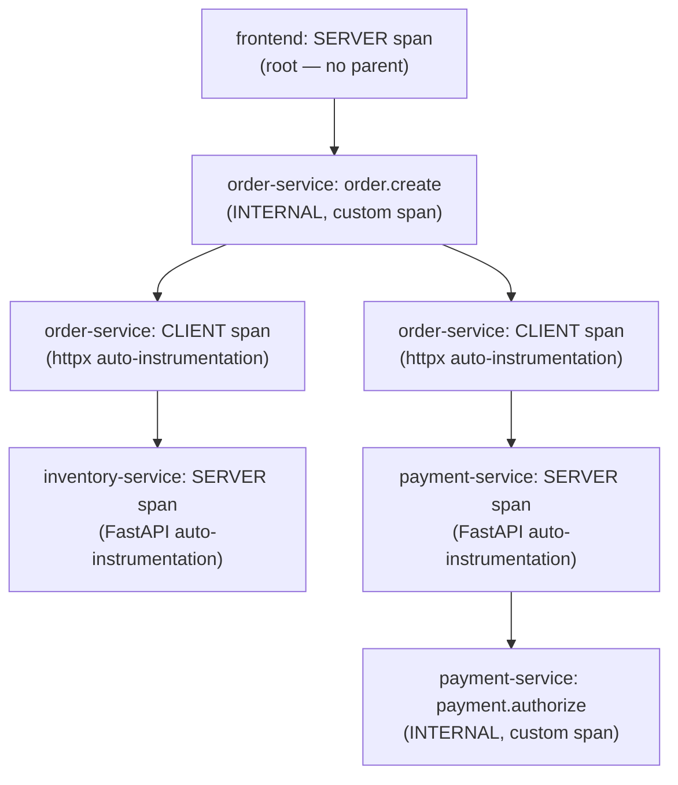

# Distributed Tracing

## Definition

A **trace** represents one logical transaction's path through a distributed system, composed of **spans** — one span per unit of work (an HTTP request, a downstream call, a business operation) — linked into a tree by parent-child relationships, all sharing one **trace ID**.

## Problem solved

In `frontend → order-service → {inventory-service, payment-service}`, a slow request could be slow in any of four services, or in the network between them. Without a trace, diagnosing this means correlating four separate log streams by timestamp and hoping nothing else was happening concurrently. A trace makes the actual call graph, and exactly which hop took the time, directly visible.

## Traditional implementation

Manually threading a request ID through every service's logs (a "correlation ID" pattern) — gets you log correlation but not timing/parent-child structure; you can find related log lines but not see a waterfall of where time was actually spent.

## OpenTelemetry implementation

Every span carries: **trace ID** (32 hex chars, shared by every span in the trace), **span ID** (16 hex chars, unique per span), a **parent span ID** (absent only for the **root span** — the first span created, with no parent), **kind** (`SERVER`/`CLIENT`/`INTERNAL`/`PRODUCER`/`CONSUMER` — what role this span plays), **status** (`OK`/`ERROR`/`UNSET`), **attributes** (key-value metadata), **events** (timestamped points within the span's duration, e.g. an exception), and **links** (references to causally-related spans outside the direct parent-child tree, e.g. a batch job spawned by, but not blocking, the triggering request).

## Internal processing flow

`demo-application/order-service/app.py`'s `create_order()` shows this exactly: FastAPI's instrumentation creates a `SERVER` root span for the incoming HTTP request; `tracer.start_as_current_span("order.create")` creates a child `INTERNAL` span for the business operation; the `httpx` instrumentation creates `CLIENT` spans for each downstream call, which arrive at `inventory-service`/`payment-service` as new `SERVER` spans continuing the *same* trace ID (because trace context propagated over the HTTP call — see `07-context-propagation.md`).

## Kubernetes implementation

Every span is exported via OTLP to the local Collector Agent, forwarded to the Gateway, tail-sampled (`09-collector-internals.md`), and exported to Jaeger (`13-jaeger-architecture.md`) — no Kubernetes-specific tracing mechanism exists; Kubernetes only provides the pod-level metadata (`k8sattributes` processor) that gets attached as span resource attributes.

## Working configuration

`demo-application/order-service/app.py`'s span tree: `order.create` (custom) → `inventory.check` (custom, wraps the CLIENT span httpx auto-creates) → `payment.authorize` (custom, same pattern). Read the actual file for the real attribute names used (`order.id`, `customer.type`, `inventory.available`, `payment.provider`).

## Validation commands

```bash
kubectl -n otel-demo exec deploy/frontend -- curl -s -X POST http://localhost:3000/ 2>/dev/null || true
```
Then search Jaeger for service `frontend` — the resulting trace should show 4 services and at least 6 spans (root + `order.create` + `inventory.check` + `inventory-service`'s own server span + `payment.authorize` + `payment-service`'s own server span).

## Critical path, latency attribution, error propagation

The **critical path** is the sequence of spans that actually determines the trace's total duration (if `inventory.check` and a hypothetical parallel call both take 100ms but only one is awaited before the response, only that one is on the critical path). **Latency attribution** means reading which specific span's *self* time (its duration minus its children's durations) is large — Jaeger's waterfall view shows this directly. **Error propagation**: a span's `status: ERROR` (set explicitly via `span.set_status(...)` in `order-service`/`payment-service`) should propagate visually up the parent chain in Jaeger's UI, distinguishing "this exact span failed" from "a descendant of this span failed."

## Service dependency graph, asynchronous tracing, broken propagation

The **service dependency graph** (Jaeger's `/api/dependencies`, `jaeger/queries/jaeger-api-examples.md`) is derived automatically from enough traces' parent-child service transitions — a live, evidence-based architecture diagram, not a hand-maintained one. **Asynchronous tracing** (queue/pub-sub-based call chains) uses **links** rather than direct parent-child spans, since the producer doesn't block on the consumer — not exercised in this lab's synchronous HTTP-only demo app, documented as a gap. **Broken propagation** — see `07-context-propagation.md` and `docs/21-troubleshooting.md` "Partial traces" / "Missing service name."

## Distributed trace across microservices



All seven spans share one `trace_id`; each arrow is a parent-child relationship established either by direct in-process nesting (`order.create` inside the root span) or by trace-context propagation over an HTTP call (`INVCLIENT` → `INVSERVER`).

## Failure modes

- Expecting every span to appear even under tail sampling's probabilistic-baseline policy — only error/slow traces are *guaranteed* kept (`09-collector-internals.md`, `labs/lab-15-sampling.md`); a normal, fast, successful trace has only a 15% chance of being kept by this lab's default policy.
- A "trace" that's actually several disconnected single-span traces, one per service — the signature of broken context propagation (`docs/21-troubleshooting.md` "Broken context propagation").

## Production considerations

Trace volume at real production scale makes head sampling (a decision made per-span, before knowing the trace's outcome) attractive for cost reasons, but loses the "always keep errors and slow traces" guarantee tail sampling provides — this lab's tail-sampling default is deliberately the more expensive-but-more-useful choice for a *learning* lab; `16-production-design.md` covers the real cost/completeness tradeoff at scale.

## Interview-level explanation

*"Walk me through what happens, trace-wise, for one request through this demo app."* — `frontend` starts a root SERVER span for the incoming request. It calls `order-service`, propagating trace context in the HTTP headers; `order-service`'s own SERVER span becomes a child of that root, and inside it, `order-service` creates a custom INTERNAL span (`order.create`) for the business logic. Calling `inventory-service` and `payment-service` each creates a CLIENT span (from the httpx auto-instrumentation) as a child of `order.create`, and each arrives at its target as a new SERVER span continuing the same trace — because the CLIENT span propagated the trace context over the wire. The result is one trace, one trace_id, a tree of parent-child spans spanning four services and two languages, viewable as a single waterfall in Jaeger.
