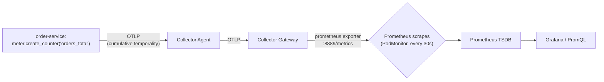

# Metrics

## Definition

A **metric** is a numeric measurement of a system's behavior over time, recorded via one of a small set of **instrument types**, aggregated over time windows for storage and query efficiency (unlike traces/logs, individual raw data points are not retained).

## Problem solved

Storing every individual request's outcome as a discrete event (log-like) doesn't scale for "what's the error rate over the last 5 minutes across 10,000 requests/sec" — metrics pre-aggregate exactly that class of question into cheap-to-store, cheap-to-query time series.

## Traditional implementation

StatsD-style push-based counters/gauges to a central aggregator, or hand-rolled `/metrics` text endpoints scraped by a monitoring tool — inconsistent naming, inconsistent unit conventions, no standard for what a "good" metric name even looks like.

## OpenTelemetry implementation

Instrument types: **Counter** (monotonically increasing, e.g. `orders_total`), **UpDownCounter** (can increase or decrease, e.g. `active_requests`), **Histogram** (distribution of values into buckets, e.g. `order_processing_duration` — enables percentile queries), **Observable Gauge** (a current value read on demand, e.g. a queue depth). This lab's business metrics (`demo-application/order-service/app.py`, `payment-service/app.py`) use exactly these four correctly per their actual semantics — `orders_total`/`payment_authorizations_total` are Counters (only ever increase), `active_requests` is an UpDownCounter (goes up and down), `order_processing_duration` is a Histogram.

## Internal processing flow

```text
meter.create_counter("orders_total").add(1, {"status": "success"})
  → SDK's MeterProvider
  → PeriodicExportingMetricReader (flushes every 15s, this lab's config)
  → OTLPMetricExporter
  → Collector (aggregation NOT re-done here — the SDK already aggregated)
  → prometheus exporter (Gateway) — converts OTLP metric points to Prometheus exposition format
  → Prometheus scrapes it
```

## Kubernetes implementation

`prometheus/podmonitors/otel-collector-podmonitor.yaml`'s `prom-export` endpoint (Gateway's `prometheus` exporter, port 8889) is how the demo app's OTLP-native metrics become Prometheus-scrapeable — see `docs/DECISIONS.md` ADR-028 for why scrape-based rather than remote-write.

## Working configuration

`demo-application/order-service/app.py`'s `orders_total`/`orders_failed_total`/`order_processing_duration`/`active_requests` — read directly; each instrument's creation call states its type explicitly (`create_counter`/`create_up_down_counter`/`create_histogram`).

## Validation commands

```bash
kubectl -n observability port-forward svc/kube-prometheus-stack-prometheus 9090:9090 &
curl -s 'http://localhost:9090/api/v1/query?query=orders_total' | python3 -m json.tool
```

## Attributes, dimensions, cardinality, aggregation

**Attributes** on a metric data point (e.g. `orders_total{status="success"}`) become Prometheus **labels** — each unique combination of label values is a separate **time series**; the number of such combinations is that metric's **cardinality**. `order.id` would be a catastrophic label choice (unbounded cardinality, one series per order forever) — this lab's metrics deliberately use only low-cardinality attributes (`status`, `customer_type`, `reason`) — see `18-performance-and-capacity.md` and `collector/examples/cardinality-limiting.yaml`.

## Delta vs. cumulative temporality

**Cumulative** (this lab's default, and Prometheus's expected model): each reported value is the total since the instrument was created; Prometheus's `rate()`/`increase()` functions handle counter resets automatically. **Delta**: each reported value is only the change since the last export — required by some backends (not Prometheus), and NOT what this lab uses; mixing temporalities incorrectly between an SDK and a backend is a real, if latent, source of double-counting or under-counting bugs.

## Application, runtime, Kubernetes, and Collector-internal metrics

**Application metrics** — this lab's custom business counters/histograms. **Runtime metrics** — language-runtime-level (GC pauses, heap size); not explicitly instrumented in this lab's demo app (a documented gap, not silently assumed present). **Kubernetes metrics** — from kube-state-metrics/node-exporter (bundled by kube-prometheus-stack), scraped independently of the OTel pipeline entirely. **Collector-internal metrics** — the Collector's own health (`otelcol_*`), covered in `09-collector-internals.md`.

## Prometheus scraping vs. remote write, recording/alerting rules

Covered in depth in `11-prometheus-architecture.md` — this doc stays scoped to the metric *signal* itself, not the storage backend.

## Prometheus metrics flow



## Failure modes

- Using a high-cardinality field (order ID, customer ID, trace ID) as a metric attribute — see `18-performance-and-capacity.md` "Cardinality" and `labs/lab-19-cardinality-control.md`.
- Confusing a Histogram's bucket boundaries with actual percentile precision — `histogram_quantile()` interpolates between configured bucket boundaries; a poorly-chosen bucket set gives misleading P95/P99 numbers even though the query itself is correct.

## Production considerations

`enableFeatures: [exemplar-storage]` (`install/prometheus/values-*.yaml`) is required, not default — a real, easy-to-miss production gotcha this lab surfaces explicitly rather than silently relying on.

## Interview-level explanation

*"Why is a Histogram the right instrument for request duration, and not a Gauge?"* — A Gauge only holds the current/last value — you lose every prior observation's distribution shape. A Histogram buckets every observation, letting you compute P50/P95/P99 after the fact via `histogram_quantile()` — essential for latency, where the *tail* (P99, not the average) is usually what actually matters operationally. `order_processing_duration` in this lab is a Histogram specifically because "what's our P95 order-processing time" is a real question this lab's dashboards and alerts (`HighP95Latency`) answer directly from it.
