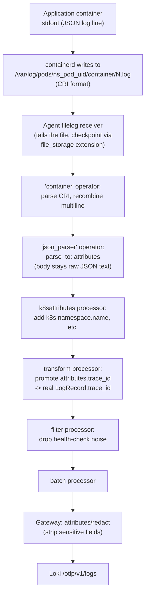

# Logs

## Definition

A **log** is a timestamped record of a discrete event, with a **severity**, a **body** (the message), and optional **attributes**/**resource attributes** — the least structured, most detailed of the three signals.

## Problem solved

Traces and metrics are purpose-built and structured; logs are where arbitrary, unanticipated detail lives — a stack trace, a one-off debug print, a third-party library's own diagnostic output. No amount of tracing/metrics instrumentation eliminates the need for logs; they're complementary, not redundant.

## Traditional implementation

`kubectl logs`, or Promtail/Fluentd/Fluent Bit shipping container stdout to a log aggregator, with no inherent connection to any trace or metric describing the same request.

## OpenTelemetry implementation

**Structured logs** (this lab's application logs — real JSON, one object per line) vs. **unstructured** (plain text, common for third-party library output, container runtime messages, etc.) — both are ingested identically by `filelog`, but only structured logs support reliable field extraction (`json_parser` operator). This lab's default log collection is exclusively the OpenTelemetry Collector's `filelog` receiver — never Promtail (mentioned here only as historical/comparative context, per this lab's own explicit scope) — see `docs/DECISIONS.md` ADR-007.

## Internal processing flow — the mandatory pipeline

```text
Container stdout/stderr
  → containerd writes to /var/log/pods/<ns>_<pod>_<uid>/<container>/<N>.log (CRI format)
  → Collector Agent's filelog receiver tails this file
  → `container` operator: parses CRI format, recombines multiline entries
  → `json_parser` operator: parses the app's JSON body into `attributes` (parse_to: attributes — body stays intact)
  → k8sattributes processor: adds k8s.namespace.name/k8s.pod.name/etc.
  → transform processor: promotes attributes.trace_id/span_id into the real LogRecord trace_id/span_id fields
  → filter processor: drops health-check-probe noise
  → batch → OTLP → Gateway → otlphttp exporter → Loki /otlp
```

See `collector/agent/configmap.yaml` for the real, complete version of this pipeline.

## Kubernetes implementation: CRI log format, multiline, JSON parsing

Kubernetes/containerd write one line per log line, each prefixed with a timestamp and stream indicator (the **CRI log format**) — `/var/log/pods/*/*/*.log`, confirmed as this cluster's unmodified default path (`../../auto-setup-default-kube-env/`'s provisioning has no custom log-dir override). **Multiline** entries (a Python/Node stack trace spanning many physical lines) must be recombined into one logical record — the `container` operator does this automatically (`06-logs.md`'s pipeline above), the modern approach over manually chaining `regex_parser`+`recombine` operators.

## Severity, timestamp, body, attributes, resource attributes

Severity (`INFO`/`WARNING`/`ERROR`) and timestamp are extracted from the app's JSON body into first-class OTLP `LogRecord` fields (`severity_parser`/`time_parser` operators) — not left buried inside the JSON text, so backends can filter/sort on them natively. Resource attributes (`k8s.namespace.name`, `service.name`, etc.) describe *what produced* the log, distinct from the log's own attributes (`order_id`, `trace_id`) describing *this specific event*.

## Trace ID and span ID injection, log-to-trace and trace-to-log correlation

`demo-application/order-service/app.py`'s `TraceContextJsonFormatter` reads the currently-active span's context and injects `trace_id`/`span_id` into every JSON log line — the foundation `08-telemetry-correlation.md` builds on. `inventory-service`'s auto-instrumented equivalent relies on the Operator-injected `OTEL_PYTHON_LOG_CORRELATION=true` env var instead of hand-written code — see `demo-application/inventory-service/app.py`'s comment.

## Loki labels, structured metadata, cardinality control

**Labels** are indexed (fast to query by, expensive if high-cardinality — `k8s_namespace_name`, `service_name`). **Structured metadata** (Loki 3.0+) carries additional per-line fields (`trace_id`, `span_id`, `order_id`) without indexing them as labels — the correct place for exactly the high-cardinality fields that would be disastrous as labels. See `loki/logql/logql-examples.md`'s explicit "avoiding high-cardinality indexed labels" section and `19-cost-optimization.md`.

## Sensitive-data filtering, retention

`collector/gateway/configmap.yaml`'s `attributes/redact` processor deletes known-sensitive keys (`password`, `token`, `card_number`, `customer.ssn`, `http.request.header.authorization`) from every pipeline, logs included, before export — see `17-security-and-governance.md`. Retention: `loki/retention/README.md`.

## The three-tool split, stated explicitly (as required)

**Grafana visualizes logs. Loki stores and queries logs. The OpenTelemetry Collector collects and processes logs.** Three distinct responsibilities, three distinct components — conflating any two of them (e.g., assuming Grafana stores anything, or that Loki does any processing beyond storage/indexing) leads to real confusion when something breaks, since the fix lives in a different component than the symptom.

## Filelog receiver flow



## Start_at behavior, duplication risk, loss risk

`start_at: beginning` (`collector/agent/configmap.yaml`) means a **brand-new** log file (a newly-created pod) is read from its start — correct for not missing early logs, but means a Collector Agent that's never seen a given node before could, in principle, read a large backlog on first start. The `file_storage/checkpoint` extension persists each file's read offset to a node-local `hostPath` (not `emptyDir`, deliberately — survives pod recreation, not just container restart) specifically to avoid re-reading the same lines after an Agent restart (**duplication risk**) — but a truly-deleted checkpoint volume (e.g., manual node maintenance) combined with `start_at: beginning` would re-read from scratch, duplicating everything still on disk. Conversely, if log rotation deletes a file *faster* than the Agent reads it (very high-throughput pod, aggressive rotation), lines can be lost before ever being read (**loss risk**) — a real, bounded risk this lab documents rather than pretends doesn't exist; see `21-troubleshooting.md`.

## Failure modes

- Reading `/var/log/pods` as non-root and hitting permission errors — see `daemonset.yaml`'s header comment and `21-troubleshooting.md` "Filelog permission denied," a deliberately-not-hidden consequence of this lab's non-root Agent choice.
- Assuming Loki does log *processing* (parsing, enrichment) — it doesn't; all of that happens in the Collector before Loki ever sees the data. A misbehaving parser shows up as "logs look wrong in Loki," but the fix is in `collector/agent/configmap.yaml`, not Loki.

## Production considerations

Multiline/CRI-parsing correctness at real log volume (many pods, high throughput) is worth load-testing explicitly — a misconfigured `container` operator degrading gracefully into "mostly works, occasionally splits a stack trace" is a subtle, hard-to-notice production bug class.

## Interview-level explanation

*"Why did you choose the Collector's filelog receiver over Promtail?"* — Because this lab's entire pipeline is unified around OTLP — traces, metrics, and logs all flow through the same Agent→Gateway architecture, get the same `k8sattributes` enrichment, and (critically) logs get trace-context promoted into their `LogRecord` fields by the same pipeline that's already processing traces, which is what makes trace-log correlation (`08-telemetry-correlation.md`) work without a second, separately-configured log-shipping tool. Promtail is a fine, mature tool, but running it alongside the Collector would mean maintaining two separate enrichment/processing configurations for what should be one coherent pipeline.
