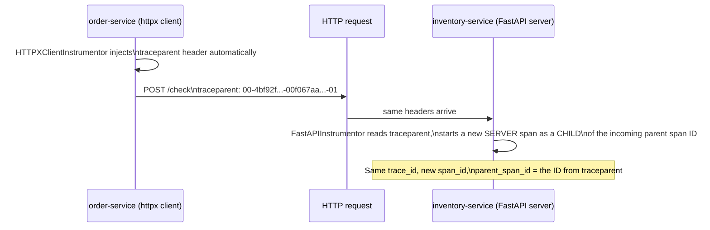

# Context Propagation

## Definition

**Context propagation** is how trace context (which trace, which span is the current parent) crosses a process boundary — carried in request headers, using a standardized format so services written in different languages/frameworks still connect into one trace.

## Problem solved

Without a standard, every framework/language pairing would need custom glue to pass trace context between services — exactly the fragmentation OpenTelemetry's semantic conventions exist to eliminate elsewhere. **W3C Trace Context** is that standard: one HTTP header format every OTel SDK understands natively.

## Traditional implementation

Proprietary headers (`X-B3-TraceId` for Zipkin/B3 propagation, vendor-specific headers for commercial APMs) — functional within one vendor's ecosystem, broken the moment a request crosses into a different vendor's instrumented service.

## OpenTelemetry implementation

The **`traceparent`** HTTP header (`00-<trace-id>-<parent-span-id>-<flags>`) carries the trace ID, the immediate parent span ID, and trace flags (notably whether this trace is sampled). The **`tracestate`** header carries vendor-specific extensions, rarely needed in this lab. **Baggage** (a separate `baggage` header) carries arbitrary key-value application context alongside trace context — distinct from trace context itself, propagated but not directly tied to span parent-child structure (e.g., propagating `customer.type` to every downstream service without re-deriving it at each hop).

## Internal processing flow

`demo-application/order-service/app.py`'s `httpx` calls to `inventory-service`/`payment-service` have their `traceparent` header injected automatically by `HTTPXClientInstrumentor()` — no manual header manipulation in application code. `inventory-service`'s FastAPI auto-instrumentation reads that incoming header automatically and continues the same trace as a new child SERVER span.

## Kubernetes implementation

Not Kubernetes-specific — propagation happens entirely within the HTTP request/response cycle between pods; Kubernetes networking is transparent to it (no service mesh is involved in this module, unlike `../../istio/`, which layers its own separate mTLS/routing concerns on top without touching trace-context headers).

## Working configuration

`operator/instrumentation/nodejs-instrumentation.yaml`/`python-instrumentation.yaml` both set `propagators: [tracecontext, baggage]` explicitly — confirming this lab uses the W3C standard, not a legacy format, for every auto-instrumented service. `order-service`/`payment-service`'s manual SDK setup gets `tracecontext`/`baggage` propagation for free from `HTTPXClientInstrumentor`'s default configuration.

## Validation commands

```bash
kubectl -n otel-demo exec deploy/frontend -- curl -sv http://order-service.otel-demo.svc.cluster.local:8000/health 2>&1 | grep -i traceparent
```
A manually-issued request like this (not going through an instrumented client) won't show a `traceparent` header at all — that's expected; it demonstrates the header only appears when an instrumented HTTP client actually generates it.

## W3C Trace Context format, precisely

```text
traceparent: 00-4bf92f3577b34da6a3ce929d0e0e4736-00f067aa0ba902b7-01
              │  └──────────32-hex trace ID───────┘ └8-hex parent span┘ │
           version                                                  flags (01 = sampled)
```

## W3C context propagation



## Sampling decisions and propagation

The `flags` field's sampled bit (`01` above) is itself propagated — a head-sampling decision made at the trace's root is honored by every downstream service, so you never get a trace with some services sampled and others not due to independent local decisions (this lab uses tail sampling at the Gateway instead, `09-collector-internals.md`, which makes this specific propagated-bit mechanism less load-bearing here, but it's still how `parentbased_traceidratio` — this lab's configured SDK sampler, `operator/instrumentation/*.yaml` — decides whether to even create real spans vs. no-op ones for non-root spans).

## Failure modes

- A manually-constructed HTTP call (bypassing the instrumented client library, e.g. a raw `socket` call or a library the instrumentation doesn't cover) silently drops trace context — the resulting trace fragments into disconnected pieces, `docs/21-troubleshooting.md` "Broken context propagation."
- Two services using different propagator configurations (one W3C, one B3-only) — context that reaches a service which can't parse the incoming header format is effectively lost, producing a new, unrelated root span instead of a continued trace.

## Production considerations

Propagator configuration should be a fleet-wide, centrally-enforced convention (this lab does it via the `Instrumentation` CRD, `../../istio/` phase's equivalent lesson for mesh-level concerns) — a single team quietly switching propagators breaks correlation for every trace crossing that team's service boundary, often discovered only when someone notices traces mysteriously stop connecting.

## Interview-level explanation

*"How does a trace ID actually get from one service to another?"* — Via the W3C `traceparent` HTTP header, injected automatically by the calling service's instrumented HTTP client library (no manual code) and read automatically by the receiving service's instrumented HTTP server framework. The header carries the trace ID, the calling span's ID (which becomes the new span's parent), and a sampled flag. Neither service has to manually pass or parse anything — it's entirely the instrumentation libraries' job, which is exactly why using an *instrumented* client (not a raw socket call) at every hop is a hard requirement for trace continuity, not an optional nicety.
