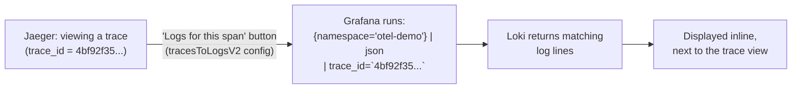
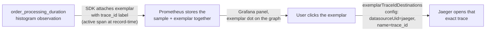

# Telemetry Correlation

## Definition

Correlation is the ability to navigate directly between related pieces of the three signals — from a slow metric to the specific trace that was slow, from that trace to the exact log lines it produced — rather than manually cross-referencing timestamps across three separately-opened tools.

## Problem solved

Three excellent, independently-functioning tools (Prometheus, Jaeger, Loki) are still three separate silos without correlation — an operator would still have to guess which trace corresponds to a metric spike and search for it by approximate time window. Correlation turns "three tools" into "one investigative workflow."

## Traditional implementation

Manual: note the timestamp of an anomaly in a metrics dashboard, open a separate tracing UI, filter by service and approximate time range, hope the volume is low enough to spot the relevant trace by eye — slow, error-prone, and impossible at high request volume.

## OpenTelemetry implementation

Correlation in this lab rests on one underlying fact: **`trace_id` is present, identically, in the trace itself, in the metric exemplar attached to a histogram observation, and in the structured JSON log line** — all three link on the same literal string. `install/grafana/datasources/datasources.yaml` configures Grafana to make each of the three link directions clickable; but the links only work because the underlying data genuinely correlates (`tests/correlation-test.sh` proves this directly, not just that the config exists).

## Internal processing flow

See `06-logs.md`'s pipeline (trace_id promoted into LogRecord via `transform/log_trace_context`) and `05-metrics.md`'s exemplar note — both converge on the same `trace_id` value, generated once by the OTel SDK's active-span context at the moment the log/metric was recorded.

## Kubernetes implementation

Not Kubernetes-specific — correlation is a data-modeling property, working identically regardless of where the backends run.

## Working configuration

`install/grafana/datasources/datasources.yaml`'s three `jsonData` blocks (`exemplarTraceIdDestinations`, `tracesToLogsV2`, `derivedFields`) are the complete, real configuration — see `grafana/correlations/README.md` for a guided read-through.

## Validation commands

```bash
bash tests/correlation-test.sh
```
This is the definitive check — it extracts a *real* trace_id from a *real* Jaeger trace and confirms the *same* trace_id exists in a *real* Loki log record, rather than just checking that Grafana's datasource config parses.

## Metric → trace (exemplars)

An **exemplar** is a specific raw data point attached to an aggregated metric sample, carrying its own labels — including, in this lab, `trace_id`. Requires Prometheus's `exemplar-storage` feature flag (`install/prometheus/values-*.yaml`) and the SDK actually attaching one (the OTel Python/Node SDKs do this automatically for histogram recordings made within an active span — no extra code needed in `order-service`/`payment-service` beyond what `05-metrics.md` already shows).

## Trace → log

Jaeger's embedded view inside Grafana (`tracesToLogsV2`) runs a LogQL query scoped to the trace's own time window, filtered by `trace_id` — see `install/grafana/datasources/datasources.yaml`'s exact query.

## Log → trace

Loki's `derivedFields` regex-matches `"trace_id":"..."` in the raw log line and links it as an internal Jaeger query — see the same file's comment on why no `url` field is needed for an internal link.

## Trace-to-log correlation



## Metrics exemplar-to-trace flow



## Failure modes

- Exemplar dots never appearing on a Grafana graph — usually `exemplar-storage` not enabled on Prometheus, or the SDK's histogram recording happening *outside* an active span context (no span to derive `trace_id` from) — `docs/21-troubleshooting.md` "Exemplar links missing."
- `derivedFields`/`tracesToLogsV2` configured but returning nothing — almost always the underlying `trace_id` isn't actually present/matching in the target backend's data, not a Grafana config bug; `tests/correlation-test.sh` is designed to catch exactly this distinction.

## Production considerations

Correlation quality degrades silently if any one team's service stops propagating trace context correctly into its logs (`06-logs.md`'s trace-context-injection step) — worth a standing, automated check (this lab's `correlation-test.sh` is a template for that) rather than discovering it only when someone tries to use a correlation link during an incident and it comes up empty.

## Interview-level explanation

*"How would you prove telemetry correlation actually works, not just that it's configured?"* — Don't just check that Grafana's datasource JSON has the right fields; extract a real trace_id from a real trace in the tracing backend, then query the logging backend directly for that exact trace_id and confirm a match. That's what `tests/correlation-test.sh` in this lab does — it's the difference between "the wiring exists" and "the wiring actually carries a signal," and only the second one is what an engineer investigating a real incident actually depends on.
