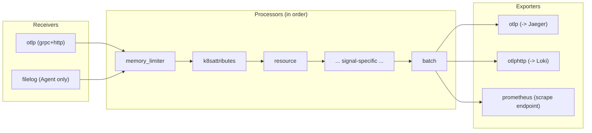
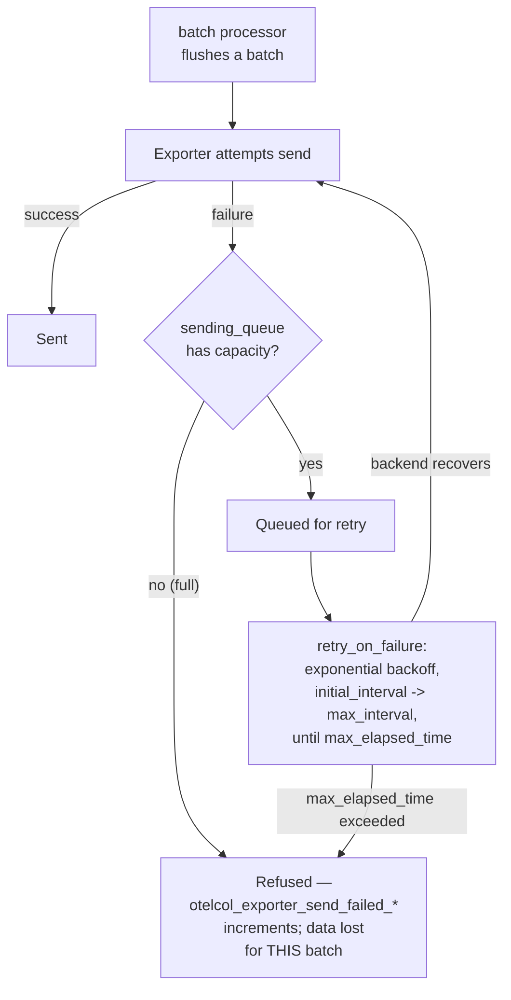

# Collector Internals

## Definition

The **OpenTelemetry Collector** is a standalone, vendor-neutral telemetry pipeline: **receivers** accept data in, **processors** transform/filter/batch it, **exporters** send it out, **connectors** bridge one pipeline's output into another pipeline's input, and **extensions** add cross-cutting capabilities (health checks, storage, diagnostics) not tied to any one pipeline.

## Problem solved

Without a Collector, every application would need to know every backend's specific protocol/auth/retry requirements directly — N applications × M backends worth of integration code. The Collector centralizes that: applications only ever speak OTLP to the Collector; the Collector's exporters handle the actual backend-specific details, changeable without touching application code.

## Traditional implementation

Backend-specific agents bundled into each application (a New Relic agent, a Datadog agent) — each reimplementing batching/retry/queueing logic independently, with no shared processing layer for cross-cutting concerns like PII redaction or Kubernetes metadata enrichment.

## OpenTelemetry implementation

This lab's exact component list, in the actual order they run — see `collector/agent/configmap.yaml` and `collector/gateway/configmap.yaml` for the real, complete configs:

| Component | Type | Role in this lab |
| --- | --- | --- |
| `otlp` | receiver | Accepts OTLP gRPC/HTTP from apps and, at the Gateway, from Agents |
| `filelog` | receiver | Agent only — reads `/var/log/pods/*/*/*.log` |
| `memory_limiter` | processor | Always first — refuses new data under memory pressure rather than OOMing |
| `k8sattributes` | processor | Enriches with `k8s.namespace.name`/`k8s.pod.name`/etc. |
| `resource` | processor | Adds static attributes (`deployment.environment`, `cluster.name`) |
| `transform` | processor | Agent: promotes JSON-parsed `trace_id`/`span_id` into real LogRecord fields |
| `attributes` | processor | Gateway: `attributes/redact` — deletes sensitive keys |
| `filter` | processor | Drops health-check-probe noise |
| `tail_sampling` | processor | Gateway traces pipeline only — see below |
| `batch` | processor | Always last — groups records for efficient export |
| `otlp`/`otlphttp`/`prometheus` | exporters | To Jaeger, Loki, and Prometheus (scrape) respectively |
| `health_check`, `pprof`, `zpages` | extensions | Liveness/readiness, profiling, live pipeline introspection |
| `file_storage` | extension | Agent only — persists filelog checkpoint offsets |

## Internal processing flow (per-pipeline)

Each of traces/metrics/logs is an **independent pipeline** — same Collector process, separate receiver→processor-chain→exporter wiring per signal (`service.pipelines.{traces,metrics,logs}` in the config). A processor failing in the traces pipeline has zero effect on the logs pipeline.

## Kubernetes implementation

Covered in `10-collector-deployment-patterns.md` — this doc stays scoped to what happens *inside* one Collector process, not how it's deployed.

## Working configuration

`collector/gateway/configmap.yaml`'s `service.pipelines` block is the authoritative, complete example — read it directly rather than a reproduced snippet.

## Validation commands

```bash
kubectl -n opentelemetry port-forward svc/otel-collector-gateway 8888:8888 &
curl -s http://localhost:8888/metrics | grep otelcol_receiver_accepted
```

## Head vs. tail sampling

**Head sampling** decides per-span, at creation time, before the trace's outcome (error? slow?) is known — cheap, but structurally can't guarantee "always keep errors." **Tail sampling** (this lab's choice, Gateway only — head sampling would have to happen at the SDK, which this lab doesn't configure to drop anything, relying entirely on tail sampling instead) buffers spans for `decision_wait` (10s, `config/lab-settings.env`) until a full trace is assembled, THEN decides — enabling policies like "keep 100% of error traces" that head sampling structurally cannot express. The cost: the Gateway must hold recent trace state in memory (`num_traces: 50000`) and only Gateway replicas that received *all* of a given trace's spans can make a correct decision for it — a real constraint at Gateway-replica-count > 1, `16-production-design.md` "Stateful tail sampling, consistent routing."

## Cardinality, temporality, aggregation

Covered from the metrics-specific angle in `05-metrics.md` — this doc's relevant note: the Collector does NOT re-aggregate metrics the SDK already aggregated (no double-counting), it only forwards/converts format (OTLP → Prometheus exposition format via the `prometheus` exporter).

## Queue capacity and sizing

`sending_queue.queue_size` (`collector/gateway/configmap.yaml`) is measured in **batches**, not individual telemetry items — `queue_size: 2000` with `send_batch_size: 1024` items/batch means roughly 2 million buffered items before the queue is full and the exporter starts blocking/refusing, not 2000 individual spans. Getting this unit wrong is a common, easy sizing mistake — `18-performance-and-capacity.md`.

## Collector receiver-processor-exporter pipeline



## Collector retry and queue flow



## Failure modes

- `queue_size` sized in "batches" but reasoned about as "items" — leads to either wildly over- or under-provisioned memory headroom; see `18-performance-and-capacity.md`.
- Assuming a Collector CrashLoopBackOff or OOMKill means the config is wrong — often it's `memory_limiter.limit_mib` set too close to (or above) the container's actual `resources.limits.memory`, leaving no headroom for the process's own baseline memory use; `21-troubleshooting.md` "Collector OOMKilled."

## Production considerations

`zpages`/`pprof` extensions (enabled in this lab, bound to `127.0.0.1` only, not exposed via the Service) are real, valuable live-debugging tools for "what is this specific Collector instance's pipeline doing right now" — worth knowing they exist even if rarely reached for; `21-troubleshooting.md`.

## Interview-level explanation

*"What's the difference between head and tail sampling, and why would you choose one over the other?"* — Head sampling decides whether to keep a trace at the moment the root span is created, before anything about the trace's actual outcome is known — cheap and stateless, but can never guarantee "always keep the errors," since you don't know yet if there will be one. Tail sampling waits until an entire trace has arrived, then decides — meaning you can express policies like "always keep traces with an error status, always keep traces over 500ms, otherwise sample 15%," which is exactly what this lab's Gateway does. The tradeoff is the Gateway has to buffer in-flight trace state, which has real memory and multi-replica-consistency implications at scale — a cost worth paying for a learning lab (and often worth paying in production) specifically because "we definitely captured every error" is usually more valuable than the resource savings of head sampling.
