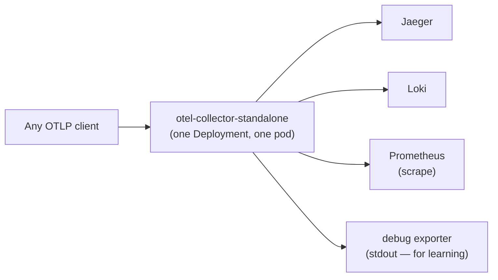
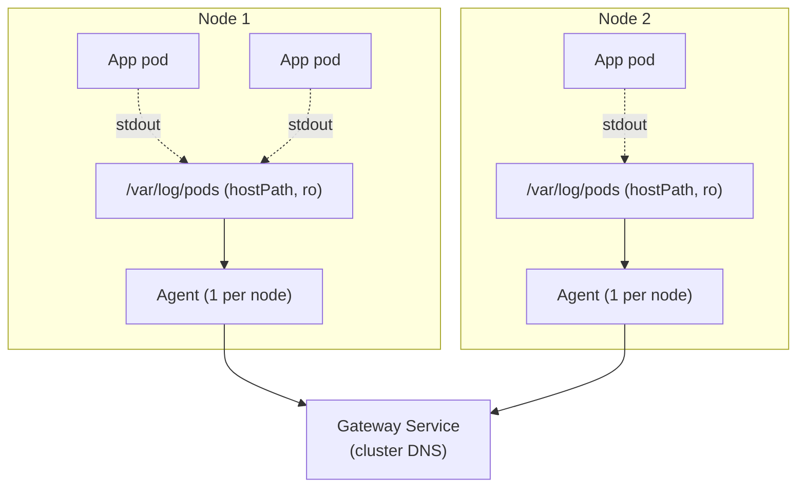
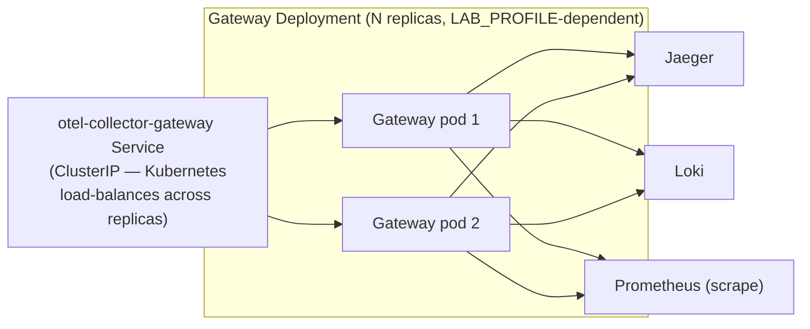
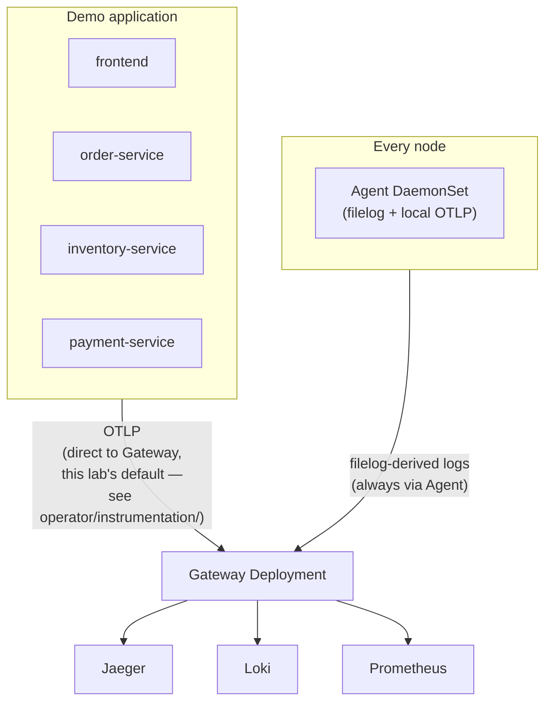

# Collector Deployment Patterns

## Definition

Three distinct ways to run a Collector in Kubernetes: **standalone** (one instance, simplest possible topology), **DaemonSet agent** (one per node, for node-local data), and **Deployment gateway** (centrally scaled, for cluster-wide processing) — this lab implements all three, deliberately, as a teaching progression.

## Problem solved

A single Collector instance can't simultaneously (a) efficiently read node-local log files on every node and (b) be centrally, independently scaled for CPU-heavy processing like tail sampling — the agent+gateway split exists because these are genuinely different scaling dimensions.

## Traditional implementation

Not applicable — this is itself the modern pattern; there's no meaningful "traditional" predecessor beyond running fewer, more monolithic log-shipping/metrics-scraping agents with none of this pipeline's shared processing model.

## OpenTelemetry implementation: three patterns compared

| Pattern | Where | Scaling axis | This lab's use |
| --- | --- | --- | --- |
| **Standalone** | `collector/standalone/` | N/A (single instance) | `labs/lab-06-collector-standalone.md` only — introductory, not installed by default |
| **Agent** | `collector/agent/` (DaemonSet) | One per node, scales with node count | Default install — reads filelog, receives local OTLP |
| **Gateway** | `collector/gateway/` (Deployment) | Independently, by replica count | Default install — central processing, tail sampling, fan-out to 3 backends |

## Internal processing flow

Standalone: one process, receiver→processor→exporter, no fan-in. Agent+Gateway: N agent processes each forward to a shared Gateway Service (Kubernetes load-balances across Gateway replicas via the Service's normal `ClusterIP` behavior — no custom load-balancing logic needed at this scale).

## Kubernetes implementation

`scripts/install-collector.sh` installs the Gateway *before* the Agent specifically so the Agent's `otlp/gateway` exporter has a real Service to resolve from its very first pod (`docs/09-collector-internals.md`'s exporter config references `otel-collector-gateway.opentelemetry.svc.cluster.local`, a name that must already exist).

## Working configuration

`operator/collectors/example-operator-managed-collector.yaml` shows the FOURTH option this lab documents but doesn't use by default: an Operator-managed `OpenTelemetryCollector` CRD, which the Operator reconciles into a Deployment+ConfigMap+Service automatically — see `docs/DECISIONS.md` ADR-029 for exactly why this lab's actual install uses raw manifests instead (explicit hostPath/RBAC control).

## Validation commands

```bash
kubectl -n opentelemetry get daemonset otel-collector-agent
kubectl -n opentelemetry get deployment otel-collector-gateway
kubectl -n opentelemetry get pods -l app=otel-collector-agent -o wide   # one per node
```

## Standalone: what it teaches

`labs/lab-06-collector-standalone.md` deploys `collector/standalone/` — one receiver, minimal processors, a `debug` exporter alongside the real backend exporters, so you can literally watch the pipeline's own stdout logs show exactly what telemetry it received, in full detail — the fastest way to build intuition for "what does a Collector actually do" before adding the agent/gateway split's real-world complexity.

## Agent responsibilities, precisely

Reads node-local Kubernetes logs (`filelog`); receives local OTLP telemetry (this lab's demo app is wired to talk directly to the Gateway by default for simplicity — see `operator/instrumentation/*.yaml`'s comment — but the Agent's `otlp` receiver is fully configured and available as an alternative, documented pattern); parses CRI logs; enriches with Kubernetes metadata; filters unwanted logs; forwards everything to the Gateway.

## Gateway responsibilities, precisely

Receives OTLP from apps and Agents; central processing (redaction, tail sampling); exports to all three backends. A single logical fan-in/fan-out point — the natural place for anything that needs a *global* view (tail sampling needs to see a whole trace, which could arrive from multiple Agents/nodes).

## Collector standalone architecture



## Collector DaemonSet agent architecture



## Collector gateway architecture



## Agent-and-gateway architecture



This is the architecture `scripts/install-collector.sh` actually installs and `combined-observability-lab/` exercises end to end.

## Failure modes

- Assuming the Agent DaemonSet handles trace/metric ingestion for this lab's demo app by default — it doesn't; this lab's apps talk directly to the Gateway (a documented simplification, `operator/instrumentation/nodejs-instrumentation.yaml`'s comment) — only logs are guaranteed to flow through the Agent.
- Scaling Gateway replicas without considering tail-sampling's per-trace state requirement — `16-production-design.md` "consistent routing."

## Production considerations

At real scale, routing all of one trace's spans to the *same* Gateway replica (consistent hashing on trace ID, often via a load balancer exporter in front of the Gateway) becomes necessary for tail sampling to work correctly across multiple Gateway replicas — not implemented in this lab (single logical Gateway, Kubernetes Service round-robin is good enough at this scale), documented as a real gap in `16-production-design.md`.

## Interview-level explanation

*"Why split Collector deployment into an Agent DaemonSet and a Gateway Deployment instead of just running one centrally-scaled Collector?"* — They scale along genuinely different axes. The Agent needs to run on every node specifically to read that node's local log files efficiently (a DaemonSet is the only Kubernetes primitive that guarantees "one instance per node," which log collection structurally needs) — and node count typically grows independently of telemetry-processing load. The Gateway does CPU/memory-heavy central processing (tail sampling needs to hold in-flight trace state) that benefits from independent horizontal scaling by request volume, not node count. Collapsing both into one tier means either over-provisioning every node's log-reading capacity to match peak processing load, or under-provisioning processing capacity to match node count — the split avoids both.
