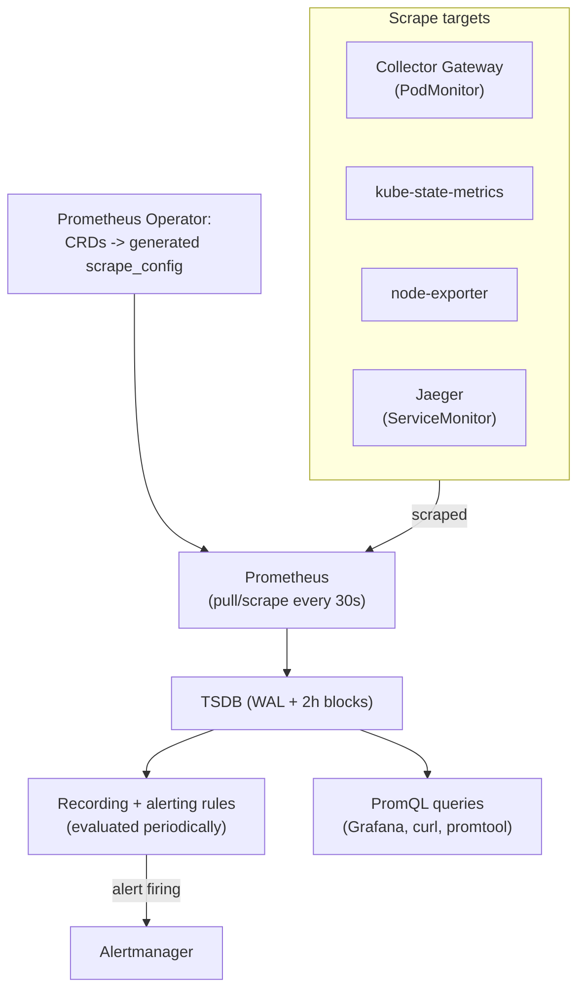

# Prometheus Architecture

## Definition

Prometheus is a **pull-based** time-series database: it scrapes `/metrics` HTTP endpoints on a schedule, stores samples in a local **TSDB**, and answers queries via **PromQL** — this lab installs it via the **kube-prometheus-stack** chart, which additionally bundles the Prometheus Operator, Alertmanager, kube-state-metrics, and node-exporter (`docs/DECISIONS.md` ADR-025).

## Problem solved

A push-based model requires every metric source to know where to push and to handle backpressure/retries itself; pull-based scraping centralizes that concern in Prometheus, and makes "is this target even reachable" a directly observable property (`up{job=...}`) rather than an absence of pushed data that could mean many different things.

## Traditional implementation

Hand-rolled scrape configs (a static YAML list of targets) with no service-discovery integration — brittle the moment pods are rescheduled with new IPs, which is constantly, in Kubernetes.

## OpenTelemetry / Kubernetes implementation

The **Prometheus Operator** (bundled in kube-prometheus-stack) replaces static scrape config with two CRDs: **`ServiceMonitor`** (selects Kubernetes `Service`s to scrape, following their Endpoints) and **`PodMonitor`** (selects Pods directly — used by this lab's `prometheus/podmonitors/otel-collector-podmonitor.yaml` specifically because the Collector Agent DaemonSet has no fronting Service to scrape through). This lab does **not** ingest OTLP metrics via Prometheus's own OTLP receiver (a real, current Prometheus capability) — it uses the Collector's `prometheus` exporter (scrape-based) instead, `docs/DECISIONS.md` ADR-028, for a simpler, single-path metrics story.

## Internal processing flow

```text
ServiceMonitor/PodMonitor (declares WHAT to scrape)
  → Prometheus Operator watches these CRDs
  → generates Prometheus's actual scrape_config
  → Prometheus's own service-discovery mechanism resolves current Pod IPs
  → scrapes /metrics on schedule (30s, this lab's PodMonitor interval)
  → writes samples to the TSDB (via the WAL first, for crash safety)
  → recording/alerting rules evaluate against the TSDB periodically
```

## Kubernetes implementation

`install/prometheus/values-*.yaml` sets `serviceMonitorSelectorNilUsesHelmValues: false`/`podMonitorSelectorNilUsesHelmValues: false`/`ruleSelectorNilUsesHelmValues: false` — permissive discovery (any `ServiceMonitor`/`PodMonitor`/`PrometheusRule` in the cluster is picked up), a deliberate single-tenant-lab simplification documented as such (a production cluster would scope this by label, `16-production-design.md`).

## Working configuration

`prometheus/podmonitors/otel-collector-podmonitor.yaml` and `prometheus/servicemonitors/jaeger-servicemonitor.yaml` are the real, complete examples.

## Validation commands

```bash
kubectl -n observability port-forward svc/kube-prometheus-stack-prometheus 9090:9090 &
curl -s http://localhost:9090/api/v1/targets | python3 -c "import json,sys; d=json.load(sys.stdin); print([t['labels']['job'] for t in d['data']['activeTargets']])"
```

## WAL, TSDB, retention, cardinality

The **WAL** (write-ahead log) makes ingestion crash-safe — samples are written there before being committed to in-memory chunks, so a Prometheus restart doesn't lose recent data. The **TSDB** organizes data into 2-hour blocks, compacted over time; `retention` (`install/prometheus/values-*.yaml`, 6h minimum / 24h recommended) controls how long blocks are kept before deletion. **Cardinality** — the total number of unique label-combination time series — is Prometheus's dominant cost/performance driver; this lab's recording rules (`prometheus/recording-rules/`) deliberately pre-aggregate high-cardinality raw series (per-request) into lower-cardinality per-job series for dashboard/alert use.

## Query execution, PromQL

PromQL evaluates lazily over the time range/instant requested — `prometheus/queries/promql-examples.md` has the full set this lab uses; `histogram_quantile()` specifically interpolates percentiles from bucket boundaries, not raw samples (`05-metrics.md`).

## Recording rules, alerting rules, kube-state-metrics, node-exporter

Recording rules precompute expensive expressions (`prometheus/recording-rules/`); alerting rules fire on top of them (`prometheus/alerts/`). **kube-state-metrics** exposes Kubernetes *object state* (replica counts, pod phase) as metrics — distinct from **node-exporter**, which exposes *host/OS-level* metrics (CPU, memory, disk) — both bundled by kube-prometheus-stack, both feeding `grafana/dashboards/kubernetes-workload-overview.json`.

## Prometheus internal metrics

Prometheus exposes its own `/metrics` (scrape duration, WAL corruption events, rule-evaluation duration) — genuinely useful for "is Prometheus itself healthy," not exercised by a dedicated dashboard in this lab but queryable directly (`up{job="prometheus"}`, `prometheus_target_scrapes_exceeded_sample_limit_total`, etc.).

## Prometheus metrics flow



## Failure modes

- A target showing `up == 0` — always the first thing to check (`prometheus/alerts/observability-alerts.yaml`'s `PrometheusTargetDown`) before assuming the *metric* itself is wrong; if the target's down, nothing it would have reported exists at all.
- `ServiceMonitor`/`PodMonitor` applied but not discovered — usually a label-selector mismatch against the Prometheus CR's own `serviceMonitorSelector`, not a bug in the `ServiceMonitor` itself; this lab's permissive `SelectorNilUsesHelmValues: false` setting avoids this specific class of mistake, at the cost of the production label-scoping `16-production-design.md` recommends.

## Production considerations

`docs/16-production-design.md` "Prometheus" section covers HA pairs, remote write for long-term storage, and Alertmanager HA — none implemented by this lab's single-replica default.

## Interview-level explanation

*"Why pull instead of push for metrics?"* — Pull makes target health directly observable (`up`) independent of whether the target itself has anything interesting to report, and centralizes scrape-scheduling/backpressure concerns in one place instead of every metric source implementing its own retry/backoff logic. It does mean Prometheus needs network reachability to every target, which is why short-lived batch jobs are usually pushed instead (via a Pushgateway, not used in this lab) — the two models aren't universally interchangeable, and this lab's continuously-running services are exactly the case pull-based scraping fits well.
