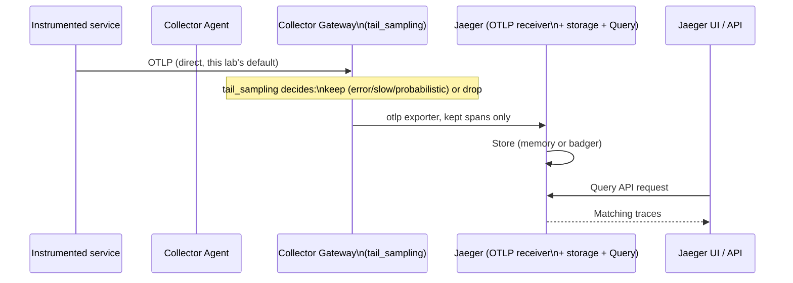

# Jaeger Architecture

## Definition

Jaeger is a distributed-tracing backend: it ingests spans, stores them, and serves the **Query** service (API + UI) for searching/viewing traces. Jaeger **v2** (this lab's pinned version, `config/versions.env` `JAEGER_APP_VERSION`) is itself built on the OpenTelemetry Collector core — its "collector" component is architecturally an OTel Collector distribution with Jaeger-specific storage exporters built in.

## Problem solved

Traces need purpose-built storage (indexed by trace ID, service, operation, tags, duration — not a general-purpose time-series or log store) and a query UI that understands trace structure (waterfalls, service dependency graphs) — Jaeger is that purpose-built layer.

## Traditional implementation

Jaeger v1's architecture had a separate proprietary ingestion protocol and a standalone **Jaeger Agent** sidecar/daemonset pattern for collecting spans — both superseded in v2 by native OTLP support built directly into the collector component, eliminating the need for a separate agent tier entirely (`config/versions.env`'s note: "No Jaeger agent in Jaeger v2").

## OpenTelemetry implementation

Native, stable **OTLP receiver** — gRPC on port 4317, HTTP on port 4318 (`config/versions.env` `JAEGER_OTLP_GRPC_PORT`/`JAEGER_OTLP_HTTP_PORT`), enabled via `allInOne.args: [--collector.otlp.enabled=true]` (`install/jaeger/values-*.yaml`). This lab's Collector Gateway exports directly via a plain `otlp` exporter (`collector/gateway/configmap.yaml`'s `otlp/jaeger`) — no Jaeger-proprietary protocol involved anywhere in this pipeline.

## Internal processing flow

```text
Collector Gateway's otlp/jaeger exporter
  → Jaeger's OTLP receiver (built into its collector component)
  → Jaeger's internal storage writer (memory in 'minimum' profile, badger in 'recommended')
  → Jaeger Query service reads from the same storage
  → Query API / UI serves search results
```

## Kubernetes implementation

`install/jaeger/values-minimum.yaml`/`values-recommended.yaml` both use `allInOne.enabled: true` — a single Deployment running collector+query+UI together, explicitly **not** production-grade (`docs/DECISIONS.md` ADR-027, this doc's "Production distributed mode" section below) — resource-efficient for a lab, at the cost of no independent collector/query scaling and (minimum profile) no persistent storage.

## Working configuration

`install/jaeger/values-recommended.yaml`'s `badger` storage config — read directly for the exact env vars (`SPAN_STORAGE_TYPE`, `BADGER_EPHEMERAL`, `BADGER_DIRECTORY_VALUE`/`_KEY`) and PVC mount.

## Validation commands

```bash
make port-forward-jaeger &
curl -s http://localhost:16686/api/services | python3 -m json.tool
```
See `jaeger/queries/jaeger-api-examples.md` for the full query reference.

## All-in-one vs. production distributed mode

**All-in-one** (this lab, both profiles): one process, in-memory or embedded (badger) storage, no independent scaling of ingestion vs. query load. **Production distributed mode**: separate, independently-scaled collector and query deployments, backed by Elasticsearch or Cassandra (a real, external, horizontally-scalable storage backend) — necessary once trace volume exceeds what a single embedded-storage process can hold or once ingestion and query load need to scale independently. This lab explicitly does not implement distributed mode — stated here directly, not left ambiguous: **all-in-one mode, as configured here, is not production-grade**, regardless of which profile you choose.

## Trace search, service search, operation search, tags, duration, dependencies

Covered with real API examples in `jaeger/queries/jaeger-api-examples.md` — service dropdown/API param, operation (span name) filtering, tag-based filtering (span attributes), `minDuration` filtering (finding slow traces even under sampling), and the `/api/dependencies` service-graph endpoint.

## Sampling

Jaeger itself has no sampling configuration in this lab's pipeline — sampling decisions are made entirely upstream, at the Collector Gateway's `tail_sampling` processor (`09-collector-internals.md`) and, for non-root spans, the SDK's `parentbased_traceidratio` sampler (`operator/instrumentation/*.yaml`). Jaeger stores and serves whatever traces actually reach it, unconditionally.

## Storage retention

`config/retention.env`'s `JAEGER_MAX_TRACES_MINIMUM`/`_RECOMMENDED` (25000/100000) bound in-memory/badger storage size directly, rather than a time-based retention window — a real difference from Prometheus/Loki's time-based retention, worth noting explicitly since it's an easy assumption to get wrong.

## Jaeger trace flow



## Failure modes

- Restarting the Jaeger pod under the `minimum` profile and being surprised traces are gone — expected, documented, in-memory storage (`install/jaeger/values-minimum.yaml`'s header comment).
- Assuming Jaeger's Operator is the current recommended install path — it's upstream-deprecated (last release over a year stale as of this research pass) and explicitly not used here; `docs/DECISIONS.md` ADR-027.

## Production considerations

`16-production-design.md` "Jaeger" covers the real storage-backend decision (Elasticsearch vs. Cassandra), collector/query independent scaling, and production sampling strategy — none implemented here, all documented as the concrete next step beyond this lab.

## Interview-level explanation

*"Is Jaeger's all-in-one mode ever appropriate for production?"* — Only at genuinely small scale with a real, external, persistent storage backend behind it — bare all-in-one with in-memory or even embedded badger storage (what this lab uses) is not production-appropriate at any real trace volume, since it has no independent scaling for ingestion vs. query load and no durability beyond a single process's local disk. Production Jaeger means distributed mode: separately-scaled collector and query components backed by Elasticsearch or Cassandra. This lab uses all-in-one deliberately for resource efficiency in a learning environment, and says so explicitly rather than letting a learner assume the lab defaults generalize.
