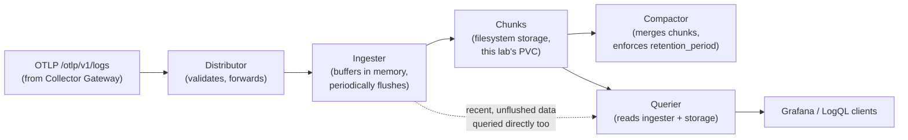

# Loki Architecture

## Definition

Loki is a log-aggregation system that indexes only **labels** (not full-text), storing log content in compressed **chunks** — a deliberate design tradeoff (cheaper to run than a full-text-indexed system like Elasticsearch, at the cost of needing well-chosen labels for query performance).

## Problem solved

Full-text-indexing every log line at scale is expensive (storage and compute both). Loki's bet is that most real log queries start with "which service/namespace/pod" (a small set of known labels) before any content filtering — so only index that, and filter content at query time from compressed chunks instead.

## Traditional implementation

Elasticsearch-backed log aggregation (the ELK/EFK stack) — full-text indexed, more expensive to run and operate at scale, but supports arbitrary free-text search without label pre-planning.

## OpenTelemetry implementation

**Native OTLP ingestion** at `POST /otlp/v1/logs` — no separate log-shipping client, no Promtail (`docs/DECISIONS.md` ADR-008, ADR-007). Structured metadata (Loki 3.0+, enabled by default in this lab's pinned `3.7.4`) lets high-cardinality fields (`trace_id`, `span_id`, `order_id`) travel with each log line without being promoted to indexed labels — see `06-logs.md`.

## Internal processing flow (conceptually — Monolithic mode collapses these into one process)

**Distributor** — receives incoming log streams, validates, forwards to ingesters. **Ingester** — buffers recent log data in memory, periodically flushes compressed chunks to storage. **Querier** — executes LogQL queries against both recent (ingester) and historical (storage) data. **Query frontend** — splits/parallelizes large queries, adds caching (more relevant at `SimpleScalable`/`Distributed` scale than this lab's `Monolithic` deployment). **Compactor** — merges/deduplicates chunks and enforces `retention_period` deletion (`loki/retention/README.md`).

## Kubernetes implementation

`install/loki/values-*.yaml`'s `deploymentMode: Monolithic` runs every component above inside one binary/Deployment — the current chart's default and correct choice for a lab-scale install; `SimpleScalable` (deprecated, removal targeted Loki 4.0) and `Distributed` (real horizontal scaling of each component independently) are documented alternatives, not implemented here.

## Working configuration

`install/loki/values-*.yaml`'s `schemaConfig`/`limits_config` — `store: tsdb`, `object_store: filesystem`, `retention_period`, `max_label_names_per_series: 15` (a deliberate low ceiling, forcing cardinality discipline).

## Validation commands

```bash
make port-forward-loki &
curl -s http://localhost:3100/ready
curl -s -G http://localhost:3100/loki/api/v1/labels | python3 -m json.tool
```

## Single-binary vs. simple-scalable vs. distributed mode

Covered above under "Kubernetes implementation" — restated for emphasis since chart terminology has shifted across Loki's own history (the old name `SingleBinary` is now an alias for `Monolithic`). Always check the terminology against the *currently installed* chart version rather than older tutorials — `config/versions.env`'s note on this exact point.

## Streams, labels, structured metadata, LogQL

A **stream** is one unique combination of label values — the fundamental unit Loki indexes and stores chunks per. **Labels** (`k8s_namespace_name`, `service_name`) define streams; **structured metadata** rides along per-line without creating new streams. **LogQL** — Loki's query language, covered exhaustively in `loki/logql/logql-examples.md`.

## Index, chunks, object storage, compaction, cardinality

The **index** maps label combinations to chunk locations. **Chunks** are the actual compressed log content. This lab uses `object_store: filesystem` (a PVC) — real production Loki typically uses S3/GCS instead (`16-production-design.md`). **Compaction** (the compactor component) is what actually enforces retention and merges small chunks into larger, more query-efficient ones over time. **Cardinality** here means "how many distinct streams" — directly driven by how many distinct label-value combinations exist, which is exactly why `max_label_names_per_series` and the structured-metadata-vs-label discipline (`06-logs.md`) matter so much for Loki specifically.

## Tenant model

This lab runs Loki single-tenant (`auth_enabled: false`, `install/loki/values-*.yaml`) — every log stream shares one implicit tenant, simplest possible configuration. Multi-tenancy (per-team/per-namespace isolated log stores within one Loki install) is a real, documented-but-not-implemented production feature — `17-security-and-governance.md` "Multi-tenancy limitations."

## Loki log flow



In `Monolithic` mode, every box above runs inside the same process — the diagram shows the logical components Loki always has, regardless of deployment mode.

## Failure modes

- Selecting on a high-cardinality label first in a LogQL query (or having one in the schema at all) — the exact opposite of `loki/logql/logql-examples.md`'s guidance; `19-cost-optimization.md`.
- Assuming `SimpleScalable` mode is still the recommended non-Monolithic option — it's deprecated in the current chart, slated for removal in Loki 4.0; `Distributed` is the real production path now.

## Production considerations

`16-production-design.md` "Loki" covers object storage (S3/GCS instead of this lab's filesystem PVC), `Distributed` deployment mode, and multi-tenancy — all real gaps between this lab and a production Loki install, stated explicitly.

## Interview-level explanation

*"Why does Loki index only labels, not full log content — and what does that cost you?"* — It's a deliberate cost/performance tradeoff: indexing every word of every log line (like Elasticsearch) is expensive to store and compute at scale; Loki bets that most real queries start by narrowing to a service/namespace/pod (a small, well-known label set) before any content filtering, so only that gets indexed, and content filtering happens at query time against compressed chunks. The cost is query performance depends heavily on choosing good labels up front — a query that can't narrow by label first (e.g., "find this exact string anywhere in any log") is genuinely slower in Loki than in a full-text-indexed system, which is exactly why `docs/06-logs.md`/`loki/logql/logql-examples.md` are so insistent about selecting on indexed labels first and using structured metadata (not labels) for high-cardinality fields like `trace_id`.
