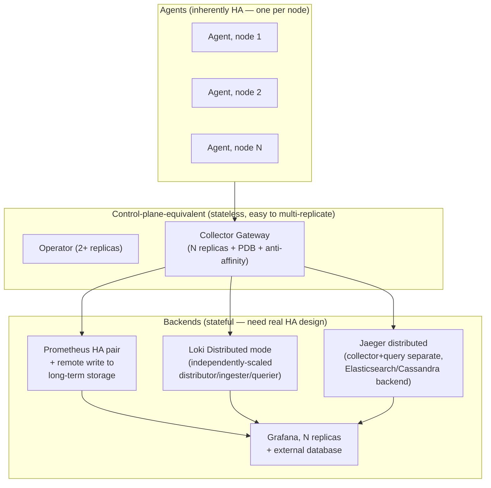

# High Availability and Disaster Recovery

## Definition

What it would take to run this stack without a single point of failure per component, versus what this lab's `minimum`/`recommended` profiles actually provide (neither is HA in the full sense — stated directly, matching `16-production-design.md`'s honesty pattern).

## Problem solved

An observability stack that goes down exactly when the systems it's monitoring have an incident is close to useless at the moment it matters most — HA design for the observability stack itself is not a luxury, it's what makes the stack trustworthy during the incidents it exists to help diagnose.

## Traditional implementation

Single-instance monitoring tools with no redundancy — acceptable for a small, low-stakes environment, a real liability once the monitored system's own availability requirements exceed the monitoring stack's.

## OpenTelemetry implementation: per-component HA shape

| Component | This lab (`recommended` profile) | Real production HA |
| --- | --- | --- |
| Collector Gateway | N replicas (LAB_PROFILE-driven), no PDB, no anti-affinity | + PodDisruptionBudget, pod anti-affinity/topology spread, persistent export queues |
| Collector Agent | Inherently HA-by-design (DaemonSet — one node's Agent failing doesn't affect others) | Same — this is already the correct pattern |
| Prometheus | Single replica | HA pair (2+ independent replicas scraping the same targets), deduplicated at query time or via remote-write to a long-term store |
| Alertmanager | 2 replicas (`recommended` profile) — a real HA gesture already present | Same, already adequate at small scale |
| Loki | Single `Monolithic` instance | `Distributed` mode, each component (distributor/ingester/querier) independently replicated |
| Jaeger | Single `allInOne` instance | Distributed collector+query, backed by a real HA-capable storage backend (Elasticsearch/Cassandra cluster) |
| Grafana | Single replica | Multiple replicas behind a shared external database (not the implicit SQLite default) |

## Internal processing flow

Not applicable at this conceptual level — see each component's own architecture doc (`09`–`14`) for the actual internals an HA topology would replicate.

## Kubernetes implementation

`install/prometheus/values-recommended.yaml`'s `alertmanager.alertmanagerSpec.replicas: 2` is this lab's one genuine multi-replica HA gesture among the backends; everything else in the table above stays single-replica even at the `recommended` profile, a deliberate scope boundary stated here rather than left implicit.

## Working configuration

Not applicable — this lab does not ship a true-HA configuration for any backend beyond Alertmanager; see the table above for what would need to change.

## Validation commands

```bash
kubectl -n observability get pods -l app.kubernetes.io/name=alertmanager   # expect 2
kubectl -n observability get pods -l app.kubernetes.io/name=prometheus     # expect 1, both profiles
```

## What is stateless vs. what contains persistent data

Restated from `16-production-design.md`'s DR section, specifically through the HA lens: stateless components (Collector, Operator, Grafana's rendering layer) can be freely multi-replicated without data-consistency concerns. Stateful components (Prometheus TSDB, Loki chunks, Jaeger badger storage) need real HA strategies that account for data consistency/deduplication across replicas — simply running two independent Prometheus replicas, for example, gives you availability but two *independent* datasets, not a synchronized HA pair, unless paired with a deduplicating query layer or remote-write to a shared long-term store.

## Production HA architecture



Every box in "Backends" is a real, non-trivial HA design decision this lab documents but does not implement — the diagram above is the production target, not this lab's actual topology.

## Disaster recovery: what to validate, concretely

```bash
make clean && make install-all LAB_PROFILE=recommended && make validate-installation
```
proves configuration-only recovery works (everything this lab actually automates). Real DR validation for the stateful backends' *historical data* would additionally require: taking and restoring a Prometheus/Loki/Jaeger PVC snapshot externally, confirming query results match pre-disaster expectations — not automated by this lab's scripts, since no backup mechanism is implemented by default (`16-production-design.md`'s DR section).

## Failure modes

- Assuming `LAB_PROFILE=recommended` means "HA" — per the table above, only Alertmanager gets genuine multi-replica treatment; every other backend stays single-instance.
- Restoring a Prometheus/Loki PVC from a snapshot taken at an inconsistent point relative to the WAL/ingester's in-memory state — real backup procedures for these systems need to account for this, not just snapshot the underlying volume blindly.

## Production considerations

This document's comparison table *is* the production checklist for HA specifically (as distinct from `16-production-design.md`'s broader scope) — treat "recommended profile" and "production HA" as two different bars, not synonyms.

## Interview-level explanation

*"Is this lab's 'recommended' profile production-HA?"* — No, and specifically: only Alertmanager gets a genuine multi-replica HA configuration. Collector Gateway scales by replica count but has no PodDisruptionBudget or anti-affinity; Prometheus, Loki, and Jaeger all stay single-instance in both profiles, with no HA pairing, no distributed deployment mode, and no external durable storage backend beyond a local PVC. Getting to real HA means, per backend: Prometheus HA pairs with remote-write, Loki's `Distributed` mode, Jaeger with a real Elasticsearch/Cassandra backend and separately-scaled components, and Grafana on an external database with multiple replicas — a materially larger, more expensive deployment than this lab's, which is exactly why this lab doesn't pretend the `recommended` profile is a production HA target.
