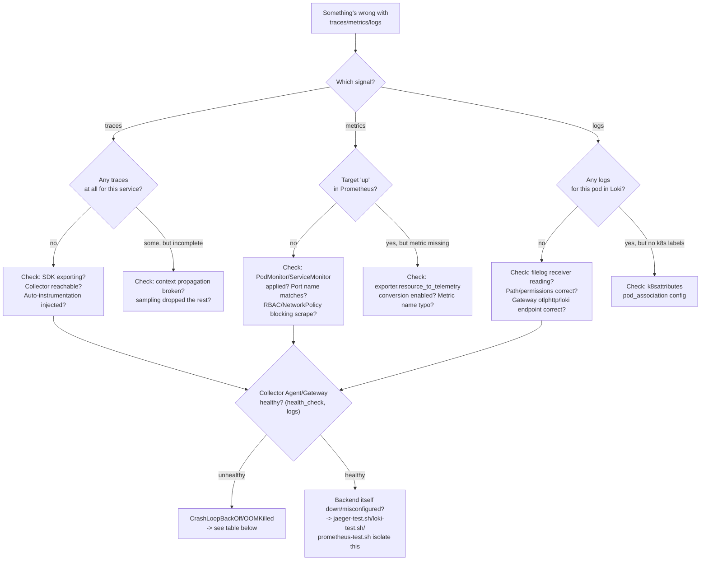

# Troubleshooting

A symptom-first reference. For each: symptoms, diagnostic commands, root cause, immediate mitigation, permanent fix, validation. Start with the decision tree below, then jump to the matching table row.

## Troubleshooting decision tree

## Tracing

| Symptom | Diagnostic commands | Root cause | Immediate mitigation | Permanent fix | Validation |
| --- | --- | --- | --- | --- | --- |
| No traces in Jaeger | `bash tests/jaeger-test.sh` (isolates Jaeger itself); `kubectl -n opentelemetry logs -l app=otel-collector-gateway` | SDK not exporting, Collector unreachable, or Jaeger itself down | Restart the affected component | Fix the specific broken hop identified above | `traces-test.sh` passes |
| Partial traces (some spans missing) | Compare span count in Jaeger UI against expected call chain | A hop used a non-instrumented client, or that hop's export failed silently | None — data for missing spans is gone | Ensure every HTTP call uses an instrumented client (`07-context-propagation.md`) | Re-run the request, confirm full trace |
| Broken context propagation | Check for multiple single-span "traces" instead of one connected trace for what should be one request | A raw/uninstrumented client call didn't propagate `traceparent` | None | Use the framework's instrumented client library | `docs/04-distributed-tracing.md`'s expected span tree matches |
| Missing service name | `kubectl -n otel-demo exec deploy/<svc> -- env \| grep OTEL_SERVICE_NAME` (auto) or check `Resource.create()` (manual) | Resource attribute not set | None | Set `OTEL_SERVICE_NAME` or the SDK's `Resource` explicitly | New traces show the correct service name |
| Duplicate service names | `curl .../api/services` shows near-duplicate entries (e.g. casing difference) | Inconsistent `service.name` value across replicas/versions | None | Standardize the exact string everywhere | One entry per logical service |

## Metrics

| Symptom | Diagnostic commands | Root cause | Immediate mitigation | Permanent fix | Validation |
| --- | --- | --- | --- | --- | --- |
| Missing metrics | `bash tests/metrics-test.sh` | See "Prometheus target down" and "Metric labels missing" rows | — | — | — |
| Prometheus target down | `curl .../api/v1/targets` | Pod down, PodMonitor/ServiceMonitor misapplied, port name mismatch | Restart the target pod | Fix the PodMonitor/ServiceMonitor's `selector`/port name | Target shows `health: up` |
| Metric labels missing | `curl .../api/v1/query?query=<metric>` and inspect labels | `resource_to_telemetry_conversion` disabled on the `prometheus` exporter, or attribute never set at the SDK | None | Enable the conversion (`collector/gateway/configmap.yaml`) or fix the SDK call | Labels present on next scrape |

## Logs

| Symptom | Diagnostic commands | Root cause | Immediate mitigation | Permanent fix | Validation |
| --- | --- | --- | --- | --- | --- |
| No logs in Loki | `bash tests/loki-test.sh` (isolates Loki); `kubectl -n opentelemetry logs -l app=otel-collector-agent` | filelog not reading, or Gateway's `otlphttp/loki` misconfigured | Restart the Agent | Fix path/permissions or the exporter endpoint | `logs-test.sh` passes |
| Filelog permission denied | Agent container logs show a permission error reading `/var/log/pods/...` | Non-root Agent UID vs. actual file permissions on this specific node/containerd config | Temporarily run the Agent as root (not committed — a diagnostic-only change) | Confirm/fix the node's log-file permission model; `collector/agent/daemonset.yaml`'s header comment documents this exact risk | Agent logs stop showing permission errors |
| Incorrect file path | Agent logs show "no files match" | `/var/log/pods` glob doesn't match this node's actual layout (custom kubelet/containerd config) | None | Confirm the actual path via `kubectl debug node/<node>` and update `filelog.include` | New log files are picked up |
| CRI parsing failure | Malformed/garbled log content in Loki | The `container` operator's format assumption doesn't match this runtime's actual log format | None | Confirm containerd (not another runtime) and current CRI format | Log content parses cleanly |
| Duplicate logs | Same log line appears more than once in Loki | Checkpoint (`file_storage/checkpoint`) lost/reset, or `start_at: beginning` re-reading after Agent restart | None — re-ingest is idempotent-ish but not deduplicated | Confirm the checkpoint hostPath survives pod restarts on that node | No new duplicates after Agent restart |
| Logs reread after restart | Same as above | Checkpoint volume lost (e.g., node-level cleanup) | None | See `06-logs.md` "Start_at behavior" | Checkpoint file exists and updates over time |
| Trace ID missing from logs | Log line has no `trace_id` field | `transform/log_trace_context` didn't find `attributes.trace_id` (JSON parsing failed) or the app's log formatter doesn't inject it | None | Confirm the app log formatter (`demo-application/*/app.py`) and the `json_parser`'s `parse_to: attributes` | New logs carry `trace_id` |

## Collector

| Symptom | Diagnostic commands | Root cause | Immediate mitigation | Permanent fix | Validation |
| --- | --- | --- | --- | --- | --- |
| Collector CrashLoopBackOff | `kubectl -n opentelemetry describe pod -l app=otel-collector-gateway`; `kubectl logs --previous` | Invalid config (YAML/component reference), or a genuinely unsupported component | Roll back to the last-known-good ConfigMap | Fix the config; validate with `otelcol-contrib validate --config=` if available | Pod reaches `Running`, stays up |
| Collector OOMKilled | `kubectl describe pod` shows `OOMKilled`; compare `memory_limiter.limit_mib` to `resources.limits.memory` | `limit_mib` too close to/above the container's actual memory limit, leaving no headroom | Increase `resources.limits.memory` | Set `memory_limiter.limit_mib` meaningfully below `resources.limits.memory` | No further OOMKills under the same load |
| Invalid Collector configuration | `otelcol-contrib validate --config=<file>` (if installed) or apply and watch pod status | YAML syntax error or invalid component config | Revert to last-known-good | Fix and re-validate before applying | Validates clean, pod starts |
| Unsupported receiver/exporter | Collector logs: "unknown receiver/exporter type" | Component not present in the pinned Contrib image, or a typo in the component name | Revert | Confirm the component exists in `config/versions.env`'s pinned Contrib version's manifest | Pod starts cleanly |
| OTLP gRPC and HTTP mismatch | Client errors like "unimplemented" or protocol errors | Client configured for gRPC pointed at the HTTP port (4318) or vice versa | Fix the client's endpoint/port | Standardize per `02-opentelemetry-fundamentals.md`'s port table | Export succeeds |
| Loki OTLP endpoint incorrect | Gateway logs show 404s from Loki | `otlphttp/loki.endpoint` includes `/v1/logs` (double-appended) or wrong port | Fix the endpoint to the `/otlp` path only | See `config/versions.env`'s comment | `logs-test.sh` passes |
| Jaeger OTLP endpoint incorrect | Gateway logs show connection refused/timeout to Jaeger | Wrong Service name/port (Jaeger chart's actual generated names can differ — `13-jaeger-architecture.md`'s "needs re-verification" note) | Fix the endpoint | Confirm the real Service name post-install, update `collector/gateway/configmap.yaml` | `jaeger-test.sh` passes |
| Collector export timeout / backend unavailable | `otelcol_exporter_send_failed_*` nonzero | Backend down or unreachable | `sending_queue`/`retry_on_failure` absorb it temporarily | Restore the backend | `resilience-test.sh` passes |
| Sending queue full | `otelcol:queue_utilization:ratio` near 1.0 | Backend down/slow for longer than the queue can absorb | Scale the Gateway or the backend | Increase `queue_size` and/or fix the backend | Queue utilization drops |
| Dropped telemetry | `otelcol_receiver_refused_*` nonzero | `memory_limiter` refusing under pressure | Reduce load or increase memory | Right-size `memory_limiter`/pod resources | Refused rate returns to 0 |
| Excessive cardinality | Prometheus/Loki showing unexpectedly high series/stream counts | A high-cardinality field promoted to a label/attribute | None immediate — the damage is already stored | Remove the offending label per `18`/`19` | Series/stream count stabilizes |
| Tail sampling missing expected traces | An error trace not found in Jaeger despite the `keep-all-errors` policy | Span status not actually set to `ERROR`, or the policy order/config is wrong | None | Confirm `span.set_status(Status(StatusCode.ERROR, ...))` is actually called; check policy order in `collector/gateway/configmap.yaml` | `sampling-test.sh` passes |
| Kubernetes metadata missing | Telemetry has no `k8s.namespace.name`/etc. | `pod_association` misconfigured, or RBAC too narrow | None | Fix `k8sattributes.pod_association`/RBAC (`15-kubernetes-observability.md`) | New telemetry carries metadata |

## Operator / Instrumentation

| Symptom | Diagnostic commands | Root cause | Immediate mitigation | Permanent fix | Validation |
| --- | --- | --- | --- | --- | --- |
| Operator webhook failure | `kubectl get mutatingwebhookconfiguration`; check the Operator pod's own logs | Operator not Ready, or its self-signed cert (`autoGenerateCert`) not yet generated | Wait/restart the Operator pod | Confirm `scripts/install-operator.sh`'s webhook-ready wait actually completed | Webhook registered, cert valid |
| Auto-instrumentation not injected | `kubectl get pod -o jsonpath='{.spec.initContainers}'` shows nothing | Pod created before the webhook was ready (a race), or the annotation is missing/misnamed | Delete and recreate the pod | Ensure `Instrumentation` + webhook exist before deploying the app | Init container present on next pod creation |
| Application SDK not exporting | No telemetry at all, but no errors either | The API's no-op default — no SDK ever registered | None | Confirm auto-injection happened, or manual `setup_telemetry()` was actually called | `02-opentelemetry-fundamentals.md`'s validation command shows a real provider |
| Certificate failure | Operator/webhook TLS errors | `autoGenerateCert` Job failed or the cert expired without `recreate: true` | Re-run the Helm install/upgrade | Confirm `install/opentelemetry-operator/values.yaml`'s `recreate: true` | Webhook TLS handshake succeeds |

## Infrastructure / cross-cutting

| Symptom | Diagnostic commands | Root cause | Immediate mitigation | Permanent fix | Validation |
| --- | --- | --- | --- | --- | --- |
| NetworkPolicy block | Connections between Agent/Gateway/backends time out | A `CiliumNetworkPolicy` (not applied by this lab by default) blocking required traffic | Identify and adjust the offending policy | Ensure any NetworkPolicy applied to these namespaces explicitly allows the pipeline's own traffic | Connectivity restored |
| Clock skew | Spans/logs with implausible timestamps or ordering | Node clock drift (rare on a well-managed cluster, but real) | None from this lab's scope | Fix NTP/chrony on the affected node (`../../auto-setup-default-kube-env/` scope, not this module's) | Timestamps consistent across nodes |
| Grafana data source unhealthy | `bash tests/grafana-test.sh` | Backend down, or datasource URL/auth wrong | Fix the backend or the datasource config | Update `install/grafana/datasources/datasources.yaml` | Datasource health check passes |
| Dashboard shows no data | Check the datasource health first, then the panel's query directly in Explore | Usually a healthy-datasource-but-wrong-query issue, or genuinely no matching data in the selected time range | Widen the time range | Fix the panel query | Data appears |
| Exemplar links missing | No exemplar dots on a histogram panel | `exemplar-storage` not enabled on Prometheus, or the SDK recorded outside an active span | Enable the feature flag | `install/prometheus/values-*.yaml`; confirm SDK usage matches `05-metrics.md` | Exemplars appear on next scrape |

## Interview-level explanation

*"Walk me through your triage order for 'no telemetry is showing up.'"* — Same shape regardless of signal: first confirm the SDK is actually configured (not the no-op API default) and the application itself isn't erroring. Second, check the Collector — is the Agent/Gateway healthy (`health_check` extension, no CrashLoopBackOff/OOMKill), and do its own internal metrics (`otelcol_receiver_accepted_*`) show it received anything at all. Third, isolate the backend directly — send a manual OTLP payload straight to Jaeger/Loki, bypassing the Collector, to determine whether the backend itself is the problem or the pipeline in front of it is. This ordering (app → Collector → backend) is exactly why this lab's `jaeger-test.sh`/`loki-test.sh` bypass the Collector deliberately — they exist specifically to answer step three in isolation, rather than only ever testing the whole pipeline end to end and having to guess which link in the chain actually broke.
